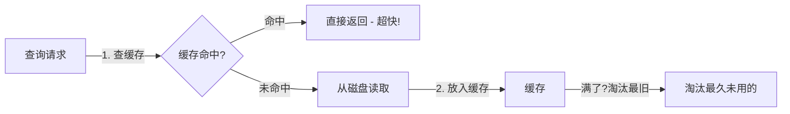
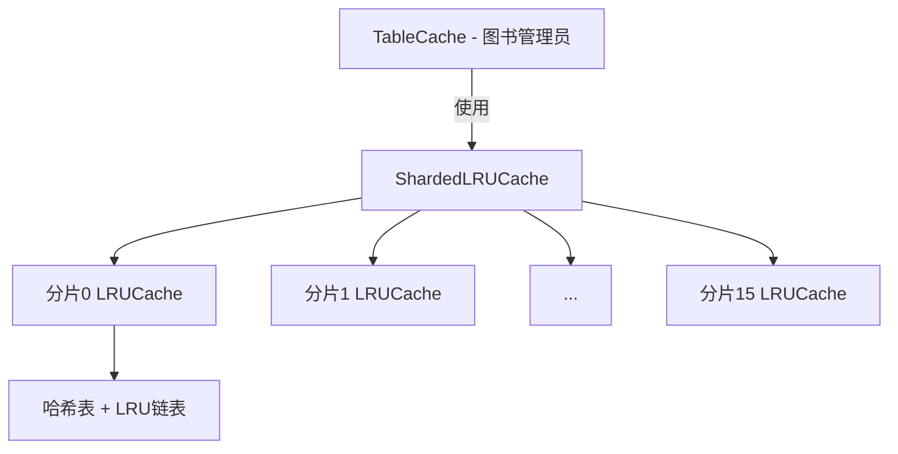
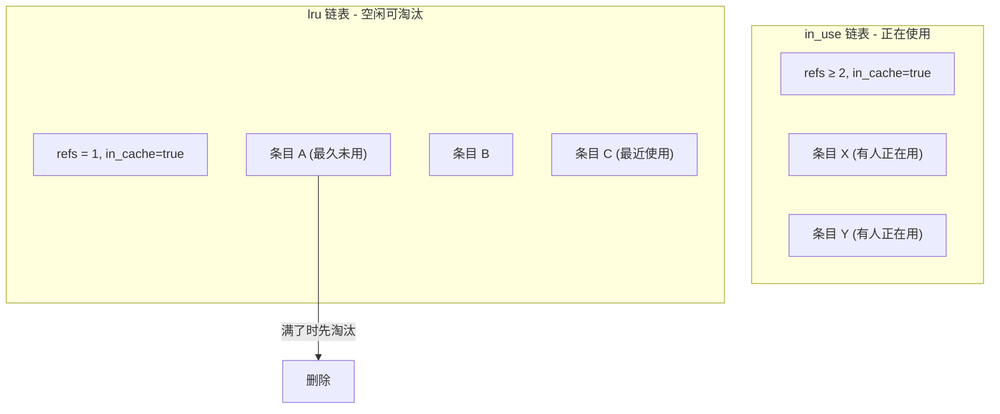
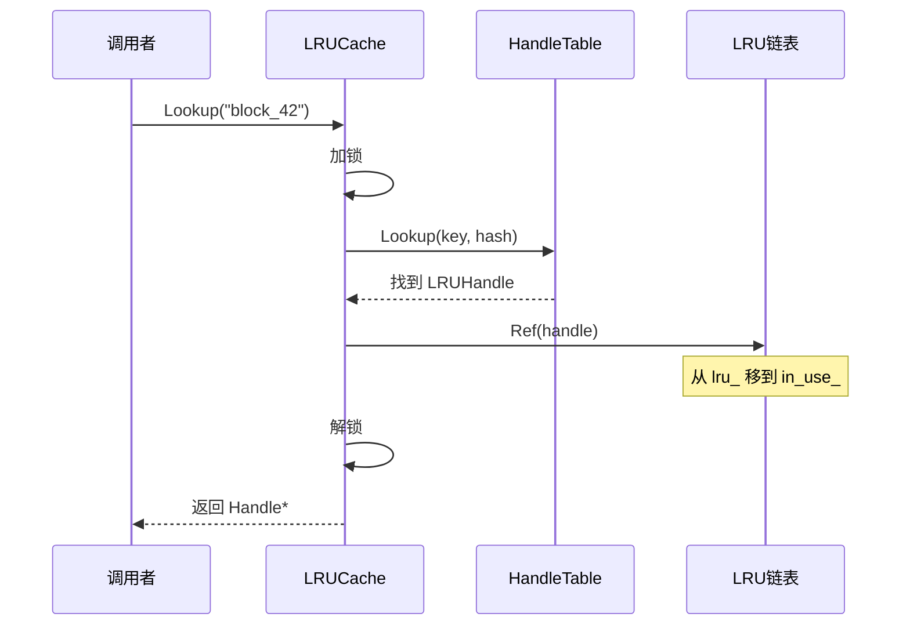
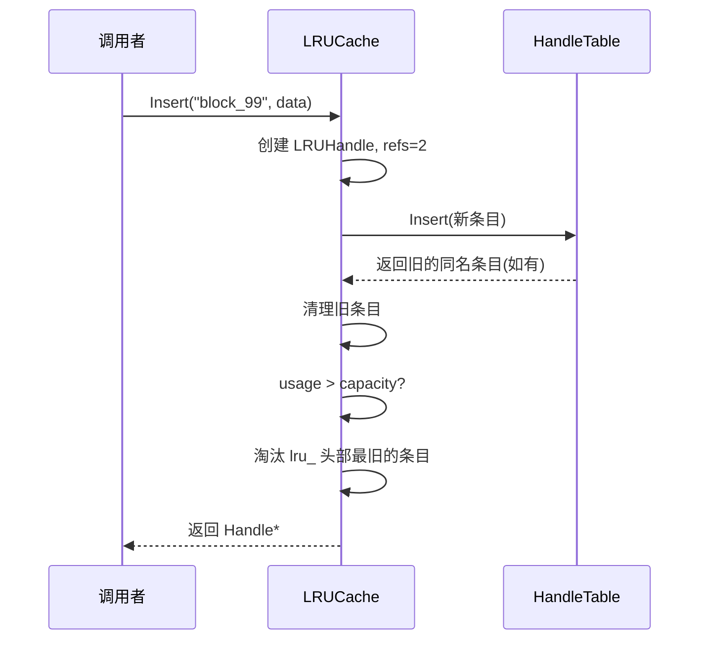
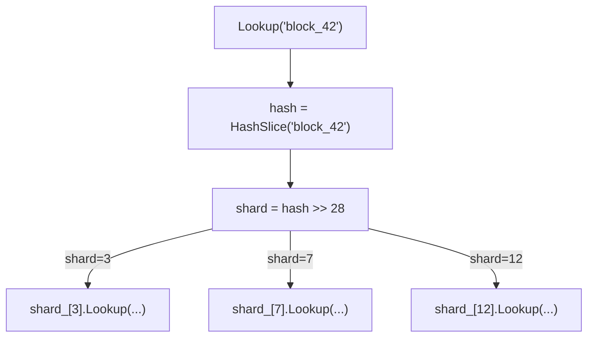
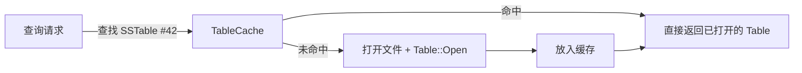
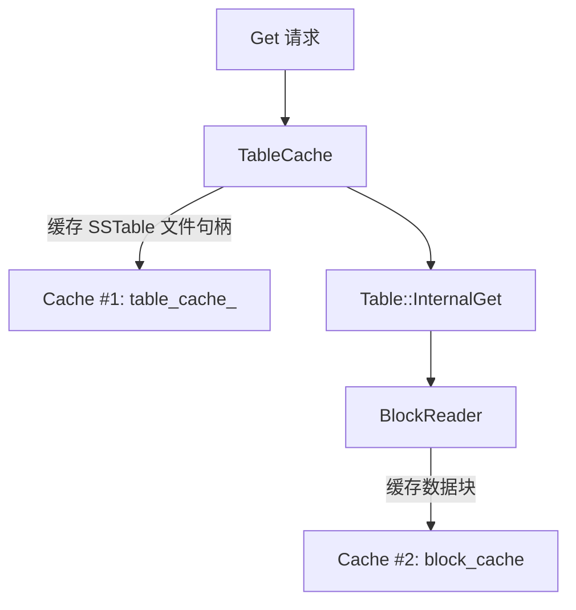
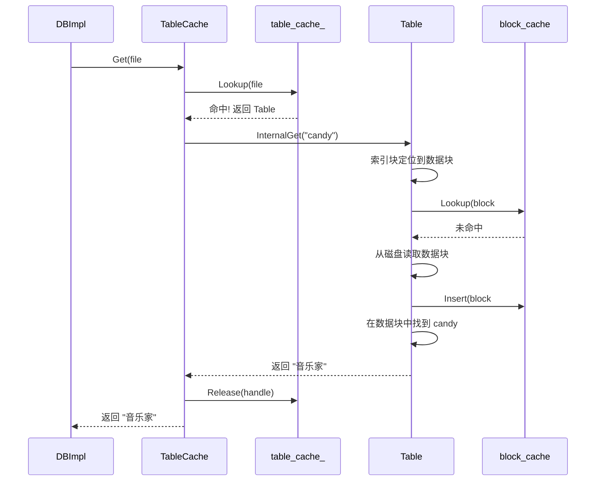

# Chapter 7: LRU 缓存 (Cache)

在上一章 [迭代器体系 (Iterator)](06_迭代器体系__iterator.md) 中，我们了解到遍历数据库时，SSTable 文件中的数据块会被频繁读取。你可能注意到了一个问题：如果反复读取同一个数据块，每次都要从磁盘加载，岂不是很浪费？

本章的主角——**LRU 缓存**，就是解决这个问题的"加速利器"。

## 为什么需要缓存？

假设你的应用程序在短时间内多次查询相邻的 key：

```
db->Get("alice", &value);   // 需要读磁盘上的数据块A
db->Get("alien", &value);   // "alien" 也在数据块A中
db->Get("alice", &value);   // 又要读数据块A？
```

每次查询都要打开文件、读取数据块、解压——这些磁盘操作比内存慢 **10万倍**！如果第一次读完数据块A后，能把它**留在内存里**，后续查询直接从内存取，速度就飞快了。

但内存有限，不可能把所有数据块都缓存起来。怎么办？**淘汰最久没用过的！**

## 书桌上的常用书架

把缓存想象成你书桌上的一个小书架，只能放 10 本书：

```
书架（缓存）：[数据结构] [算法导论] [C++] [操作系统] [网络编程]...
大书柜（磁盘）：几千本书
```

- **查书**：先看书架上有没有（缓存命中）→ 有就直接拿，超快！
- **书架没有**（缓存未命中）→ 去大书柜找，慢但找到了
- **放回书架**：刚查的书放到书架上，方便下次用
- **书架满了**：把**最久没翻过的书**放回大书柜，腾出位置

这就是 **LRU（Least Recently Used，最近最少使用）** 策略——最近用过的保留，最久没用的淘汰。



## 三层架构概览

LevelDB 的缓存系统分为三层：

| 层级 | 类名 | 比喻 | 职责 |
|------|------|------|------|
| 接口层 | `Cache` | 书架的规格说明 | 定义 Insert/Lookup/Release 等操作 |
| 实现层 | `ShardedLRUCache` | 16 个小书架 | 分片减少锁竞争 |
| 应用层 | `TableCache` | 图书管理员 | 缓存打开的 SSTable 文件句柄 |



接下来我们从底层往上一层层拆解。

## 第一层：Cache 接口

`Cache` 是一个抽象类，定义了缓存的所有操作——就像"书架规格说明书"。

```c++
// include/leveldb/cache.h
class Cache {
 public:
  struct Handle {};  // 不透明的句柄
  virtual Handle* Insert(const Slice& key, void* value,
      size_t charge, void (*deleter)(...)) = 0;
  virtual Handle* Lookup(const Slice& key) = 0;
  virtual void Release(Handle* handle) = 0;
  virtual void* Value(Handle* handle) = 0;
  virtual void Erase(const Slice& key) = 0;
};
```

五个核心操作：

| 操作 | 比喻 | 作用 |
|------|------|------|
| `Insert` | 把书放上架 | 插入一个键值对到缓存 |
| `Lookup` | 在书架上找书 | 查找一个 key |
| `Release` | 把书放下 | 用完了，告诉缓存"我不用了" |
| `Value` | 翻开书 | 从句柄中取出实际的值 |
| `Erase` | 把书扔掉 | 从缓存中删除一个条目 |

注意一个重要的模式：`Lookup` 返回一个 **Handle**（句柄），你通过句柄访问数据，用完后必须调用 `Release` 归还。这就像图书馆借书——借出去的书不能被淘汰，还回来后才可以。

## 使用缓存的基本流程

```c++
// 创建一个容量为 100 的 LRU 缓存
Cache* cache = NewLRUCache(100);

// 插入数据
Cache::Handle* h = cache->Insert(
    "block_42",          // key
    block_data,          // value（指向数据的指针）
    block_size,          // charge（占用的"容量单位"）
    &DeleteBlock);       // 删除回调函数
cache->Release(h);       // 插入后释放句柄
```

`charge` 是这个条目占用的"容量单位"。缓存的总 charge 不超过创建时设定的 capacity。

```c++
// 查找数据
Cache::Handle* h = cache->Lookup("block_42");
if (h != nullptr) {
  // 缓存命中！
  Block* block = (Block*)cache->Value(h);
  // 使用 block...
  cache->Release(h);  // 用完必须释放！
}
```

**必须调用 `Release`！** 否则这个条目永远不会被淘汰，内存就泄漏了。

## 第二层：LRUHandle——缓存条目的"身份证"

每个缓存条目都用一个 `LRUHandle` 结构体来表示。它就像每本书上贴的标签，记录了所有必要的信息。

```c++
// util/cache.cc
struct LRUHandle {
  void* value;           // 实际数据（指向数据块等）
  void (*deleter)(...);  // 删除回调函数
  LRUHandle* next_hash;  // 哈希表中的下一个节点
  LRUHandle* next;       // 链表中的下一个
  LRUHandle* prev;       // 链表中的上一个
  size_t charge;         // 占用的容量
  uint32_t refs;         // 引用计数
  uint32_t hash;         // key 的哈希值
  bool in_cache;         // 是否还在缓存中
  char key_data[1];      // key 数据（变长）
};
```

关键字段的作用：

| 字段 | 作用 |
|------|------|
| `refs` | 引用计数：有人在用就不能删 |
| `next/prev` | 双向链表指针：维护 LRU 顺序 |
| `next_hash` | 哈希链表指针：在哈希表中快速查找 |
| `in_cache` | 是否还属于缓存 |
| `charge` | 占用的容量单位 |

注意 `key_data[1]` 这个技巧——它是 C 语言中"柔性数组"的经典用法。实际分配内存时会多分配 key 的长度，key 就存储在结构体末尾。

## 第三层：两个链表——LRU 的核心

每个 `LRUCache` 维护两个双向循环链表，这是 LRU 策略的核心：



| 链表 | 含义 | refs | 能否淘汰 |
|------|------|------|----------|
| `in_use_` | 正在被外部使用的条目 | ≥ 2 | 不能 |
| `lru_` | 空闲的条目（候选淘汰） | = 1 | 可以 |

**引用计数 `refs` 的含义：**
- `refs = 1`：只有缓存本身持有引用 → 在 `lru_` 链表中，可以淘汰
- `refs ≥ 2`：缓存 + 外部用户持有引用 → 在 `in_use_` 链表中，不能淘汰
- `refs = 0`：没人引用了 → 真正释放内存

条目在两个链表之间**自动迁移**：

```
Lookup/Insert  →  refs++  →  移入 in_use_（正在借出）
Release        →  refs--  →  如果refs=1，移入 lru_（已归还）
                          →  缓存满了时，从 lru_ 头部淘汰
```

## Ref 和 Unref：条目的借出与归还

```c++
// util/cache.cc
void LRUCache::Ref(LRUHandle* e) {
  if (e->refs == 1 && e->in_cache) {
    // 从 lru_ 移到 in_use_
    LRU_Remove(e);
    LRU_Append(&in_use_, e);
  }
  e->refs++;
}
```

当有人开始使用（`Ref`），如果条目之前在 `lru_` 链表中（refs=1），就移到 `in_use_` 链表。

```c++
void LRUCache::Unref(LRUHandle* e) {
  e->refs--;
  if (e->refs == 0) {
    // 没人用了，释放内存
    (*e->deleter)(e->key(), e->value);
    free(e);
  } else if (e->in_cache && e->refs == 1) {
    // 外部用完了，从 in_use_ 移回 lru_
    LRU_Remove(e);
    LRU_Append(&lru_, e);
  }
}
```

当用户 `Release`（`Unref`）时：
- 如果 refs 降到 1——从 `in_use_` 移回 `lru_`（书还回来了）
- 如果 refs 降到 0——说明已从缓存移除且没人用了，真正释放

## 链表操作：简洁而精巧

两个链表操作非常简单——标准的双向链表：

```c++
void LRUCache::LRU_Remove(LRUHandle* e) {
  e->next->prev = e->prev;
  e->prev->next = e->next;
}
```

从链表中摘除一个节点——把前后邻居直接连起来。

```c++
void LRUCache::LRU_Append(LRUHandle* list, LRUHandle* e) {
  e->next = list;
  e->prev = list->prev;
  e->prev->next = e;
  e->next->prev = e;
}
```

在 `list` 节点**之前**插入 `e`。因为 `lru_` 是循环链表，`lru_.prev` 是最新的，`lru_.next` 是最旧的。插在 `lru_` 前面就是"放到最新位置"。

## HandleTable：自己实现的哈希表

LRU 链表解决了"淘汰谁"的问题，但"怎么快速找到"需要哈希表。LevelDB 自己实现了一个简洁的哈希表 `HandleTable`。

```c++
// util/cache.cc
class HandleTable {
  uint32_t length_;     // 桶数组长度
  uint32_t elems_;      // 元素个数
  LRUHandle** list_;    // 桶数组
};
```

这是一个经典的**拉链法**哈希表：

```
桶数组: [ 桶0 ] [ 桶1 ] [ 桶2 ] [ 桶3 ] ...
          ↓        ↓
        条目A    条目C
          ↓
        条目B
```

每个桶是一个链表（通过 `next_hash` 指针串联），哈希冲突的条目放在同一个桶的链表中。

### FindPointer：核心查找

```c++
LRUHandle** FindPointer(const Slice& key, uint32_t hash) {
  LRUHandle** ptr = &list_[hash & (length_ - 1)];
  while (*ptr != nullptr &&
         ((*ptr)->hash != hash || key != (*ptr)->key())) {
    ptr = &(*ptr)->next_hash;
  }
  return ptr;
}
```

`hash & (length_ - 1)` 定位到桶（因为 length_ 是 2 的幂），然后沿着链表找。返回的是**指向指针的指针**——这个技巧让插入和删除操作特别优雅，不需要特殊处理头节点。

### 自动扩容

```c++
if (elems_ > length_) {
  Resize();  // 元素数 > 桶数时扩容
}
```

当平均每个桶超过 1 个元素时就扩容（桶数翻倍），保证查找速度接近 O(1)。

## LRUCache::Lookup：完整的查找流程



```c++
Cache::Handle* LRUCache::Lookup(const Slice& key,
                                 uint32_t hash) {
  MutexLock l(&mutex_);
  LRUHandle* e = table_.Lookup(key, hash);
  if (e != nullptr) {
    Ref(e);  // 引用计数+1，移到 in_use_
  }
  return reinterpret_cast<Cache::Handle*>(e);
}
```

加锁 → 在哈希表中查找 → 找到则增加引用计数 → 返回。`MutexLock` 是一个 RAII 风格的锁，构造时加锁，析构时自动解锁。

## LRUCache::Insert：插入并淘汰

Insert 是最复杂的操作——不仅要插入新条目，还可能需要淘汰旧条目。

```c++
Cache::Handle* LRUCache::Insert(
    const Slice& key, uint32_t hash,
    void* value, size_t charge,
    void (*deleter)(...)) {
  MutexLock l(&mutex_);
  // 1. 创建新条目
  LRUHandle* e = reinterpret_cast<LRUHandle*>(
      malloc(sizeof(LRUHandle) - 1 + key.size()));
  e->value = value;
  e->charge = charge;
  e->refs = 1;  // 返回给调用者的引用
```

分配内存（结构体大小 + key 长度），初始化各字段。`refs = 1` 是返回给调用者的引用。

```c++
  if (capacity_ > 0) {
    e->refs++;      // 缓存本身的引用，共 refs=2
    e->in_cache = true;
    LRU_Append(&in_use_, e);  // 放入 in_use_ 链表
    usage_ += charge;
    FinishErase(table_.Insert(e)); // 替换旧的同名条目
  }
```

如果缓存启用（capacity > 0），增加缓存自身的引用（变为 refs=2），放入 `in_use_` 链表。`table_.Insert` 如果发现已有同名条目，会返回旧条目，`FinishErase` 把旧条目清理掉。

```c++
  // 2. 淘汰——如果超出容量
  while (usage_ > capacity_ && lru_.next != &lru_) {
    LRUHandle* old = lru_.next; // 最久未使用的
    FinishErase(table_.Remove(old->key(), old->hash));
  }
  return reinterpret_cast<Cache::Handle*>(e);
}
```

如果总用量超了，就从 `lru_` 链表头部（最久未使用的）开始逐个淘汰，直到用量降到容量以下。

### 完整的 Insert 流程



## 分片设计：16 把小锁

到目前为止，每个 `LRUCache` 只用一把锁保护。在多线程高并发场景下，这把锁会成为瓶颈——所有线程都要排队等。

LevelDB 的解决方案很聪明：**分 16 个片，每片一把锁！**

```c++
// util/cache.cc
static const int kNumShardBits = 4;
static const int kNumShards = 1 << kNumShardBits; // 16

class ShardedLRUCache : public Cache {
  LRUCache shard_[kNumShards]; // 16 个独立的 LRUCache
};
```

就像超市有 16 个收银台——顾客分散到不同收银台，排队更短，效率更高。

### 如何分片？

```c++
static uint32_t Shard(uint32_t hash) {
  return hash >> (32 - kNumShardBits); // 取哈希值的高4位
}
```

用哈希值的**高 4 位**决定分到哪个片。高 4 位有 16 种可能（0~15），正好对应 16 个分片。

### 各操作的分片路由

```c++
Handle* Insert(const Slice& key, ...) override {
  const uint32_t hash = HashSlice(key);
  return shard_[Shard(hash)].Insert(key, hash, ...);
}

Handle* Lookup(const Slice& key) override {
  const uint32_t hash = HashSlice(key);
  return shard_[Shard(hash)].Lookup(key, hash);
}
```

每个操作都是：**计算哈希 → 确定分片 → 在对应分片上操作**。不同分片之间互不影响，16 个线程可以同时操作 16 个不同的分片！



### 容量分配

```c++
ShardedLRUCache(size_t capacity) {
  const size_t per_shard =
      (capacity + (kNumShards - 1)) / kNumShards;
  for (int s = 0; s < kNumShards; s++) {
    shard_[s].SetCapacity(per_shard);
  }
}
```

总容量均分给 16 个分片。向上取整确保不浪费。

## 应用层：TableCache

了解了底层缓存机制后，让我们看看它是如何被**实际使用**的。

在 [有序表文件 (SSTable / Table)](05_有序表文件__sstable___table.md) 中我们知道，查询数据时需要打开 SSTable 文件并读取索引块。打开文件是一个耗时操作——`TableCache` 就是用来**缓存已打开的 SSTable 文件句柄**的。



### TableCache 的结构

```c++
// db/table_cache.cc
struct TableAndFile {
  RandomAccessFile* file;  // 打开的文件句柄
  Table* table;            // 解析好的 Table 对象
};
```

缓存的值是 `TableAndFile`——包含文件句柄和 Table 对象，避免重复打开文件和解析页脚/索引块。

### FindTable：核心查找方法

```c++
Status TableCache::FindTable(uint64_t file_number,
    uint64_t file_size, Cache::Handle** handle) {
  char buf[sizeof(file_number)];
  EncodeFixed64(buf, file_number);
  Slice key(buf, sizeof(buf));
  *handle = cache_->Lookup(key);
```

用文件编号作为缓存 key 去查找。

```c++
  if (*handle == nullptr) {
    // 缓存未命中：打开文件并解析
    std::string fname = TableFileName(dbname_, file_number);
    RandomAccessFile* file = nullptr;
    Table* table = nullptr;
    s = env_->NewRandomAccessFile(fname, &file);
    if (s.ok()) {
      s = Table::Open(options_, file, file_size, &table);
    }
```

未命中时，打开磁盘上的 SSTable 文件，调用 `Table::Open` 解析页脚和索引块。

```c++
    if (s.ok()) {
      TableAndFile* tf = new TableAndFile;
      tf->file = file;
      tf->table = table;
      *handle = cache_->Insert(key, tf, 1, &DeleteEntry);
    }
  }
  return s;
}
```

打开成功后，把文件句柄和 Table 对象打包放入缓存。下次再查同一个文件，就直接从缓存取了！

### Get：通过缓存查询 SSTable

```c++
Status TableCache::Get(const ReadOptions& options,
    uint64_t file_number, uint64_t file_size,
    const Slice& k, void* arg,
    void (*handle_result)(...)) {
  Cache::Handle* handle = nullptr;
  Status s = FindTable(file_number, file_size, &handle);
  if (s.ok()) {
    Table* t = reinterpret_cast<TableAndFile*>(
        cache_->Value(handle))->table;
    s = t->InternalGet(options, k, arg, handle_result);
    cache_->Release(handle);  // 用完释放！
  }
  return s;
}
```

流程：找到 Table（缓存命中或从磁盘加载） → 调用 `InternalGet` 查找 key → 释放缓存句柄。

注意 `Release(handle)` 是必须的——告诉缓存"我用完了"，这样条目才能在需要时被淘汰。

### 迭代器与缓存的配合

```c++
Iterator* TableCache::NewIterator(...) {
  // ...
  Iterator* result = table->NewIterator(options);
  result->RegisterCleanup(&UnrefEntry, cache_, handle);
  return result;
}
```

这里用到了上一章提到的 `RegisterCleanup`——迭代器销毁时自动调用 `Release`，确保不会忘记释放。

## 两种缓存的配合

实际上 LevelDB 中有**两种缓存**同时工作：



| 缓存 | 缓存什么 | 默认大小 | 作用 |
|------|----------|----------|------|
| `table_cache_` | 打开的 SSTable 文件句柄 | 1000 个文件 | 避免重复打开/解析文件 |
| `block_cache` | 未压缩的数据块 | 8MB | 避免重复读取/解压数据块 |

两者都使用相同的 `ShardedLRUCache` 实现，只是缓存的对象不同。这样从"文件打开"到"数据块读取"，每个层次都有缓存保护。

## 一次完整的缓存查找流程

让我们用一个完整的例子，追踪 `db->Get("candy")` 时缓存是如何参与的：



第一次查询 `"candy"` 时，数据块#3 不在缓存中，需要从磁盘读取并放入缓存。后续再查同一个数据块中的数据（比如 `"cat"`），就直接从缓存取了——快了好几个数量级！

## FinishErase：优雅的清理

淘汰条目时，`FinishErase` 负责做三件事：

```c++
bool LRUCache::FinishErase(LRUHandle* e) {
  if (e != nullptr) {
    LRU_Remove(e);        // 1. 从链表摘除
    e->in_cache = false;  // 2. 标记不再属于缓存
    usage_ -= e->charge;  // 3. 减少用量计数
    Unref(e);             // 4. 减少引用，可能触发释放
  }
  return e != nullptr;
}
```

如果 refs 降到 0（没有外部用户了），`Unref` 会调用 `deleter` 回调来释放实际的数据（比如释放数据块的内存，或关闭文件句柄）。

## 容量为 0 的特殊处理

LevelDB 支持将缓存容量设为 0 来**关闭缓存**：

```c++
if (capacity_ > 0) {
  // 正常缓存逻辑...
} else {
  // 不缓存，e->next 需要初始化以满足 key() 的断言
  e->next = nullptr;
}
```

容量为 0 时，Insert 返回的句柄只给调用者用一次，不放入缓存——每次都要从磁盘读取。这在测试或特殊场景下很有用。

## 总结

在本章中，我们学习了：

1. **为什么需要缓存**：磁盘读取比内存慢 10 万倍，缓存避免重复 I/O
2. **LRU 策略**：最近使用的保留，最久不用的淘汰——两个链表（`in_use_` 和 `lru_`）管理生命周期
3. **引用计数**：`refs ≥ 2` 表示正在使用（在 `in_use_`），`refs = 1` 表示可淘汰（在 `lru_`），`refs = 0` 释放内存
4. **分片设计**：16 个 `LRUCache` 分片，用哈希值高 4 位路由，减少锁竞争
5. **HandleTable**：自定义哈希表，拉链法解决冲突，平均链长 ≤ 1 时自动扩容
6. **TableCache**：在 Cache 之上缓存打开的 SSTable 文件句柄，避免重复打开文件
7. **两种缓存**：`table_cache_` 缓存文件句柄，`block_cache` 缓存数据块，层层加速

缓存让读取速度大幅提升，但数据库中还有一个重要的问题需要解决——随着数据不断写入，SSTable 文件越来越多，该如何管理这些文件？哪些文件是最新的？哪些可以删除？在下一章 [版本管理 (Version / VersionSet)](08_版本管理__version___versionset.md) 中，我们将了解 LevelDB 是如何追踪和管理所有文件版本的！

---

Generated by [AI Codebase Knowledge Builder](https://github.com/The-Pocket/Tutorial-Codebase-Knowledge)