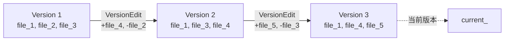
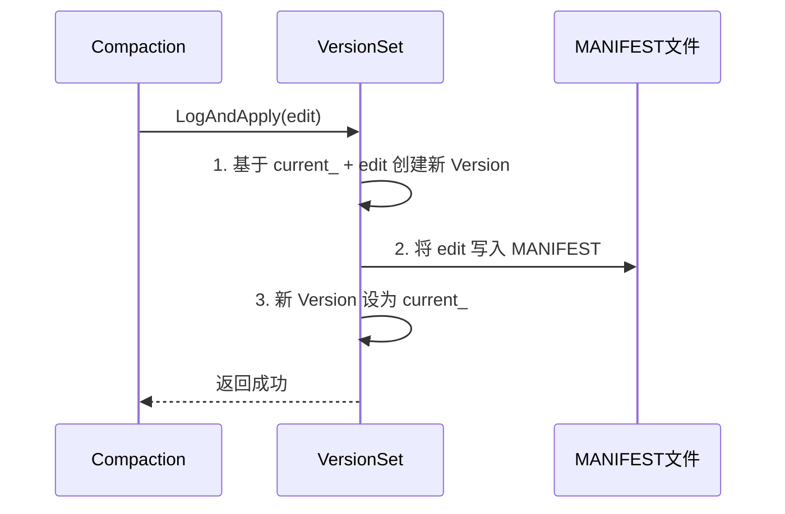
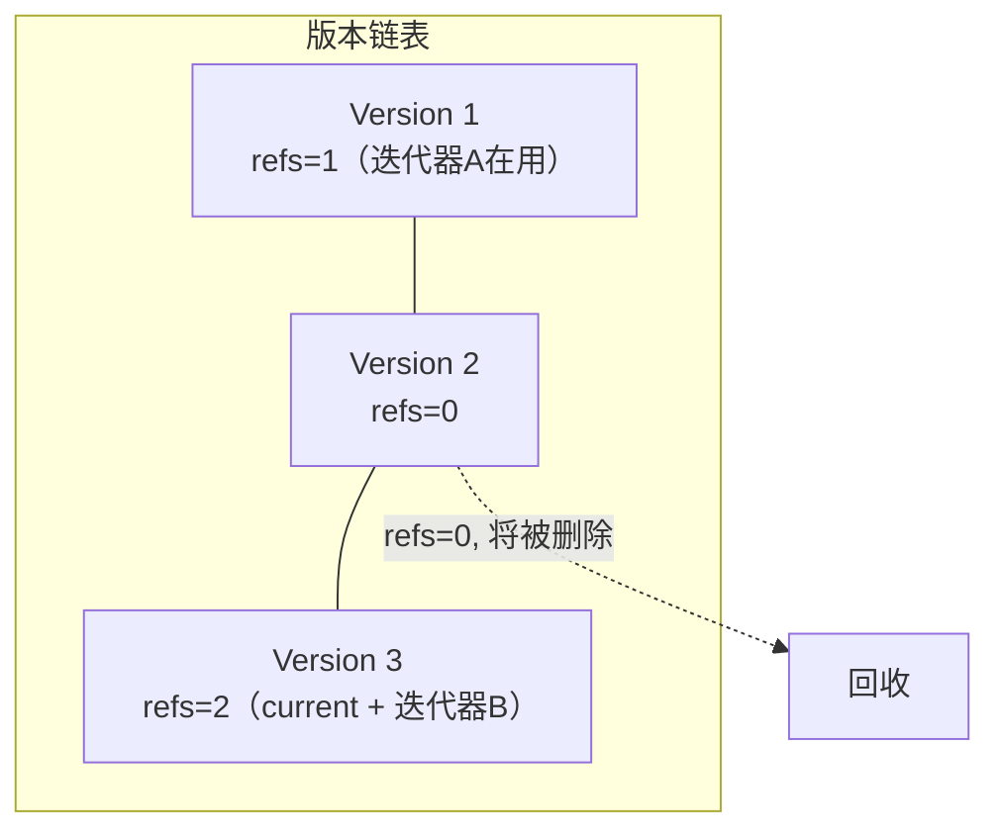
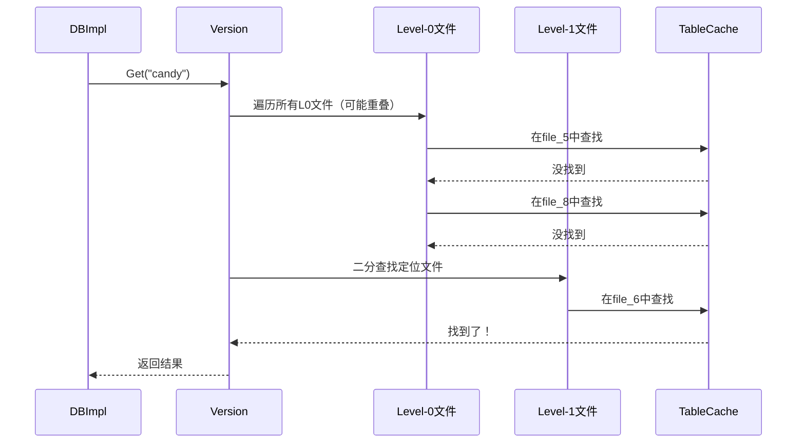
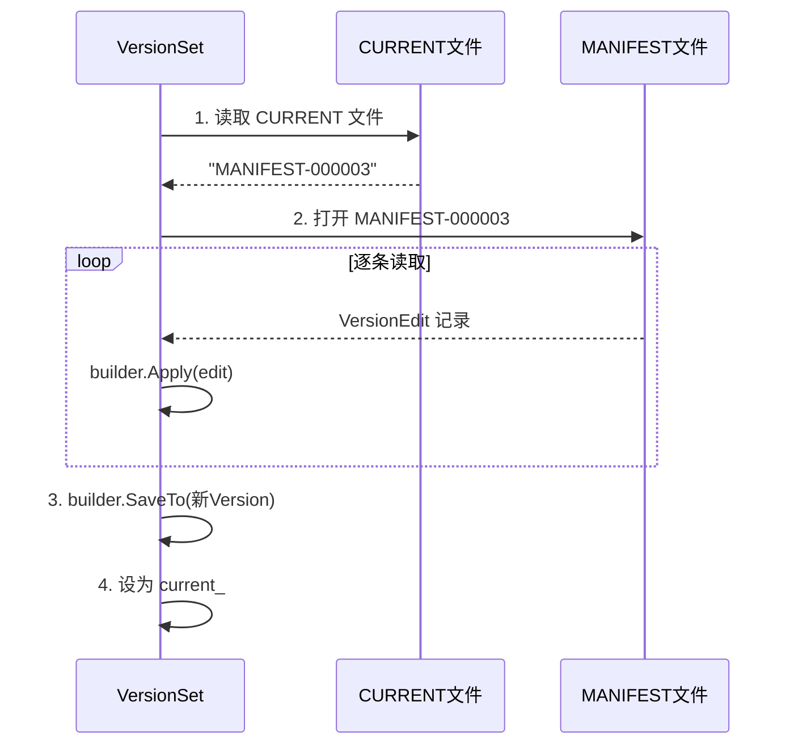
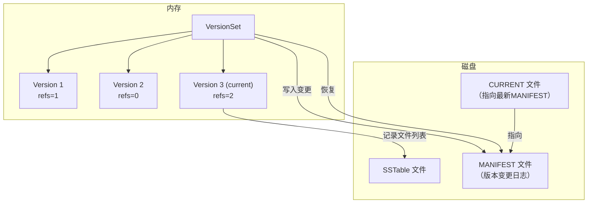
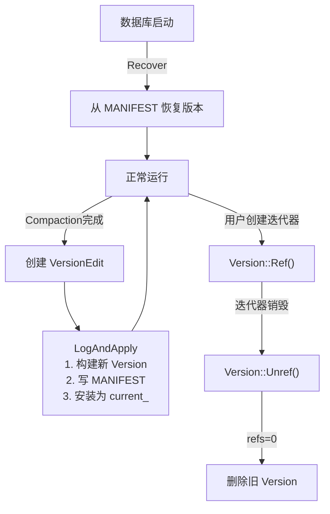

# Chapter 8: 版本管理 (Version / VersionSet)

在上一章 [LRU 缓存 (Cache)](07_lru_缓存__cache.md) 中，我们学习了如何用缓存加速磁盘读取。但还有一个根本问题没有解决——随着数据不断写入，SSTable 文件不断产生和删除，**数据库怎么知道当前有哪些文件是有效的？**

本章，我们来认识 LevelDB 的"档案管理员"——**版本管理系统**。

## 为什么需要版本管理？

假设你的数据库正在运行，磁盘上有这些 SSTable 文件：

```
Level-0: file_5.ldb, file_8.ldb
Level-1: file_2.ldb, file_3.ldb, file_6.ldb
Level-2: file_1.ldb, file_4.ldb
```

现在，后台 [压缩合并 (Compaction)](09_压缩合并__compaction.md) 完成了一次合并：把 Level-1 的 `file_3.ldb` 和 Level-2 的 `file_4.ldb` 合并成了新的 `file_9.ldb`。压缩完成后：

```
旧文件 file_3.ldb 和 file_4.ldb 应该被删除
新文件 file_9.ldb 应该出现在 Level-2
```

但是！如果有一个用户正在用迭代器遍历数据，他可能正在读 `file_3.ldb`。**此时能删除它吗？** 不能！

这就是版本管理要解决的核心问题：
1. **记录**每一层有哪些 SSTable 文件
2. **安全地**在压缩后添加/删除文件
3. **保护**正在被读取的旧文件不被删除
4. **持久化**文件变更记录，重启后能恢复

## Git 版本管理的比喻

版本管理系统就像 **Git**：

| Git 概念 | LevelDB 概念 | 说明 |
|----------|-------------|------|
| 一次提交（commit） | **Version** | 某一时刻数据库文件的"快照" |
| 提交历史 | **VersionSet** | 管理所有 Version 的链表 |
| diff（差异） | **VersionEdit** | 两个版本之间的文件增删变化 |
| `.git` 目录 | **MANIFEST 文件** | 把版本变更持久化到磁盘 |



每次 Compaction 完成后，就像一次 Git 提交——产生一个新版本。旧版本如果还有人在"查看"（迭代器在使用），就不能删除。

## 三个核心角色

### 1. Version —— "快照"

一个 `Version` 对象记录了**某一时刻每一层有哪些 SSTable 文件**。

```c++
// db/version_set.h（简化）
class Version {
  std::vector<FileMetaData*> files_[config::kNumLevels];
  int refs_;           // 引用计数
  Version* next_;      // 链表：下一个版本
  Version* prev_;      // 链表：上一个版本
};
```

`files_[level]` 是一个数组，每个元素存储该层的所有文件信息。`refs_` 是引用计数——有人在用就不能删。

### 2. VersionEdit —— "差异"

`VersionEdit` 描述了两个版本之间的**差别**：新增了哪些文件，删除了哪些文件。

```c++
// db/version_edit.h（简化）
class VersionEdit {
  DeletedFileSet deleted_files_;   // 要删除的文件
  std::vector<std::pair<int, FileMetaData>> new_files_; // 新增的文件
  // 还有日志号、序列号等元数据...
};
```

就像 Git 的 diff，只记录"变化"，不记录完整状态。

### 3. VersionSet —— "版本仓库"

`VersionSet` 管理所有 Version 的双向链表，并负责持久化。

```c++
// db/version_set.h（简化）
class VersionSet {
  Version dummy_versions_;  // 链表哨兵节点
  Version* current_;        // 当前最新版本
  WritableFile* descriptor_file_;  // MANIFEST 文件
  log::Writer* descriptor_log_;    // MANIFEST 写入器
};
```

`current_` 始终指向最新的版本。所有版本形成一个双向循环链表。

## 文件元数据：FileMetaData

每个 SSTable 文件在版本中用 `FileMetaData` 来描述：

```c++
// db/version_edit.h
struct FileMetaData {
  int refs;              // 引用计数
  uint64_t number;       // 文件编号
  uint64_t file_size;    // 文件大小
  InternalKey smallest;  // 最小 key
  InternalKey largest;   // 最大 key
  int allowed_seeks;     // 还允许多少次 seek 后触发压缩
};
```

`smallest` 和 `largest` 记录了文件中 key 的范围——这样查找时可以快速判断 key 是否可能在这个文件中，不用真的打开文件。

## 核心用例：Compaction 后更新版本

让我们用一个完整的例子，走一遍版本管理的核心流程。

**场景**：后台 Compaction 完成，需要删除旧文件 `file_3`、添加新文件 `file_9`。

### 第一步：构造 VersionEdit

```c++
VersionEdit edit;
edit.RemoveFile(1, 3);  // 从 Level-1 删除 file_3
edit.AddFile(2, 9, file_size,
             smallest_key, largest_key); // 在 Level-2 添加 file_9
```

`RemoveFile` 和 `AddFile` 只是在 edit 中记录变更，还没有真正生效。

### 第二步：应用变更

```c++
Status s = versions_->LogAndApply(&edit, &mutex_);
```

`LogAndApply` 是版本管理的核心方法——它会：
1. 基于当前版本 + 变更，创建新版本
2. 把变更写入 MANIFEST 文件（持久化）
3. 把新版本设为当前版本

### 完整流程



## LogAndApply：版本更新的核心

让我们深入 `LogAndApply` 的实现，看看新版本是怎么被"生产"出来的。

### 第一步：构建新版本

```c++
// db/version_set.cc（简化）
Status VersionSet::LogAndApply(VersionEdit* edit,
                                port::Mutex* mu) {
  // 填充默认值
  edit->SetNextFile(next_file_number_);
  edit->SetLastSequence(last_sequence_);
```

先把一些必要的元数据（下一个文件编号、最新序列号）填入 edit。

```c++
  // 创建新版本
  Version* v = new Version(this);
  {
    Builder builder(this, current_);
    builder.Apply(edit);    // 应用变更
    builder.SaveTo(v);      // 生成新版本
  }
  Finalize(v);  // 计算下次压缩的最佳层级
```

`Builder` 是一个辅助类，它的作用是：把当前版本的文件列表，加上 edit 中的增删，合并成新版本的文件列表。`Finalize` 会计算每层的"压缩分数"，决定下次该压缩哪一层。

### 第二步：写入 MANIFEST 文件

```c++
  mu->Unlock();  // 解锁，让其他操作不被阻塞
  // 将变更序列化并写入 MANIFEST
  std::string record;
  edit->EncodeTo(&record);
  s = descriptor_log_->AddRecord(record);
  if (s.ok()) {
    s = descriptor_file_->Sync();  // 刷盘
  }
  mu->Lock();
```

MANIFEST 文件使用和 [预写日志 (Write-Ahead Log)](02_预写日志__write_ahead_log.md) 相同的格式——`log::Writer` 来写入。每次版本变更就追加一条记录。

### 第三步：安装新版本

```c++
  if (s.ok()) {
    AppendVersion(v);  // 把新版本加入链表，设为 current_
    log_number_ = edit->log_number_;
  } else {
    delete v;  // 失败了，丢弃新版本
  }
  return s;
}
```

写入 MANIFEST 成功后，才把新版本安装为当前版本。如果写 MANIFEST 失败，旧版本不受影响——这保证了**原子性**。

## Builder：版本的"施工队"

`Builder` 负责把 `VersionEdit` 中的增删操作应用到基础版本上，生成新版本。

### Apply：记录变更

```c++
// db/version_set.cc（简化）
void Builder::Apply(const VersionEdit* edit) {
  // 记录要删除的文件
  for (const auto& deleted : edit->deleted_files_) {
    levels_[deleted.first].deleted_files.insert(deleted.second);
  }
  // 记录要新增的文件
  for (const auto& new_file : edit->new_files_) {
    FileMetaData* f = new FileMetaData(new_file.second);
    levels_[new_file.first].added_files->insert(f);
  }
}
```

`Apply` 只是在内部数据结构中记录变更，还没有生成最终的文件列表。

### SaveTo：合并生成新版本

```c++
// db/version_set.cc（简化）
void Builder::SaveTo(Version* v) {
  for (int level = 0; level < kNumLevels; level++) {
    // 合并基础版本的文件 + 新增文件
    // 跳过被删除的文件
    // 结果存入 v->files_[level]
  }
}
```

`SaveTo` 像一个**归并排序**：把基础版本的文件列表和新增文件按 key 范围有序合并，同时过滤掉被删除的文件。最终结果就是新版本的完整文件列表。

用一个具体例子说明：

```
基础版本 Level-1: [file_2, file_3, file_6]
edit: 删除 file_3, 新增 file_7
─────────────────────────────────────────
新版本 Level-1:   [file_2, file_6, file_7]
```

## AppendVersion：安装新版本

```c++
// db/version_set.cc
void VersionSet::AppendVersion(Version* v) {
  if (current_ != nullptr) {
    current_->Unref();  // 旧版本引用计数减一
  }
  current_ = v;
  v->Ref();  // 新版本引用计数加一
  // 插入双向链表
  v->prev_ = dummy_versions_.prev_;
  v->next_ = &dummy_versions_;
  v->prev_->next_ = v;
  v->next_->prev_ = v;
}
```

新版本被加入双向循环链表的末尾，并设为 `current_`。旧版本仍在链表中——只要有迭代器还在引用它，就不会被删除。

## 版本的引用计数：谁在用就不删

Version 的生命周期由引用计数管理，跟 [内存表 (MemTable)](03_内存表__memtable.md) 类似：

```c++
void Version::Ref() { ++refs_; }

void Version::Unref() {
  --refs_;
  if (refs_ == 0) {
    delete this;  // 没人用了，释放
  }
}
```

当用户创建一个迭代器时，会对当前 Version 执行 `Ref()`。迭代器销毁时，会执行 `Unref()`。这样就保证了：**只要有迭代器在读取，对应的版本和其引用的文件就不会被删除。**



Version 2 没有引用了，会被自动删除。Version 1 虽然不是最新的，但迭代器A还在用，所以保留。

## Version::Get：在版本中查找数据

Version 不仅记录文件，还提供查找功能。当 `DBImpl::Get` 查询磁盘文件时，实际调用的是当前 Version 的 `Get` 方法。

### 查找策略



### Level-0 的特殊处理

Level-0 的文件 key 范围可能重叠（因为直接从 MemTable 刷写），所以必须**全部检查**，从新到旧：

```c++
// db/version_set.cc（简化）
// 收集 Level-0 中所有范围包含 user_key 的文件
for (uint32_t i = 0; i < files_[0].size(); i++) {
  FileMetaData* f = files_[0][i];
  if (user_key >= f->smallest && user_key <= f->largest) {
    tmp.push_back(f);
  }
}
// 按文件编号从大到小排序（新文件优先）
std::sort(tmp.begin(), tmp.end(), NewestFirst);
```

新文件编号更大，所以先查新文件——如果找到了就不用看旧文件了。

### Level-1+ 的二分查找

Level-1 及以上的文件 key 范围**不重叠**且有序排列，可以用二分查找快速定位：

```c++
// db/version_set.cc
int FindFile(const InternalKeyComparator& icmp,
    const std::vector<FileMetaData*>& files,
    const Slice& key) {
  uint32_t left = 0;
  uint32_t right = files.size();
  while (left < right) {
    uint32_t mid = (left + right) / 2;
    if (files[mid]->largest < key) {
      left = mid + 1;
    } else {
      right = mid;
    }
  }
  return right;
}
```

这个函数找到第一个 `largest >= key` 的文件——key 如果存在，就一定在这个文件中。

### 通过 TableCache 查找

定位到文件后，通过 [LRU 缓存 (Cache)](07_lru_缓存__cache.md) 中介绍的 `TableCache` 进行实际查找：

```c++
// db/version_set.cc（简化）
state.s = state.vset->table_cache_->Get(
    *state.options, f->number, f->file_size,
    state.ikey, &state.saver, SaveValue);
```

`TableCache::Get` 会打开对应的 SSTable 文件（可能从缓存取），然后在其中查找目标 key。

## VersionEdit 的持久化：MANIFEST 文件

版本变更需要写入磁盘，这样重启后才能恢复。MANIFEST 文件就是版本变更的**日志**。

### VersionEdit 的编码

VersionEdit 被编码为一串带标签的字段：

```c++
// db/version_edit.cc（简化）
void VersionEdit::EncodeTo(std::string* dst) const {
  if (has_log_number_) {
    PutVarint32(dst, kLogNumber);
    PutVarint64(dst, log_number_);
  }
  // 编码删除的文件
  for (const auto& del : deleted_files_) {
    PutVarint32(dst, kDeletedFile);
    PutVarint32(dst, del.first);   // level
    PutVarint64(dst, del.second);  // 文件编号
  }
  // 编码新增的文件
  for (const auto& nf : new_files_) {
    PutVarint32(dst, kNewFile);
    PutVarint32(dst, nf.first);   // level
    PutVarint64(dst, nf.second.number);
    PutVarint64(dst, nf.second.file_size);
    // ... smallest, largest
  }
}
```

每个字段前面有一个**标签号**（Tag），读取时根据标签号决定怎么解析。这种格式灵活且可扩展。

### MANIFEST 的整体结构

```
MANIFEST 文件：
  记录1: 完整快照（所有文件信息）   ← 首次创建时
  记录2: VersionEdit（+file_5）    ← 第一次压缩后
  记录3: VersionEdit（-file_3, +file_9） ← 第二次压缩后
  记录4: VersionEdit（+file_10）   ← 第三次压缩后
  ...
```

第一条记录是数据库的完整快照，后续都是增量变更。重启恢复时，先读快照再逐条回放变更，就能重建最新版本。

## Recover：从 MANIFEST 恢复

数据库重启时，需要从 MANIFEST 文件恢复版本信息。

### 恢复流程



### 代码实现

```c++
// db/version_set.cc（简化）
Status VersionSet::Recover(bool* save_manifest) {
  // 1. 读取 CURRENT 文件，找到 MANIFEST 文件名
  std::string current;
  ReadFileToString(env_, CurrentFileName(dbname_), &current);
```

CURRENT 是一个纯文本文件，内容就一行——当前 MANIFEST 文件的名字。

```c++
  // 2. 打开 MANIFEST 文件，逐条读取
  Builder builder(this, current_);
  log::Reader reader(file, &reporter, true, 0);
  while (reader.ReadRecord(&record, &scratch)) {
    VersionEdit edit;
    edit.DecodeFrom(record);
    builder.Apply(&edit);  // 累积所有变更
  }
```

用 `log::Reader`（和 WAL 相同的格式）逐条读取 VersionEdit，全部应用到 Builder 中。

```c++
  // 3. 生成恢复后的版本
  Version* v = new Version(this);
  builder.SaveTo(v);
  Finalize(v);
  AppendVersion(v);  // 设为当前版本
```

所有变更累积完毕后，Builder 一次性生成最终版本。这比每条 edit 都创建一个 Version 高效得多。

## Finalize：决定下次压缩哪一层

每次新版本创建后，`Finalize` 会计算每层的"压缩分数"：

```c++
// db/version_set.cc（简化）
void VersionSet::Finalize(Version* v) {
  int best_level = -1;
  double best_score = -1;
  for (int level = 0; level < kNumLevels - 1; level++) {
    double score;
    if (level == 0) {
      // Level-0 按文件数量计分
      score = v->files_[level].size() / 4.0;
    } else {
      // 其他层按总字节数计分
      score = TotalFileSize(v->files_[level])
              / MaxBytesForLevel(options_, level);
    }
    if (score > best_score) {
      best_level = level;
      best_score = score;
    }
  }
  v->compaction_level_ = best_level;
  v->compaction_score_ = best_score;
}
```

- **Level-0**：文件数超过 4 个就需要压缩（因为文件可能重叠，太多会拖慢读取）
- **Level-1+**：总大小超过阈值就需要压缩（Level-1 是 10MB，Level-2 是 100MB，每层 ×10）

`compaction_score_ >= 1` 说明该层"满了"，需要压缩。

## Version 的迭代器：AddIterators

在 [迭代器体系 (Iterator)](06_迭代器体系__iterator.md) 中，我们提到 MergingIterator 需要来自磁盘各层的子迭代器。这些子迭代器就是由 Version 提供的：

```c++
// db/version_set.cc（简化）
void Version::AddIterators(const ReadOptions& options,
    std::vector<Iterator*>* iters) {
  // Level-0: 每个文件一个迭代器（可能重叠）
  for (auto* f : files_[0]) {
    iters->push_back(
        vset_->table_cache_->NewIterator(
            options, f->number, f->file_size));
  }
  // Level-1+: 每层一个连接迭代器
  for (int level = 1; level < kNumLevels; level++) {
    if (!files_[level].empty()) {
      iters->push_back(
          NewConcatenatingIterator(options, level));
    }
  }
}
```

Level-0 的文件可能重叠，所以每个文件单独一个迭代器，由 MergingIterator 来归并。Level-1+ 的文件不重叠，可以用 `TwoLevelIterator` 把一整层当作一个连续序列来遍历——更高效。

## seek 触发的压缩

Version 还有一个巧妙的机制：**追踪 seek 次数来触发压缩**。

```c++
// db/version_set.cc
bool Version::UpdateStats(const GetStats& stats) {
  FileMetaData* f = stats.seek_file;
  if (f != nullptr) {
    f->allowed_seeks--;
    if (f->allowed_seeks <= 0 &&
        file_to_compact_ == nullptr) {
      file_to_compact_ = f;
      file_to_compact_level_ = stats.seek_file_level;
      return true;  // 需要压缩！
    }
  }
  return false;
}
```

每次 `Get` 查找时，如果一个文件被 seek 但最终在另一个文件中找到了数据，这个文件的 `allowed_seeks` 就减一。当减到零时，说明这个文件经常被"白白查找"——触发压缩可以减少无效 I/O。

## 整体架构图

让我们把所有组件串联起来：



## 版本管理的生命周期

用一张流程图总结版本管理的完整生命周期：



## 总结

在本章中，我们学习了：

1. **Version**：数据库在某一时刻的"快照"，记录每一层有哪些 SSTable 文件
2. **VersionEdit**：描述两个版本之间的差异——新增和删除了哪些文件
3. **VersionSet**：管理所有 Version 的双向链表，通过 MANIFEST 文件持久化
4. **LogAndApply**：核心方法——构建新版本、写 MANIFEST、安装为 current_，保证原子性
5. **引用计数**：正在被迭代器使用的旧版本不会被删除，保证读取一致性
6. **Finalize**：计算每层的压缩分数，决定下次该压缩哪一层
7. **Recover**：重启时从 CURRENT → MANIFEST 重建版本信息

版本管理解决了"知道当前有哪些文件"的问题。但是，随着数据不断写入，文件越来越多，每层越来越满——怎么办？那就需要**压缩合并**了。在下一章 [压缩合并 (Compaction)](09_压缩合并__compaction.md) 中，我们将了解 LevelDB 是如何通过合并文件来保持数据库的健康和高效！

---

Generated by [AI Codebase Knowledge Builder](https://github.com/The-Pocket/Tutorial-Codebase-Knowledge)