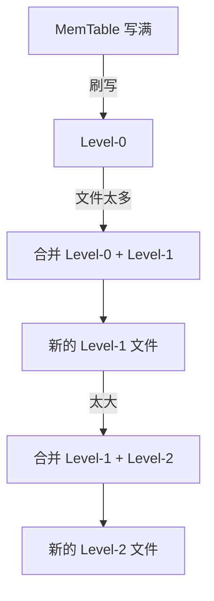
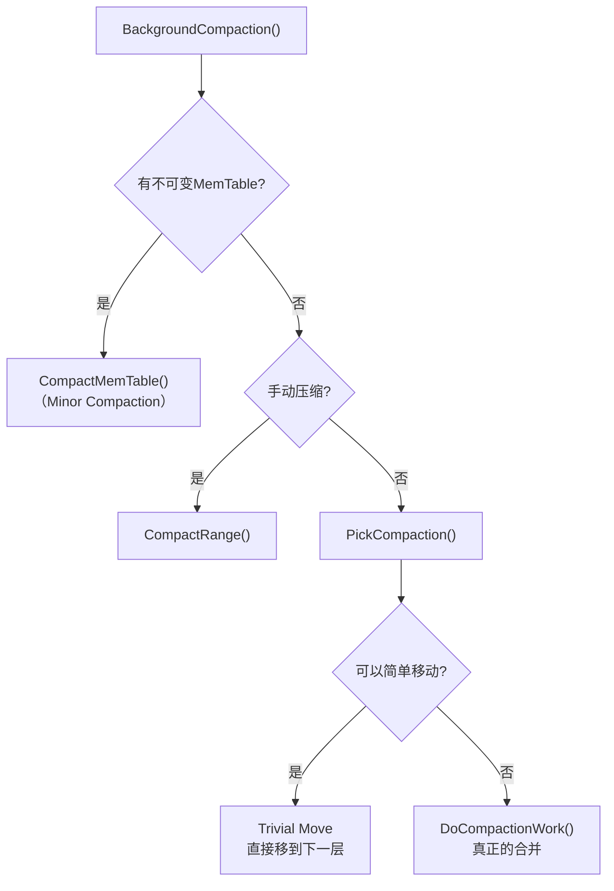
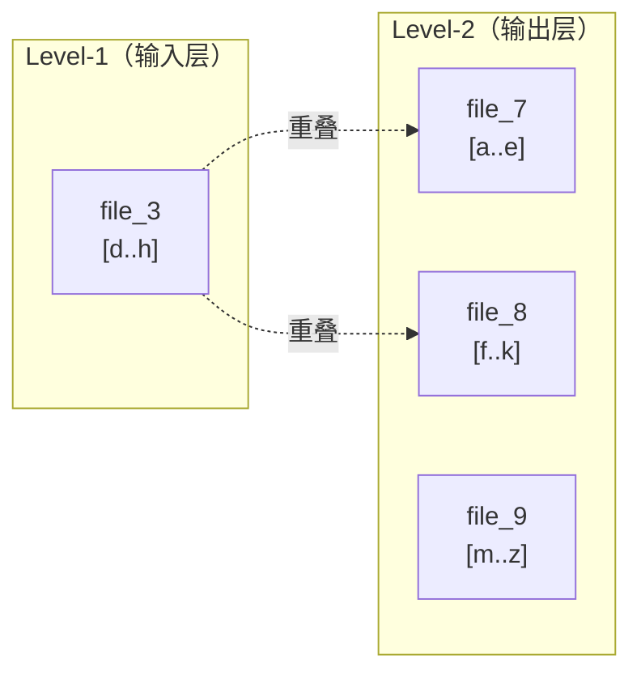
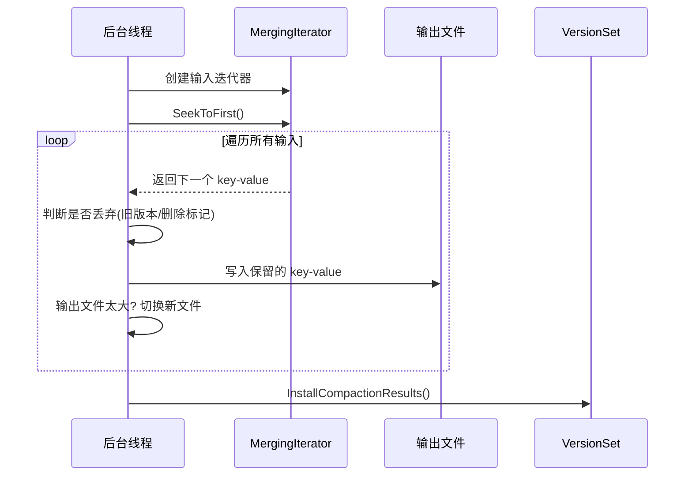
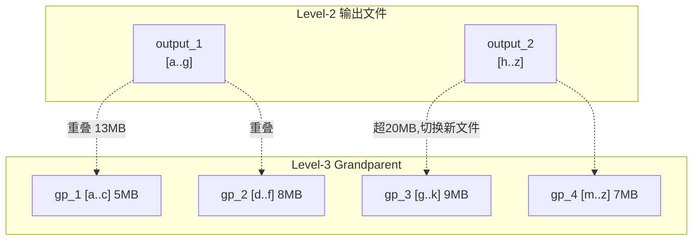
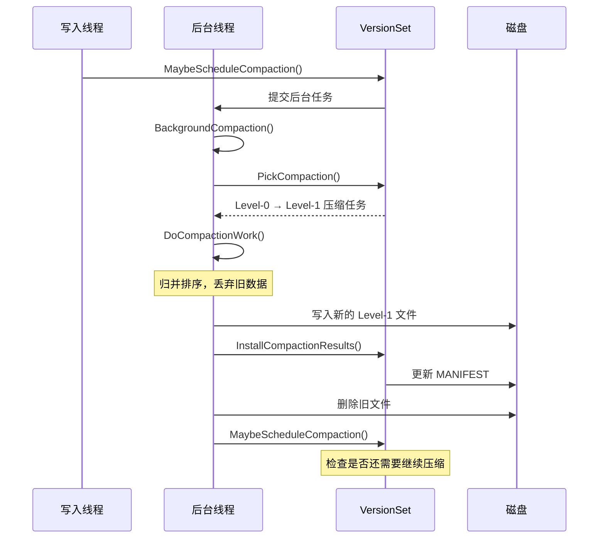

# Chapter 9: 压缩合并 (Compaction)

在上一章 [版本管理 (Version / VersionSet)](08_版本管理__version___versionset.md) 中，我们学习了 LevelDB 如何追踪每一层有哪些 SSTable 文件，以及如何通过 `Finalize` 计算每层的"压缩分数"。当分数 >= 1 时，就说明这一层"满了"。那满了之后该怎么办呢？

答案就是：**压缩合并（Compaction）**——LevelDB 的"后台清洁工"。

## 解决什么问题？

假设你的应用不断写入数据：

```
db->Put("alice", "V1");
db->Put("bob",   "设计师");
db->Delete("alice");         // 删除 alice
db->Put("alice", "V2");      // 又写入新的 alice
```

随着时间推移，问题越来越多：

1. **文件堆积**：MemTable 不断刷写成 Level-0 文件，Level-0 的文件越来越多
2. **冗余数据**：`"alice"` 有旧版本 V1、删除标记、新版本 V2——三份数据只需要保留 V2
3. **读取变慢**：Level-0 文件可能互相重叠，查询一个 key 可能需要查很多个文件

Compaction 就是来解决这些问题的——**定期整理，合并文件，丢弃垃圾。**

## 整理书架的比喻

把 LevelDB 的层级结构想象成一个**多层书架**：

```
Level-0:  散乱的笔记本（可能有重叠内容）
Level-1:  整理好的小册子（每本内容不重叠，总共10MB）
Level-2:  合订本（100MB）
Level-3:  大百科全书（1000MB）
...
```

- **书桌满了**（MemTable 写满）→ 把笔记本放到 Level-0 书架上
- **Level-0 笔记本太多**（超过4本）→ 把它们和 Level-1 的小册子**合并**，生成新的小册子
- **Level-1 太大**（超过10MB）→ 把部分小册子和 Level-2 的合订本**合并**

Compaction 就像定期整理书架——扔掉重复的页面、撕掉划掉的内容、把散乱的资料合并成整齐的分册。



## 两种压缩合并

LevelDB 有两种 Compaction，对应"小整理"和"大整理"：

| 类型 | 触发条件 | 做什么 |
|------|---------|--------|
| **Minor Compaction** | MemTable 写满（4MB） | 把不可变 MemTable 刷写成 Level-0 SSTable |
| **Major Compaction** | 某层文件过多或过大 | 合并 Level-L 和 Level-(L+1) 的文件 |

Minor Compaction 很简单——我们在前面章节已经见过。本章重点讲解 **Major Compaction**。

## 什么时候触发 Compaction？

Compaction 由三种情况触发：

### 1. 容量触发（size compaction）

在 [版本管理 (Version / VersionSet)](08_版本管理__version___versionset.md) 中，`Finalize` 计算每层的压缩分数：

```c++
// Level-0: 按文件数量
score = 文件数 / 4.0;
// Level-1+: 按总大小
score = 总字节数 / 该层上限;
```

当 `score >= 1` 时，说明该层需要压缩。

### 2. Seek 触发（seek compaction）

如果一个文件被反复"白白查找"（seek 了但数据在别的文件里），`allowed_seeks` 减到 0 后也会触发压缩。

### 3. 手动触发

用户调用 `db->CompactRange()` 可以手动触发指定范围的压缩。

## 总调度入口：MaybeScheduleCompaction

所有 Compaction 的起点都是这个方法：

```c++
// db/db_impl.cc
void DBImpl::MaybeScheduleCompaction() {
  if (background_compaction_scheduled_) return; // 已有任务
  if (shutting_down_) return;                    // 正在关闭
  if (!bg_error_.ok()) return;                   // 有错误
  if (imm_ == nullptr && !versions_->NeedsCompaction())
    return;  // 没活干
  background_compaction_scheduled_ = true;
  env_->Schedule(&DBImpl::BGWork, this); // 提交后台任务
}
```

它检查是否需要压缩，如果需要就向 [环境抽象层 (Env)](10_环境抽象层__env.md) 提交一个后台任务。

## BackgroundCompaction：后台调度中心

后台线程执行 `BackgroundCompaction`，它负责决定"干什么活"：



对应的核心代码：

```c++
// db/db_impl.cc（简化）
void DBImpl::BackgroundCompaction() {
  if (imm_ != nullptr) {
    CompactMemTable();  // 优先处理 Minor Compaction
    return;
  }
  Compaction* c = versions_->PickCompaction();
```

**Minor Compaction 优先级最高**——如果有写满的 MemTable 等着刷盘，先处理它。否则调用 `PickCompaction` 选择一次 Major Compaction。

## PickCompaction：选择谁来合并

这是 Major Compaction 的第一步——决定从哪个层选哪些文件来合并。

```c++
// db/version_set.cc（简化）
Compaction* VersionSet::PickCompaction() {
  const bool size_compaction =
      (current_->compaction_score_ >= 1);
  const bool seek_compaction =
      (current_->file_to_compact_ != nullptr);
```

优先处理容量触发的压缩，其次是 seek 触发的。

### 容量触发的选文件策略

```c++
  if (size_compaction) {
    level = current_->compaction_level_;
    c = new Compaction(options_, level);
    // 轮转选择：从上次压缩结束的 key 之后开始
    for (auto* f : current_->files_[level]) {
      if (compact_pointer_[level].empty() ||
          icmp_.Compare(f->largest.Encode(),
                        compact_pointer_[level]) > 0) {
        c->inputs_[0].push_back(f);
        break;
      }
    }
    // 如果没找到，从头开始（回绕）
    if (c->inputs_[0].empty()) {
      c->inputs_[0].push_back(current_->files_[level][0]);
    }
  }
```

有一个精巧的设计：**轮转选择**。每层记录上次压缩到哪个 key 了（`compact_pointer_`），下次从那之后开始。这样所有文件都能"雨露均沾"。

### Level-0 的特殊处理

Level-0 的文件可能互相重叠，所以选中一个文件后，要把所有重叠的 Level-0 文件也拉进来：

```c++
  if (level == 0) {
    InternalKey smallest, largest;
    GetRange(c->inputs_[0], &smallest, &largest);
    current_->GetOverlappingInputs(
        0, &smallest, &largest, &c->inputs_[0]);
  }
```

比如选了文件 A（范围 `[a, f]`），发现文件 B（范围 `[c, h]`）和它重叠，那 B 也要加入。B 加入后范围扩大到 `[a, h]`，可能又和文件 C 重叠——所以 `GetOverlappingInputs` 会不断扩展直到没有新的重叠。

## SetupOtherInputs：找下一层的"对手"

选好了 Level-L 的输入文件后，还要找出 Level-(L+1) 中**所有**和它们范围重叠的文件。



在这个例子中，Level-1 的 file_3（范围 `[d..h]`）与 Level-2 的 file_7（`[a..e]`）和 file_8（`[f..k]`）都有重叠，所以它们都是压缩的输入。file_9 不重叠，不参与。

```c++
// db/version_set.cc（简化）
void VersionSet::SetupOtherInputs(Compaction* c) {
  GetRange(c->inputs_[0], &smallest, &largest);
  // 找到 Level-(L+1) 中所有重叠文件
  current_->GetOverlappingInputs(
      level + 1, &smallest, &largest, &c->inputs_[1]);
```

### 扩展优化

LevelDB 还会尝试**扩展** Level-L 的输入：如果能多加几个 Level-L 文件而不增加 Level-(L+1) 的文件数，就值得一试——这样一次合并可以处理更多数据。

```c++
  // 尝试扩展 Level-L 的输入
  if (expanded0.size() > c->inputs_[0].size() &&
      inputs1_size + expanded0_size <
          ExpandedCompactionByteSizeLimit(options_)) {
    // 扩展后 L+1 层文件数不变，值得扩展！
    c->inputs_[0] = expanded0;
  }
```

但有个上限：总输入不能超过 25 倍目标文件大小（默认 50MB），防止一次合并做太多工作。

### 记录 Grandparent 重叠

```c++
  // 记录 Level-(L+2) 的重叠文件
  if (level + 2 < config::kNumLevels) {
    current_->GetOverlappingInputs(
        level + 2, &all_start, &all_limit,
        &c->grandparents_);
  }
  // 更新轮转指针
  compact_pointer_[level] = largest.Encode().ToString();
```

为什么要关心"孙子层"？因为输出文件如果跨越太多 Level-(L+2) 文件，下次合并那个输出文件时就会很辛苦。所以需要限制——后面会详细介绍。

## Trivial Move：简单移动

有一种特殊的优化场景——**直接移动文件到下一层**，不需要任何合并：

```c++
// db/db_impl.cc（简化）
if (!is_manual && c->IsTrivialMove()) {
  FileMetaData* f = c->input(0, 0);
  c->edit()->RemoveFile(c->level(), f->number);
  c->edit()->AddFile(c->level() + 1,
      f->number, f->file_size,
      f->smallest, f->largest);
  versions_->LogAndApply(c->edit(), &mutex_);
}
```

条件是：Level-L 只有一个文件，Level-(L+1) 没有重叠文件，且 grandparent 重叠不大。

```c++
// db/version_set.cc
bool Compaction::IsTrivialMove() const {
  return (num_input_files(0) == 1 &&
          num_input_files(1) == 0 &&
          TotalFileSize(grandparents_) <=
              MaxGrandParentOverlapBytes(vset->options_));
}
```

这就像搬书时发现这本书可以直接放到下一层书架，不需要拆开重新整理——零成本！只需要修改 [版本管理 (Version / VersionSet)](08_版本管理__version___versionset.md) 中的元数据即可。

## DoCompactionWork：真正的合并

如果不能 Trivial Move，就要进行真正的**归并排序合并**。这是 Compaction 最核心的逻辑。

### 整体流程



### 创建输入迭代器

合并的第一步是创建一个 [迭代器体系 (Iterator)](06_迭代器体系__iterator.md) 来统一读取所有输入文件：

```c++
// db/version_set.cc（简化）
Iterator* VersionSet::MakeInputIterator(Compaction* c) {
  // Level-0: 每个文件一个迭代器（可能重叠）
  // Level-1+: 用 TwoLevelIterator
  if (c->level() + which == 0) {
    // 每个 Level-0 文件单独创建迭代器
    for (auto* f : files)
      list[num++] = table_cache_->NewIterator(...);
  } else {
    // 非 Level-0 用连接迭代器
    list[num++] = NewTwoLevelIterator(...);
  }
  return NewMergingIterator(&icmp_, list, num);
}
```

所有输入文件的数据通过 MergingIterator 归并成一个**全局有序**的流——然后逐条遍历。

### 核心循环：遍历 + 判断 + 输出

```c++
// db/db_impl.cc（简化）
input->SeekToFirst();
while (input->Valid() && !shutting_down_) {
  // 优先处理 MemTable 刷盘
  if (has_imm_) {
    CompactMemTable();
  }
```

合并过程中，如果有新的 MemTable 等着刷盘，会**暂停合并去处理**——写入操作优先级更高。

### 判断 key 是否应该丢弃

这是 Compaction 最精华的部分——**垃圾回收逻辑**。

```c++
  bool drop = false;
  if (!has_current_user_key ||
      user_comparator()->Compare(
          ikey.user_key, current_user_key) != 0) {
    // 这是一个新的 user key 的第一次出现
    current_user_key = ikey.user_key;
    last_sequence_for_key = kMaxSequenceNumber;
  }
```

对于每个 user key，跟踪它是否是"第一次出现"。由于输入是有序的，同一个 key 的所有版本是连续的，最新的在前面。

```c++
  if (last_sequence_for_key <= compact->smallest_snapshot) {
    drop = true;  // 被更新版本覆盖，可以丢弃
  }
```

**规则一**：如果同一个 key 已经有更新的版本被保留了，旧版本可以丢弃。

```c++
  else if (ikey.type == kTypeDeletion &&
           ikey.sequence <= compact->smallest_snapshot &&
           compact->compaction->IsBaseLevelForKey(
               ikey.user_key)) {
    drop = true;  // 删除标记且更高层没有旧数据
  }
```

**规则二**：如果是删除标记，且序列号不被任何快照使用，且更高层级没有这个 key 的数据——那这个删除标记也可以丢弃了。

让我们用一个具体例子说明：

```
输入数据流（有序）:
  alice seq=200 写入 "V2"   → 保留（最新版本）
  alice seq=150 删除         → 丢弃（被 seq=200 覆盖）
  alice seq=100 写入 "V1"   → 丢弃（被 seq=200 覆盖）
  bob   seq=300 删除         → 如果更高层没有 bob，丢弃
  candy seq=250 写入 "音乐家" → 保留

输出结果:
  alice seq=200 写入 "V2"
  candy seq=250 写入 "音乐家"
```

三条关于 `alice` 的记录只保留了最新的一条，`bob` 的删除标记也被清理掉了。这就是 Compaction 的"垃圾回收"效果！

### IsBaseLevelForKey：更高层有没有这个 key？

```c++
// db/version_set.cc
bool Compaction::IsBaseLevelForKey(
    const Slice& user_key) {
  for (int lvl = level_ + 2;
       lvl < config::kNumLevels; lvl++) {
    const auto& files = input_version_->files_[lvl];
    while (level_ptrs_[lvl] < files.size()) {
      FileMetaData* f = files[level_ptrs_[lvl]];
      if (user_key <= f->largest.user_key()) {
        if (user_key >= f->smallest.user_key())
          return false; // 更高层有这个 key！
        break;
      }
      level_ptrs_[lvl]++;
    }
  }
  return true; // 更高层没有，可以安全丢弃
}
```

这个方法检查 Level-(L+2) 到最高层是否还有同名 key。如果有，删除标记就不能丢弃——否则旧数据会"复活"。

注意 `level_ptrs_` 的巧妙用法：由于输入是有序的，每层的检查指针**只前进不后退**，总体复杂度是线性的。

### 写入输出文件

保留下来的 key-value 被写入新的 SSTable 文件：

```c++
  if (!drop) {
    if (compact->builder == nullptr) {
      OpenCompactionOutputFile(compact);
    }
    compact->builder->Add(key, input->value());
    // 输出文件够大了？关闭并开始新文件
    if (compact->builder->FileSize() >=
        compact->compaction->MaxOutputFileSize()) {
      FinishCompactionOutputFile(compact, input);
    }
  }
  input->Next();
```

默认目标文件大小是 2MB。当一个输出文件达到这个大小后，关闭它并开始新文件。

### ShouldStopBefore：Grandparent 限制

还有一个切换输出文件的条件——**Grandparent 重叠限制**：

```c++
// db/version_set.cc
bool Compaction::ShouldStopBefore(
    const Slice& internal_key) {
  while (grandparent_index_ < grandparents_.size() &&
         icmp->Compare(internal_key,
             grandparents_[grandparent_index_]
                 ->largest.Encode()) > 0) {
    if (seen_key_)
      overlapped_bytes_ +=
          grandparents_[grandparent_index_]->file_size;
    grandparent_index_++;
  }
  if (overlapped_bytes_ >
      MaxGrandParentOverlapBytes(vset->options_)) {
    overlapped_bytes_ = 0;
    return true;  // 停！换新文件
  }
  return false;
}
```

如果当前输出文件的 key 范围已经和 Level-(L+2) 超过 20MB（10倍目标文件大小）的文件重叠了，就强制切换新文件。

为什么？想象一下：如果输出了一个 key 范围超大的文件，下次要压缩这个文件时，就需要拉入 Level-(L+2) 的大量文件——那次压缩会**非常昂贵**。提前切断，就是"化整为零"的策略。



## 安装合并结果：InstallCompactionResults

合并完成后，需要将结果记录到 [版本管理 (Version / VersionSet)](08_版本管理__version___versionset.md)：

```c++
// db/db_impl.cc（简化）
Status DBImpl::InstallCompactionResults(
    CompactionState* compact) {
  // 删除所有输入文件
  compact->compaction->AddInputDeletions(
      compact->compaction->edit());
  // 添加所有输出文件到 Level-(L+1)
  for (auto& out : compact->outputs) {
    compact->compaction->edit()->AddFile(
        level + 1, out.number, out.file_size,
        out.smallest, out.largest);
  }
  // 应用版本变更
  return versions_->LogAndApply(
      compact->compaction->edit(), &mutex_);
}
```

通过 `LogAndApply`，旧文件被移除、新文件被添加，一个新的 Version 被安装为当前版本。之后 `RemoveObsoleteFiles()` 会删除不再被任何版本引用的旧文件。

## 完整的 Compaction 生命周期

让我们用一个完整的例子串联所有步骤。

**场景**：Level-0 有 5 个文件（超过阈值 4），触发压缩。



注意最后一步：完成一次 Compaction 后，会再检查一次是否需要新的 Compaction。因为这次合并可能导致 Level-1 变大，触发 Level-1 → Level-2 的压缩——形成**级联效应**。

## Minor Compaction：MemTable 刷盘

虽然 Minor Compaction 比较简单，但它是数据从内存到磁盘的关键通道：

```c++
// db/db_impl.cc（简化）
void DBImpl::CompactMemTable() {
  VersionEdit edit;
  Version* base = versions_->current();
  // 把 imm_ 写成 SSTable 文件
  Status s = WriteLevel0Table(imm_, &edit, base);
  if (s.ok()) {
    // 更新版本
    s = versions_->LogAndApply(&edit, &mutex_);
  }
  if (s.ok()) {
    imm_->Unref();  // 释放不可变 MemTable
    imm_ = nullptr;
    RemoveObsoleteFiles();
  }
}
```

`WriteLevel0Table` 内部调用 `BuildTable`（在 `db/builder.cc` 中），把 MemTable 的迭代器内容写成 [有序表文件 (SSTable / Table)](05_有序表文件__sstable___table.md)。

### PickLevelForMemTableOutput：智能选层

一个有趣的优化：MemTable 刷盘后的文件**不一定放在 Level-0**！

```c++
// db/version_set.cc（简化）
int Version::PickLevelForMemTableOutput(
    const Slice& smallest, const Slice& largest) {
  int level = 0;
  if (!OverlapInLevel(0, &smallest, &largest)) {
    while (level < kMaxMemCompactLevel) {
      if (OverlapInLevel(level + 1, &smallest, &largest))
        break;
      if (GrandparentOverlapTooMuch(level + 2))
        break;
      level++;
    }
  }
  return level;
}
```

如果新文件跟 Level-0 和 Level-1 都不重叠，可以直接放到 Level-2——跳过了两次不必要的 Compaction！但最多跳到 Level-2（`kMaxMemCompactLevel`），避免跳太多层导致后续合并代价过大。

## 写入流控：背压机制

Compaction 是后台进行的，但如果写入速度远快于合并速度怎么办？LevelDB 有一套**背压机制**：

```c++
// db/db_impl.cc MakeRoomForWrite()（简化）
if (versions_->NumLevelFiles(0) >=
    kL0_SlowdownWritesTrigger) {  // 8个文件
  // 每次写入延迟 1ms，减速！
  env_->SleepForMicroseconds(1000);
}
else if (versions_->NumLevelFiles(0) >=
    kL0_StopWritesTrigger) {      // 12个文件
  // 完全停止写入，等待压缩完成！
  background_work_finished_signal_.Wait();
}
```

| Level-0 文件数 | 动作 |
|---------------|------|
| < 4 | 正常写入 |
| 4~7 | 触发 Compaction |
| 8~11 | **减速**：每次写入延迟 1ms |
| >= 12 | **停写**：完全暂停，等待合并完成 |

这就像高速公路上车太多时，先限速（减速），再严重就禁止上高速（停写），等路上的车跑完一些（合并完成）再放行。

## 各层容量的层级设计

层级之间的大小比例是精心设计的：

```
Level-0: 4个文件（约4MB）
Level-1: 10MB
Level-2: 100MB
Level-3: 1000MB（1GB）
Level-4: 10GB
Level-5: 100GB
Level-6: 1TB
```

每层是上一层的 10 倍。这个设计保证了：
- **写放大**可控：每条数据最多被合并约 10 次（每次经过一层）
- **空间放大**可控：旧版本最多占用有限的额外空间
- **读取高效**：除了 Level-0 外，每层最多查找一个文件

## Compaction 的 I/O 开销

根据 `doc/impl.md` 中的分析：

| 类型 | 读取量 | 写入量 | 耗时（假设100MB/s） |
|------|--------|--------|---------------------|
| Level-0 压缩 | ~14MB | ~14MB | ~0.28秒 |
| Level-L 压缩 | ~26MB | ~26MB | ~0.5秒 |

Level-0 压缩读取最多 4 个 1MB 的 Level-0 文件 + 所有 Level-1 文件（约 10MB）。Level-L 压缩读取 1 个 2MB 的 Level-L 文件 + 约 12 个 Level-(L+1) 文件（约 24MB）。

## Compaction 的数据完整性保护

Compaction 过程中有多重保护措施：

```c++
// db/db_impl.cc
// 1. 输出文件编号加入 pending_outputs_
pending_outputs_.insert(file_number);

// 2. 写完后验证文件可用性
Iterator* iter = table_cache_->NewIterator(
    ReadOptions(), output_number, current_bytes);
s = iter->status();

// 3. 完成后才从 pending_outputs_ 移除
pending_outputs_.erase(out.number);
```

`pending_outputs_` 集合保护正在写入的输出文件不被 `RemoveObsoleteFiles` 误删。写完后还会验证文件能否正常打开——如果文件损坏了，会立即发现。

## 总结

在本章中，我们学习了：

1. **Compaction 的作用**：合并文件、丢弃旧数据、保持读取性能
2. **两种类型**：Minor Compaction（MemTable → SSTable）和 Major Compaction（Level-L + Level-(L+1) 合并）
3. **触发条件**：容量超限（score >= 1）、seek 过多、手动触发
4. **PickCompaction**：轮转选择 Level-L 的文件，Level-0 要特殊处理重叠
5. **SetupOtherInputs**：找出 Level-(L+1) 的重叠文件，尝试扩展输入
6. **Trivial Move**：条件满足时直接移动文件到下一层，零 I/O 成本
7. **DoCompactionWork**：归并排序遍历所有输入，丢弃旧版本和无效删除标记
8. **Grandparent 限制**：控制输出文件与 Level-(L+2) 的重叠量，避免后续合并代价过大
9. **背压机制**：Level-0 文件过多时减速或停止写入，防止堆积

Compaction 是 LevelDB 保持"身体健康"的核心机制——没有它，文件会不断堆积，读取会越来越慢，旧数据永远无法回收。而整个 Compaction 过程中的文件创建、读取、删除等操作，都依赖于一套统一的文件系统抽象。在下一章 [环境抽象层 (Env)](10_环境抽象层__env.md) 中，我们将了解 LevelDB 是如何把所有平台相关的操作封装成一套干净的接口的！

---

Generated by [AI Codebase Knowledge Builder](https://github.com/The-Pocket/Tutorial-Codebase-Knowledge)