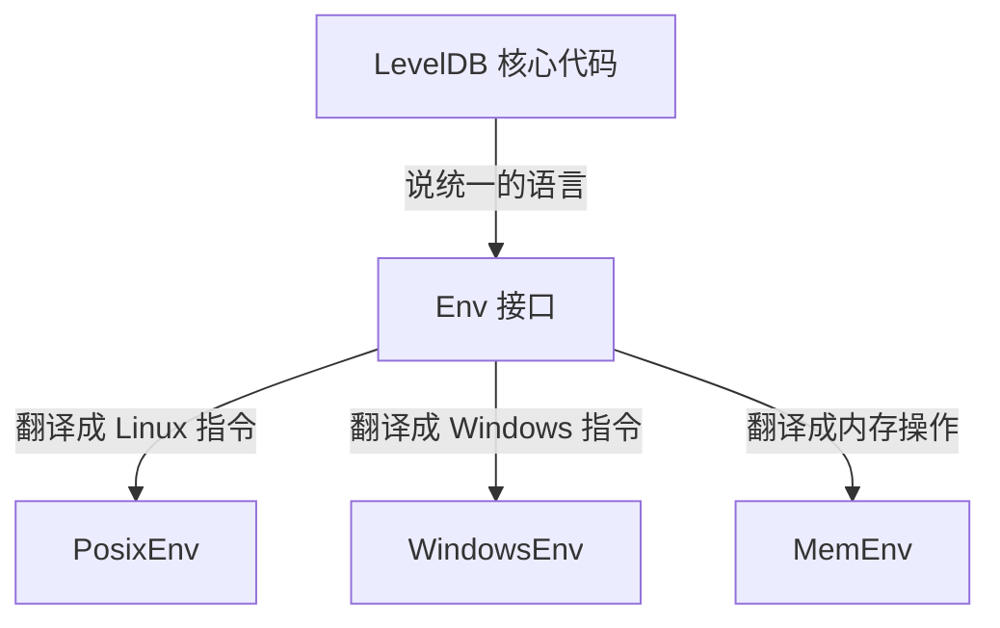
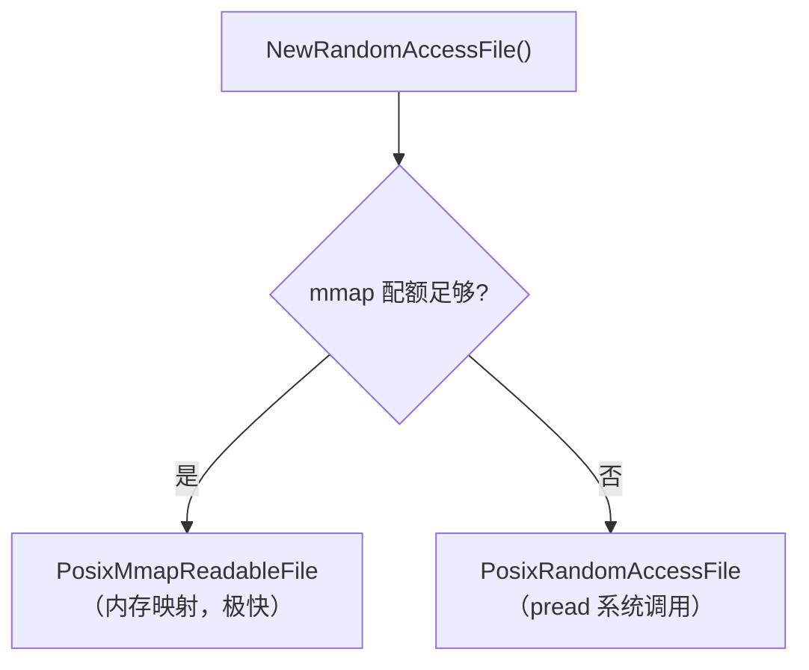
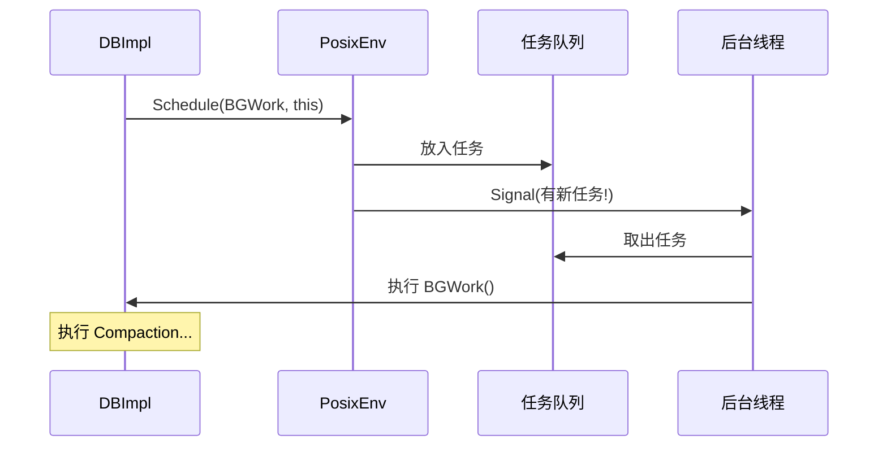
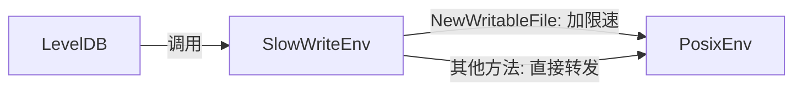
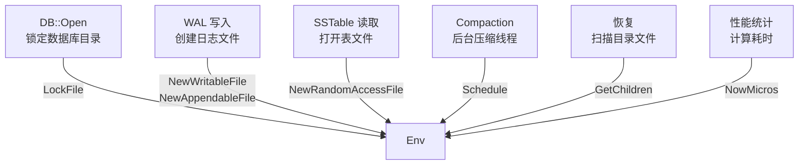
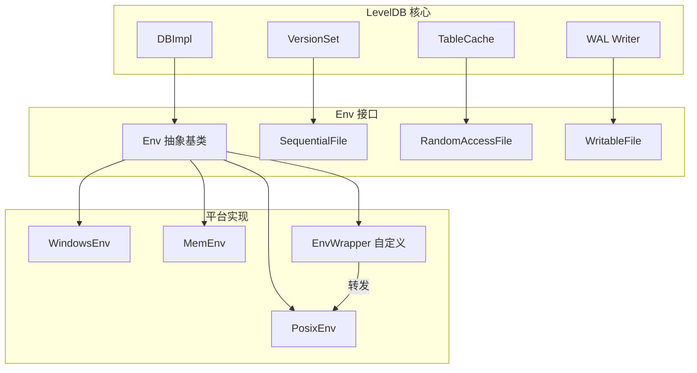

# Chapter 10: 环境抽象层 (Env)

在上一章 [压缩合并 (Compaction)](09_压缩合并__compaction.md) 中，我们看到后台线程不断地合并文件、创建新文件、删除旧文件。这些操作都依赖于操作系统提供的文件读写、线程调度等功能。但问题是——**不同操作系统的 API 完全不同**。Linux 用 `open()/read()/write()`，Windows 用 `CreateFile()/ReadFile()/WriteFile()`。LevelDB 怎么做到"一套代码，到处运行"的？

答案就是本章的主角——**环境抽象层（Env）**。

## 解决什么问题？

假设 LevelDB 核心代码中有这样一段逻辑：

```
1. 打开一个日志文件
2. 往里面写入数据
3. 把数据刷到磁盘
4. 关闭文件
```

如果直接调用 Linux 的 API：

```c++
int fd = open("log.txt", O_WRONLY | O_CREAT);
write(fd, data, size);
fsync(fd);
close(fd);
```

这段代码在 Windows 上**完全无法编译**。反过来，如果用 Windows API 写，Linux 上也跑不了。

更头疼的是，除了文件操作，还有**线程调度**（后台压缩）、**获取时间**（性能统计）、**目录操作**（列出 SSTable 文件）等功能，每个操作系统的实现方式都不一样。

**Env 的解决方案**：定义一套统一的虚拟接口，让 LevelDB 核心代码只调用这套接口。至于底层是 Linux 还是 Windows——Env 的具体实现去操心就好了。

## 翻译官的比喻

把 Env 想象成一个**翻译官**：



- LevelDB 核心代码说："请帮我打开一个文件"
- 如果在 Linux 上，PosixEnv 翻译成 `open()` 系统调用
- 如果在 Windows 上，WindowsEnv 翻译成 `CreateFile()` API
- 如果在测试中，MemEnv 翻译成"在内存中模拟一个文件"

核心代码**完全不知道**底层用的是什么操作系统——它只跟 Env 接口打交道。

## Env 接口总览

`Env` 是一个抽象基类，定义在 `include/leveldb/env.h` 中。它包含四大类操作：

| 类别 | 方法 | 作用 |
|------|------|------|
| **文件读写** | `NewSequentialFile`, `NewRandomAccessFile`, `NewWritableFile` | 创建各种文件对象 |
| **目录操作** | `FileExists`, `GetChildren`, `RemoveFile`, `CreateDir` | 管理文件和目录 |
| **线程调度** | `Schedule`, `StartThread` | 运行后台任务 |
| **时间与工具** | `NowMicros`, `SleepForMicroseconds`, `NewLogger` | 获取时间、休眠、日志 |

让我们重点看几个最常用的方法：

```c++
// include/leveldb/env.h（简化）
class Env {
 public:
  static Env* Default();  // 获取当前平台的默认 Env

  // 文件操作
  virtual Status NewWritableFile(
      const std::string& fname,
      WritableFile** result) = 0;

  virtual Status NewSequentialFile(
      const std::string& fname,
      SequentialFile** result) = 0;
```

`= 0` 表示这些是纯虚函数——Env 本身不做任何事，具体工作由子类完成。

```c++
  // 目录和文件管理
  virtual bool FileExists(
      const std::string& fname) = 0;
  virtual Status GetChildren(
      const std::string& dir,
      std::vector<std::string>* result) = 0;
  virtual Status RemoveFile(
      const std::string& fname);
```

`GetChildren` 列出目录下的所有文件——LevelDB 用它来扫描 SSTable 文件。

```c++
  // 线程调度
  virtual void Schedule(
      void (*function)(void* arg), void* arg) = 0;

  // 时间
  virtual uint64_t NowMicros() = 0;
};
```

`Schedule` 就是 [压缩合并 (Compaction)](09_压缩合并__compaction.md) 中 `MaybeScheduleCompaction` 用来提交后台任务的方法。

## 三种文件抽象

Env 不是直接返回原始文件句柄，而是返回**文件抽象对象**。LevelDB 定义了三种文件类型，对应不同的使用场景：

| 文件类型 | 比喻 | 使用场景 |
|---------|------|---------|
| `SequentialFile` | 从头到尾看书 | 读取 [预写日志 (Write-Ahead Log)](02_预写日志__write_ahead_log.md) |
| `RandomAccessFile` | 翻到任意页查字典 | 读取 [有序表文件 (SSTable / Table)](05_有序表文件__sstable___table.md) |
| `WritableFile` | 往本子上写字 | 写入日志文件和 SSTable |

### SequentialFile：顺序读

```c++
// include/leveldb/env.h
class SequentialFile {
 public:
  virtual Status Read(size_t n, Slice* result,
                      char* scratch) = 0;
  virtual Status Skip(uint64_t n) = 0;
};
```

只能从前往后读，不能跳回去。就像听录音——只能顺着播放。日志恢复时就用这种方式逐条读取。

### RandomAccessFile：随机读

```c++
class RandomAccessFile {
 public:
  virtual Status Read(uint64_t offset, size_t n,
      Slice* result, char* scratch) const = 0;
};
```

可以指定**偏移量**读取任意位置的数据。SSTable 查找时需要跳到索引块、再跳到数据块，用的就是这种文件。

### WritableFile：写入

```c++
class WritableFile {
 public:
  virtual Status Append(const Slice& data) = 0;
  virtual Status Close() = 0;
  virtual Status Flush() = 0;
  virtual Status Sync() = 0;
};
```

支持追加写入、刷新缓冲区、同步到磁盘。`Sync()` 特别重要——它保证数据真正写入了磁盘，不会因断电丢失。

## 实际使用：Env 怎么用？

让我们看看 LevelDB 核心代码是如何通过 Env 来操作文件的。

### 获取默认 Env

```c++
Env* env = Env::Default();
// 在 Linux 上返回 PosixEnv
// 在 Windows 上返回 WindowsEnv
```

`Env::Default()` 是一个静态方法，会根据编译的平台返回对应的实现。用户也可以传入自定义的 Env。

### 写入文件

```c++
WritableFile* file;
Status s = env->NewWritableFile("/tmp/test.log", &file);
if (s.ok()) {
  file->Append("Hello, LevelDB!");
  file->Sync();   // 确保数据落盘
  file->Close();
  delete file;
}
```

这段代码不管在 Linux 还是 Windows 上都能工作——因为它只和 `WritableFile` 接口打交道。

### 列出目录中的文件

```c++
std::vector<std::string> children;
env->GetChildren("/tmp/testdb", &children);
// children 可能包含: "000005.ldb", "MANIFEST-000003", ...
```

在 [数据库核心接口与实现 (DB / DBImpl)](01_数据库核心接口与实现__db___dbimpl.md) 的恢复过程中，DBImpl 就是用这个方法扫描数据库目录中的所有文件。

### 提交后台任务

```c++
env->Schedule(&DBImpl::BGWork, this);
```

这就是 [压缩合并 (Compaction)](09_压缩合并__compaction.md) 中看到的 `MaybeScheduleCompaction` 提交后台压缩任务的方式。`Schedule` 会在后台线程中执行传入的函数。

## 工具函数：简化常见操作

`util/env.cc` 中提供了两个实用的工具函数，让文件读写更方便：

```c++
// util/env.cc
Status WriteStringToFile(Env* env,
    const Slice& data, const std::string& fname) {
  WritableFile* file;
  Status s = env->NewWritableFile(fname, &file);
  if (!s.ok()) return s;
  s = file->Append(data);
  if (s.ok()) s = file->Close();
  delete file;
  if (!s.ok()) env->RemoveFile(fname);
  return s;
}
```

把字符串写入文件——打开、写入、关闭一气呵成。如果中途出错，还会自动清理残留文件。

```c++
Status ReadFileToString(Env* env,
    const std::string& fname, std::string* data) {
  SequentialFile* file;
  Status s = env->NewSequentialFile(fname, &file);
  // 循环读取直到文件末尾...
  delete file;
  return s;
}
```

把整个文件读成字符串。LevelDB 用它来读取 CURRENT 文件（只包含一行 MANIFEST 文件名）。

## PosixEnv：Linux/macOS 的实现

现在让我们深入底层，看看 `PosixEnv` 是如何把 Env 接口"翻译"成 Linux 系统调用的。

### 创建可写文件

```c++
// util/env_posix.cc（简化）
Status PosixEnv::NewWritableFile(
    const std::string& filename,
    WritableFile** result) {
  int fd = ::open(filename.c_str(),
      O_TRUNC | O_WRONLY | O_CREAT, 0644);
  if (fd < 0) {
    *result = nullptr;
    return PosixError(filename, errno);
  }
  *result = new PosixWritableFile(filename, fd);
  return Status::OK();
}
```

用 POSIX 的 `open()` 系统调用打开文件，然后包装成 `PosixWritableFile` 对象返回。

### PosixWritableFile 的写入和同步

```c++
// util/env_posix.cc（简化）
Status PosixWritableFile::Append(const Slice& data) {
  // 小数据先放入缓冲区
  size_t copy = std::min(data.size(),
      kWritableFileBufferSize - pos_);
  std::memcpy(buf_ + pos_, data.data(), copy);
  pos_ += copy;
  if (data.size() == copy) return Status::OK();
  // 缓冲区满了，刷到磁盘
  FlushBuffer();
  // 剩余大块数据直接写磁盘
  return WriteUnbuffered(data.data() + copy,
                         data.size() - copy);
}
```

写入时不是每次都直接调用系统调用——而是先放入一个 **64KB 的缓冲区**。满了再一次性写出，减少系统调用次数。

```c++
Status PosixWritableFile::Sync() {
  Status s = FlushBuffer();
  if (s.ok()) {
    s = SyncFd(fd_, filename_);  // fsync/fdatasync
  }
  return s;
}
```

`Sync()` 先把缓冲区刷出，再调用 `fsync()` 确保数据真正落到磁盘上。这是保证 [预写日志 (Write-Ahead Log)](02_预写日志__write_ahead_log.md) 数据安全的关键。

### 随机读取文件：两种策略

PosixEnv 在创建 `RandomAccessFile` 时有一个聪明的设计——**优先使用 mmap**：

```c++
// util/env_posix.cc（简化）
Status PosixEnv::NewRandomAccessFile(
    const std::string& filename,
    RandomAccessFile** result) {
  int fd = ::open(filename.c_str(), O_RDONLY);
  if (!mmap_limiter_.Acquire()) {
    // mmap 配额用完了，用普通的 pread
    *result = new PosixRandomAccessFile(
        filename, fd, &fd_limiter_);
    return Status::OK();
  }
  // 还有 mmap 配额，用 mmap 映射
  void* base = ::mmap(nullptr, file_size,
      PROT_READ, MAP_SHARED, fd, 0);
  *result = new PosixMmapReadableFile(
      filename, (char*)base, file_size,
      &mmap_limiter_);
  return Status::OK();
}
```

`mmap` 把文件内容直接映射到内存地址空间——读取数据就像读取普通内存一样快，操作系统会自动管理缓存。但 mmap 的数量有限（默认最多 1000 个），超出后退回到 `pread()` 方式读取。



### 后台线程调度

```c++
// util/env_posix.cc（简化）
void PosixEnv::Schedule(
    void (*function)(void* arg), void* arg) {
  background_work_mutex_.Lock();
  if (!started_background_thread_) {
    started_background_thread_ = true;
    std::thread t(BackgroundThreadEntryPoint, this);
    t.detach();
  }
  background_work_queue_.emplace(function, arg);
  background_work_cv_.Signal();
  background_work_mutex_.Unlock();
}
```

`Schedule` 的实现是一个经典的**生产者-消费者模式**：
1. 如果后台线程还没启动，先启动它
2. 把任务放入队列
3. 通知后台线程"有新活了"

```c++
void PosixEnv::BackgroundThreadMain() {
  while (true) {
    background_work_mutex_.Lock();
    while (background_work_queue_.empty()) {
      background_work_cv_.Wait();  // 没活？等着
    }
    auto func = background_work_queue_.front().function;
    auto arg = background_work_queue_.front().arg;
    background_work_queue_.pop();
    background_work_mutex_.Unlock();
    func(arg);  // 执行任务
  }
}
```

后台线程不断从队列取任务执行。没有任务时就休眠等待，省 CPU。

### 完整的调度流程



## WindowsEnv：Windows 的实现

`WindowsEnv` 在 `util/env_windows.cc` 中，逻辑与 PosixEnv 基本相同，只是调用的 API 不同。

| 功能 | PosixEnv | WindowsEnv |
|------|----------|------------|
| 打开文件 | `open()` | `CreateFileA()` |
| 读取文件 | `read()` / `pread()` | `ReadFile()` |
| 写入文件 | `write()` | `WriteFile()` |
| 同步磁盘 | `fsync()` / `fdatasync()` | `FlushFileBuffers()` |
| 内存映射 | `mmap()` | `CreateFileMapping()` + `MapViewOfFile()` |
| 删除文件 | `unlink()` | `DeleteFileA()` |

例如 Windows 版的写入同步：

```c++
// util/env_windows.cc（简化）
Status WindowsWritableFile::Sync() {
  Status s = FlushBuffer();
  if (s.ok()) {
    if (!::FlushFileBuffers(handle_.get())) {
      return Status::IOError(filename_,
          GetWindowsErrorMessage(::GetLastError()));
    }
  }
  return s;
}
```

跟 PosixEnv 结构完全一样——只是把 `fsync()` 换成了 `FlushFileBuffers()`。LevelDB 核心代码调用 `file->Sync()` 时，完全不需要关心底层是哪个系统调用。

## Env::Default()：自动选择平台

```c++
// util/env_posix.cc（Linux/macOS 编译时）
Env* Env::Default() {
  static PosixDefaultEnv env_container;
  return env_container.env();
}
```

```c++
// util/env_windows.cc（Windows 编译时）
Env* Env::Default() {
  static WindowsDefaultEnv env_container;
  return env_container.env();
}
```

编译器根据目标平台选择编译哪个 `.cc` 文件。这样 `Env::Default()` 在不同平台上自动返回正确的实现。使用 `SingletonEnv` 模板保证全局只有一个实例，且永远不会被析构。

## EnvWrapper：装饰器模式

如果你想**自定义部分行为**但保留大部分默认功能，可以用 `EnvWrapper`。

```c++
// include/leveldb/env.h
class EnvWrapper : public Env {
 public:
  explicit EnvWrapper(Env* t) : target_(t) {}

  // 所有方法都转发给 target_
  Status NewWritableFile(const std::string& f,
      WritableFile** r) override {
    return target_->NewWritableFile(f, r);
  }
  // ... 其他方法也类似
 private:
  Env* target_;
};
```

`EnvWrapper` 把所有调用都**转发**给内部的 `target_` Env。你只需要继承它，然后**只覆盖你想改的方法**。

### 实际例子：限速写入

假设你想限制写入速度，防止 I/O 过载：

```c++
class SlowWriteEnv : public EnvWrapper {
 public:
  SlowWriteEnv(Env* base) : EnvWrapper(base) {}

  Status NewWritableFile(const std::string& f,
      WritableFile** r) override {
    // 每次创建文件前休眠 10ms，模拟限速
    target()->SleepForMicroseconds(10000);
    return target()->NewWritableFile(f, r);
  }
  // 其他方法自动转发给默认实现
};
```

只改了 `NewWritableFile`，其他所有操作保持不变。这就是装饰器模式的威力——**组合优于继承**。



## MemEnv：纯内存测试环境

在测试时，我们不想真的读写磁盘——太慢了，而且测试之间可能互相干扰。`MemEnv` 把所有文件操作都放在**内存**中。

### 创建 MemEnv

```c++
// helpers/memenv/memenv.h
Env* NewMemEnv(Env* base_env);
```

传入一个基础 Env（用于线程调度等非文件操作），返回一个文件操作在内存中的 Env。

### MemEnv 的文件系统

```c++
// helpers/memenv/memenv.cc（简化）
class InMemoryEnv : public EnvWrapper {
 private:
  // 用 map 模拟文件系统！
  std::map<std::string, FileState*> file_map_;
  port::Mutex mutex_;
};
```

`InMemoryEnv` 继承自 `EnvWrapper`——线程调度、获取时间等操作转发给真实的 Env，只有**文件相关操作**在内存中模拟。

它用一个 `std::map` 来模拟文件系统：key 是文件路径，value 是文件内容（`FileState`）。

### FileState：内存中的"文件"

```c++
// helpers/memenv/memenv.cc（简化）
class FileState {
  int refs_;                    // 引用计数
  std::vector<char*> blocks_;   // 数据块列表
  uint64_t size_;               // 文件大小

  Status Append(const Slice& data);
  Status Read(uint64_t offset, size_t n,
              Slice* result, char* scratch);
};
```

每个 FileState 把数据存在 8KB 的内存块中。`Append` 往后面追加数据，`Read` 从任意位置读取——跟真实文件的行为完全一致。

### 在 MemEnv 中创建文件

```c++
// helpers/memenv/memenv.cc（简化）
Status InMemoryEnv::NewWritableFile(
    const std::string& fname,
    WritableFile** result) {
  MutexLock lock(&mutex_);
  FileState* file;
  if (file_map_.find(fname) == file_map_.end()) {
    file = new FileState();
    file->Ref();
    file_map_[fname] = file;
  } else {
    file = file_map_[fname];
    file->Truncate();  // 已存在就清空
  }
  *result = new WritableFileImpl(file);
  return Status::OK();
}
```

"创建文件"就是在 map 中加一个条目。如果文件已存在就清空内容。返回的 `WritableFileImpl` 写入数据时，实际写入的是内存中的 `FileState`。

### MemEnv 的使用场景

```c++
// 测试代码
Env* mem_env = NewMemEnv(Env::Default());
Options options;
options.env = mem_env;  // 告诉 LevelDB 用内存环境
DB* db;
DB::Open(options, "/test/db", &db);
// 所有读写都在内存中，测试飞快！
db->Put(WriteOptions(), "key", "value");
delete db;
delete mem_env;
```

在 `Options` 中指定自定义 Env，LevelDB 就会用它来完成所有操作系统交互。这样单元测试**不依赖磁盘**，运行速度快，互相之间也不干扰。

## Env 在 LevelDB 中的使用位置

让我们看看 LevelDB 核心代码中哪些地方使用了 Env：



几乎每一个子系统都在使用 Env：

| 子系统 | 使用的 Env 方法 | 章节 |
|--------|----------------|------|
| 数据库打开 | `LockFile`, `CreateDir`, `FileExists` | [数据库核心接口与实现](01_数据库核心接口与实现__db___dbimpl.md) |
| 预写日志 | `NewWritableFile`, `NewSequentialFile` | [预写日志](02_预写日志__write_ahead_log.md) |
| SSTable 读写 | `NewRandomAccessFile`, `NewWritableFile` | [有序表文件](05_有序表文件__sstable___table.md) |
| 版本管理 | `NewWritableFile`（写 MANIFEST）, `RenameFile` | [版本管理](08_版本管理__version___versionset.md) |
| 压缩合并 | `Schedule`, `RemoveFile` | [压缩合并](09_压缩合并__compaction.md) |

## 资源限制器：Limiter

PosixEnv 中有一个辅助类 `Limiter`，用来控制 mmap 和打开文件的数量：

```c++
// util/env_posix.cc（简化）
class Limiter {
  std::atomic<int> acquires_allowed_;
 public:
  bool Acquire() {
    int old = acquires_allowed_.fetch_sub(1,
        std::memory_order_relaxed);
    if (old > 0) return true;  // 成功获取
    acquires_allowed_.fetch_add(1,
        std::memory_order_relaxed);
    return false;  // 配额用完了
  }
  void Release() {
    acquires_allowed_.fetch_add(1,
        std::memory_order_relaxed);
  }
};
```

就像停车场的车位管理——有空位就进，满了就换别的停车场。这防止了 LevelDB 同时打开太多文件或 mmap 太多内存，导致操作系统资源耗尽。

PosixEnv 中使用了两个 Limiter：

```c++
Limiter mmap_limiter_;  // 限制 mmap 数量（默认1000）
Limiter fd_limiter_;    // 限制文件描述符数量
```

## PosixWritableFile 的 MANIFEST 特殊处理

PosixWritableFile 有一个有趣的细节——对 MANIFEST 文件做了特殊处理：

```c++
// util/env_posix.cc（简化）
Status PosixWritableFile::Sync() {
  Status s = SyncDirIfManifest();
  if (!s.ok()) return s;
  s = FlushBuffer();
  if (!s.ok()) return s;
  return SyncFd(fd_, filename_);
}
```

```c++
Status SyncDirIfManifest() {
  if (!is_manifest_) return Status::OK();
  // MANIFEST 文件：额外同步所在目录
  int fd = ::open(dirname_.c_str(), O_RDONLY);
  SyncFd(fd, dirname_);
  ::close(fd);
}
```

写入 MANIFEST 文件时，除了同步文件本身，还会**同步所在目录**。为什么？因为 MANIFEST 引用了新创建的 SSTable 文件，必须确保这些文件的目录条目也已经落盘。否则断电后，MANIFEST 记录了一个文件存在，但该文件在目录中其实还没被持久化。

## 整体架构图



## 为什么这种设计很重要？

Env 的设计体现了软件工程中一个重要原则——**依赖反转**：

```
没有 Env：
  LevelDB 核心代码 → 直接依赖 → Linux API（换平台就要改核心代码）

有 Env：
  LevelDB 核心代码 → 依赖 → Env 接口（稳定不变）
                                ↑
                      PosixEnv / WindowsEnv 实现这个接口
```

这样的好处：
1. **可移植**：支持新平台只需要写一个新的 Env 实现
2. **可测试**：用 MemEnv 做单元测试，不依赖磁盘
3. **可定制**：用 EnvWrapper 轻松添加限速、监控、加密等功能
4. **核心代码简洁**：不用到处写 `#ifdef _WIN32` 这样的条件编译

## 总结

在本章中，我们学习了：

1. **Env 的作用**：将操作系统交互封装在统一接口后面，让 LevelDB 核心代码跨平台
2. **三种文件抽象**：`SequentialFile`（顺序读）、`RandomAccessFile`（随机读）、`WritableFile`（写入）
3. **PosixEnv**：Linux/macOS 的实现——使用 `open/read/write/fsync`，支持 mmap 和缓冲写入
4. **WindowsEnv**：Windows 的实现——使用 `CreateFile/ReadFile/WriteFile/FlushFileBuffers`
5. **EnvWrapper**：装饰器模式——继承它只覆盖想改的方法，就能自定义 I/O 行为
6. **MemEnv**：纯内存文件系统——用 `std::map` 模拟文件，适合单元测试
7. **Limiter**：资源限制器——控制 mmap 和文件描述符数量，防止资源耗尽
8. **Schedule**：后台线程调度——生产者-消费者模式，供 Compaction 等后台任务使用

至此，我们走完了 LevelDB 的十个核心模块！从 [数据库核心接口与实现 (DB / DBImpl)](01_数据库核心接口与实现__db___dbimpl.md) 的大门入口，经过 [预写日志](02_预写日志__write_ahead_log.md) 的安全保障、[内存表](03_内存表__memtable.md) 的快速缓冲、[数据块](04_数据块与块构建器__block___blockbuilder.md) 和 [SSTable](05_有序表文件__sstable___table.md) 的磁盘存储、[迭代器](06_迭代器体系__iterator.md) 的统一遍历、[LRU 缓存](07_lru_缓存__cache.md) 的读取加速、[版本管理](08_版本管理__version___versionset.md) 的文件追踪、[压缩合并](09_压缩合并__compaction.md) 的后台整理，最终到本章的环境抽象层——这些模块各司其职，共同构成了一个高效、可靠、可移植的键值存储引擎。希望这个教程能帮助你理解 LevelDB 的核心设计思想！

---

Generated by [AI Codebase Knowledge Builder](https://github.com/The-Pocket/Tutorial-Codebase-Knowledge)