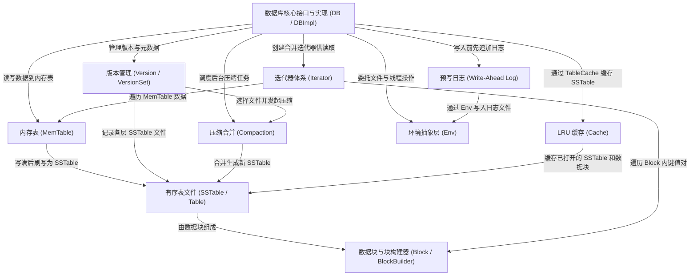

# Tutorial: leveldb

**LevelDB** 是 Google 开发的一个高性能 *嵌入式键值存储引擎*。它将数据以 **有序的键值对** 形式持久化存储在磁盘上。

其核心工作流程是：写入数据时，先记录到 **预写日志（WAL）** 保证安全，再写入内存中的 **MemTable**；当 MemTable 写满后，数据被刷写为磁盘上的 **SSTable** 文件。读取时，依次从 MemTable、不可变 MemTable 和各层 SSTable 中查找，利用 **布隆过滤器** 和 **LRU 缓存** 加速查询。后台的 **Compaction（压缩合并）** 机制负责整理和清除过期数据，保持读取性能。

整个系统通过 **版本管理** 跟踪文件变更，通过 **迭代器体系** 提供统一的数据遍历接口，并通过 **环境抽象层** 屏蔽操作系统差异，实现跨平台能力。

**Source Directory:** `/home/tz/dev/leveldb`

## Chapters

1. [数据库核心接口与实现 (DB / DBImpl)](01_数据库核心接口与实现__db___dbimpl.md)
2. [预写日志 (Write-Ahead Log)](02_预写日志__write_ahead_log.md)
3. [内存表 (MemTable)](03_内存表__memtable.md)
4. [数据块与块构建器 (Block / BlockBuilder)](04_数据块与块构建器__block___blockbuilder.md)
5. [有序表文件 (SSTable / Table)](05_有序表文件__sstable___table.md)
6. [迭代器体系 (Iterator)](06_迭代器体系__iterator.md)
7. [LRU 缓存 (Cache)](07_lru_缓存__cache.md)
8. [版本管理 (Version / VersionSet)](08_版本管理__version___versionset.md)
9. [压缩合并 (Compaction)](09_压缩合并__compaction.md)
10. [环境抽象层 (Env)](10_环境抽象层__env.md)

---

Generated by [AI Codebase Knowledge Builder](https://github.com/The-Pocket/Tutorial-Codebase-Knowledge)