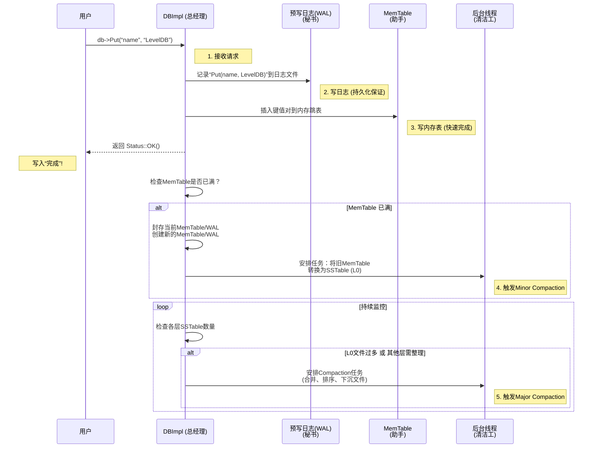

# Chapter 1: 数据库核心引擎（DBImpl）

欢迎！这是 LevelDB 源码解析教程的第一章。想象一下，你下载了 LevelDB 这个“黑盒子”，你调用 `Put`、`Get`、`Delete`，数据就被神奇地持久化存储和检索了。这个负责所有神奇操作的“总指挥”，就是 **数据库核心引擎（DBImpl）**。

如果把 LevelDB 比作一家忙碌的餐厅：
*   **MemTable** 是出菜最快的临时餐台。
*   **SSTable** 是存放所有菜品的中央大厨房。
*   **WAL（预写日志）** 是点菜单，确保订单不会丢失。
*   那么 **DBImpl** 就是这家餐厅的 **总经理**。它接收你的点单（读写请求），协调厨师（MemTable, SSTable），确保菜单被记录（WAL），并在后台打扫厨房、整理菜品（压缩），让整个餐厅高效运转。

理解 `DBImpl`，你就拿到了理解 LevelDB 如何工作的“总设计图”。

---

## 🎯 你将学到什么

在本章结束时，你将理解：
*   **DBImpl 是什么**：它在整个 LevelDB 架构中的核心角色。
*   **DBImpl 做什么**：如何协调一次简单的 `Put` 或 `Get` 操作。
*   **DBImpl 的职责**：它管理哪些关键组件和后台任务。
*   **如何与它交互**：通过 `leveldb::DB` 接口。

## 📦 先决条件

*   基本的 C++ 语法知识。
*   知道什么是键值存储（Key-Value Store）。
*   一颗充满好奇的心！

---

## 第一步：从用户视角看 DBImpl

作为 LevelDB 的用户，你永远不会直接创建或操作 `DBImpl` 对象。你接触的是一个名为 `leveldb::DB` 的抽象接口。`DBImpl` 是这个接口的具体实现。

当你写下这行代码时：
```cpp
#include “leveldb/db.h”
leveldb::DB* db;
```
变量 `db` 未来指向的，实际上就是一个 `DBImpl` 对象。`DBImpl` 继承了 `DB` 类，实现了所有对外承诺的操作。

```cpp
// db/db_impl.h 中可以看到继承关系
class DBImpl : public DB { // DBImpl 是 DB 接口的实现
 public:
  // 它必须实现以下所有虚函数
  Status Put(const WriteOptions&, const Slice& key, const Slice& value) override;
  Status Get(const ReadOptions& options, const Slice& key, std::string* value) override;
  Status Delete(const WriteOptions&, const Slice& key) override;
  // ... 以及其他方法
};
```
*代码解释*：`DBImpl` 类公开继承自 `DB` 类，并使用 `override` 关键字表明它正在实现父类的虚函数。这意味着所有通过 `leveldb::DB*` 调用的 `Put`, `Get` 等方法，最终都会执行 `DBImpl` 类中的对应实现。

---

## 第二步：DBImpl 的四大核心职责

作为“总经理”，`DBImpl` 主要有四大块工作：

1.  **请求调度与协调**：处理所有并发的读(`Get`)、写(`Put`/`Delete`/`Write`)请求，确保它们正确、有序地执行。
2.  **组件生命周期管理**：创建并管理 [MemTable（内存表）](04_内存表_memtable_与跳表_skiplist__.md)、[WAL（预写日志）](03_预写日志_wal___log__.md)、[Version（版本）](06_版本管理_versionset_与_version__.md) 等核心组件的生老病死。
3.  **后台维护（压缩）**：在独立的后台线程中，自动触发 [Compaction（压缩）](07_压缩机制_compaction__.md)，将数据从高层级整理到低层级，回收空间并保持查询性能。
4.  **错误恢复与持久化保证**：在数据库打开时，回放 WAL 日志以恢复到崩溃前的状态；确保写操作在返回成功前，数据已安全持久化。

---

## 第三步：一次 `Put` 操作之旅

让我们追踪一次最简单的 `db->Put(...)` 调用，看看 `DBImpl` 这个总经理是如何调度工作的。

### 旅程概述（非代码）
假设我们执行 `Put(“name”, “LevelDB”)`：
1.  **接收请求**：`DBImpl::Put` 方法被调用。
2.  **写入日志（防止丢失）**：总经理首先让秘书（**LogWriter**）把“设置 name=LevelDB”这条命令记录到 [预写日志（WAL）](03_预写日志_wal___log__.md) 文件中。这样即使突然停电，命令也不会丢失。
3.  **更新内存表（快速写入）**：然后，总经理让最麻利的助手（**MemTable**）把 `“name” -> “LevelDB”` 这个键值对存入其内存中的跳表里。到这里，对于用户来说写入已经“完成”了，可以返回成功。
4.  **检查是否需切换**：如果助手（MemTable）报告自己“快记满了”，总经理就会：
    a. 让当前的助手和秘书（MemTable 和 LogWriter）停工，封存他们的工作成果。
    b. 启用一套全新的助手和秘书。
    c. 安排后台线程把封存的旧 MemTable 转换成有序的、持久化的文件（即 [SSTable](05_sstable_排序表_与数据块_.md)），并将其放入第 0 层。
5.  **触发后台整理**：总经理监控着各层（尤其是第0层）的 SSTable 文件数量。如果太多，它会安排清洁工（**后台压缩线程**）开始 [压缩](07_压缩机制_compaction__.md) 工作，将文件合并并下沉到更低的层级，保持厨房（磁盘）井然有序。

### 可视化流程


*图表解释*：这个序列图展示了一次 `Put` 操作中，`DBImpl` 如何协调不同组件。关键在于：**先写日志，再写内存，然后立即返回**。繁重的磁盘I/O和文件整理工作被巧妙地推迟到后台异步进行，这让用户的写入操作感觉非常快。

---

## 第四步：窥探 `DBImpl` 的代码“办公室”

让我们看看 `DBImpl` 这个“总经理办公室”里有哪些重要的成员变量（位于 `db/db_impl.h`）。这些是它管理整个数据库的抓手。

```cpp
// db/db_impl.h (精简版)
class DBImpl : public DB {
 public:
  // ... 公共接口 (Put, Get等) ...

 private:
  Env* const env_;                // 环境抽象，用于文件/线程操作
  const InternalKeyComparator internal_comparator_; // 键比较器
  const Options options_;         // 用户传入的配置选项
  const std::string dbname_;      // 数据库目录名
  
  // 核心组件管理器
  VersionSet* const versions_;    // 管理所有SSTable文件的版本信息
  MemTable* mem_;                 // 当前可写的内存表
  MemTable* imm_ GUARDED_BY(mutex_); // 正在被压缩的不可变内存表
  WritableFile* logfile_;         // 当前的日志文件句柄
  log::Writer* log_;              // 当前的日志写入器

  // 后台工作状态
  port::Mutex mutex_;             // 保护内部状态的互斥锁
  std::atomic<bool> bg_compaction_scheduled_; // 后台压缩是否已安排
  // ... 其他成员，如TableCache, 写操作队列等 ...
};
```
*代码解释*：
*   `mem_` 和 `imm_`：这是“双缓冲”技巧。`mem_` 是当前接收写入的活跃助手。当它写满时，`DBImpl` 会将其指针赋值给 `imm_`（变为“不可变的”），然后创建一个新的 `mem_`。后台线程则负责处理 `imm_`，将其转化为 SSTable。
*   `versions_`：这是 **文件系统的“导航员”**。它知道当前数据库所有 SSTable 文件在哪里、属于哪一层、包含的键范围是什么。任何文件增减（新SSTable，压缩删除旧SSTable）都需要通过 `VersionSet` 生成新的 `Version` 来提交。
*   `mutex_`：为了保护上述共享状态（如 `mem_`, `imm_`, `versions_` 等）在并发访问下的安全，`DBImpl` 使用了一把大锁。高并发优化是另一个话题，但理解这把锁的存在很重要。

---

## 总结与下一站

恭喜！你现在已经认识了 LevelDB 的“总经理”——**DBImpl**。

**本章要点回顾**：
*   **角色**：`DBImpl` 是 LevelDB 所有操作的总协调者，是 `leveldb::DB` 接口的具体实现。
*   **工作流**：处理写请求时，遵循 **先写WAL日志，再写MemTable** 的原则，确保持久性并快速响应用户。
*   **管理职责**：它管理着 MemTable、WAL、VersionSet 等核心组件的生命周期。
*   **后台智慧**：将耗时的 MemTable 持久化和 SSTable 压缩工作放入后台线程异步执行，是 LevelDB 高性能的关键设计。

`DBImpl` 协调了众多组件，但它的很多工作都依赖于一个重要的批量操作工具——`WriteBatch`。例如，`DBImpl::Put` 内部其实就是创建了一个单次操作的 `WriteBatch` 来执行。这个工具能保证一批操作原子性（要么全成功，要么全失败），并且能提升写入性能。

在 **[下一章：WriteBatch（批量写入）](02_writebatch_批量写入__.md)** 中，我们将深入了解这个强大的工具，看看它是如何工作的，以及 `DBImpl` 是如何使用它的。

---

Generated by [AI Codebase Knowledge Builder](https://github.com/The-Pocket/Tutorial-Codebase-Knowledge)