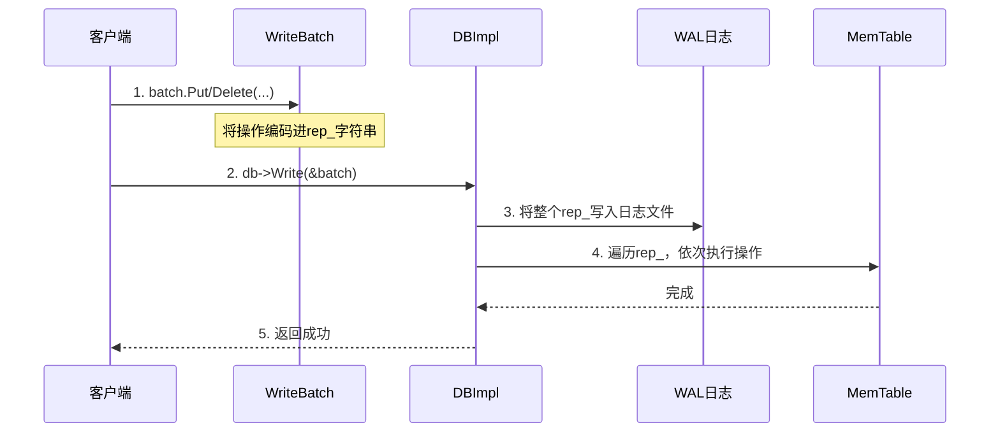

# Chapter 2: WriteBatch（批量写入）

欢迎回来！在上一章，我们认识了 LevelDB 的“总经理”——[数据库核心引擎（DBImpl）](01_数据库核心引擎_dbimpl__.md)。它负责协调所有的读写请求，就像一个繁忙餐厅的经理。

本章，我们将聚焦在一位特殊的“客户”身上。这位客户很特别：他不是一次点一道菜，而是把**一整桌宴席**的订单都写下来，然后说：“经理，请一次性把这些菜都做好端上来，要么全上，要么一个都别上。”

这位客户就是 **WriteBatch（批量写入）**。它是 LevelDB 确保数据**原子性**和提升**写入性能**的关键设计。

---

## 🎯 你将学到什么

在本章结束时，你将理解：
*   **WriteBatch 解决了什么问题**：为什么我们需要批量、原子的写入操作。
*   **如何使用 WriteBatch**：在代码中打包你的 `Put` 和 `Delete` 操作。
*   **WriteBatch 的内部秘密**：它的数据是如何被“打包”成一个紧凑格式的。
*   **性能优化**：LevelDB 如何利用 WriteBatch 实现强大的“组提交（Group Commit）”。

## 📦 先决条件
*   已完成 [第一章：数据库核心引擎（DBImpl）](01_数据库核心引擎_dbimpl__.md) 的学习。
*   理解基本的 `Put` 和 `Delete` 操作。

---

## 第一步：为什么需要 WriteBatch？—— 一个现实场景

想象你在开发一个电商应用。用户点击“结算购物车”，你需要同时完成以下几件事：
1.  在 `订单表` 创建一条新订单记录。
2.  在 `库存表` 减少对应商品的库存。
3.  在 `用户订单列表` 添加这个订单ID。

如果分三步单独调用 `db->Put(...)`，会有什么风险？
*   **原子性问题**：如果第二步成功后，第三步前程序崩溃了，系统就会处于不一致状态（库存扣了，但订单没记录）。
*   **性能问题**：每个 `Put` 都要写一次日志、更新一次内存表，频繁的磁盘和内存操作会很慢。

**WriteBatch 就是解决这两个痛点的答案**。
它让你能把多个 `Put` 和 `Delete` 操作打包成一个“事务包裹”。LevelDB 会确保这个包裹里的所有操作**要么全部成功，要么全部失败（原子性）**，并且由于是批量处理，性能也**更高**。

---

## 第二步：如何使用 WriteBatch —— 打包你的操作

使用 WriteBatch 非常简单，就像在清单上逐条记录你的操作，然后一次性交给 LevelDB 执行。

### 第1步：创建 WriteBatch 对象
```cpp
#include “leveldb/write_batch.h”
#include “leveldb/db.h”
// ... 假设 db 已经打开

leveldb::WriteBatch batch; // 创建一个空的“操作包裹”
```
*代码解释*：引入头文件，并创建一个 `WriteBatch` 对象。现在这个 `batch` 里面是空的。

### 第2步：向 Batch 中添加操作
你可以像平常一样调用 `Put` 和 `Delete`，但对象是 `batch` 而不是 `db`。
```cpp
// 向包裹里添加操作：创建一个订单
batch.Put(“order:1001”, “{product: ‘Book’, status: ‘paid’}”);
// 添加操作：扣减库存
batch.Put(“stock:Book”, “95”); // 假设原库存为100
// 添加操作：关联用户和订单
batch.Put(“user_orders:Alice”, “1001”);
```
*代码解释*：我们连续调用了三次 `batch.Put(...)`。这些操作被记录在 `batch` 内部，**但还没有真正写入数据库**。

### 第3步：执行批量写入
将打包好的 `batch` 交给数据库去执行。
```cpp
leveldb::Status s = db->Write(leveldb::WriteOptions(), &batch);
if (s.ok()) {
    std::cout << “批量写入成功！三个操作已原子性提交。” << std::endl;
} else {
    std::cout << “写入失败：” << s.ToString() << std::endl;
}
```
*代码解释*：调用 `db->Write(...)` 并传入 `batch`。LevelDB 会保证这三条 `Put` 操作作为一个整体生效。如果成功，它们会全部可见；如果失败，数据库会保持这之前的状态，就像什么都没发生过。

---

## 第三步：WriteBatch 的内部结构 —— “操作包裹”里有什么？

那么，`batch` 对象内部是如何存储这些操作的呢？它并不是简单地存一个操作列表，而是将其编码成一种非常紧凑的**二进制格式**。

### 格式总览
`WriteBatch` 内部有一个字符串 `rep_`，它的结构如下：
```
[ 8字节：序列号 (Sequence Number) | 4字节：操作计数 (Count) | 操作1 | 操作2 | ... | 操作N ]
```

让我们把它拆解开：

**1. 头部（Header）**
*   **序列号**：这个批量操作的“全局编号”，用于确定所有操作生效的顺序。所有在此 `batch` 中的操作共享同一个序列号。
*   **操作计数**：这个 `batch` 里包含多少个 `Put` 或 `Delete` 操作。

**2. 操作记录（Record）**
每个操作被编码成一小段数据：
*   **对于 `Put` 操作**：`[标记位 kTypeValue] [key的长度] [key的数据] [value的长度] [value的数据]`
*   **对于 `Delete` 操作**：`[标记位 kTypeDeletion] [key的长度] [key的数据]`

这个编码过程在 `WriteBatch::Put` 和 `WriteBatch::Delete` 方法中完成。你可以把它想象成把一堆文件压缩成一个 `.zip` 包。

---

## 第四步：从打包到生效 —— WriteBatch 的执行之旅

现在，我们看看当你调用 `db->Write(&batch)` 时，这个“包裹”是如何被处理的。



**步骤详解：**
1.  **客户端打包**：你调用 `batch.Put`，操作被编码并追加到 `batch.rep_` 字符串末尾。
2.  **提交包裹**：你将 `batch` 提交给 `DBImpl::Write`。
3.  **持久化日志**：`DBImpl` 做的第一件事是，将 `batch.rep_` **整个字符串**作为一条记录，追加到 [预写日志（WAL）](03_预写日志_wal___log__.md) 文件中。这保证了即使后续步骤失败，整个操作包也能从日志中恢复。
4.  **应用至内存**：接着，`DBImpl` 会“拆开”这个包裹。它调用一个内部函数（如 `WriteBatchInternal::InsertInto`），该函数会遍历 `rep_` 中的每条操作记录，并依次应用到 [内存表（MemTable）](04_内存表_memtable_与跳表_skiplist__.md) 中。
5.  **返回成功**：所有操作成功应用后，返回成功状态给客户端。

**关键点**：整个 `rep_` 字符串先被**原子性地写入日志**，然后才被应用到内存表。这确保了“要么全做，要么不做”的原子性。

---

## 第五步：深入代码 —— 看看“打包”和“拆包”

让我们看两段核心代码，理解编码和解析过程。

### 编码（打包）：`WriteBatch::Put`
（以下代码经过极大简化，仅保留核心逻辑）
```cpp
// 源自 db/write_batch.cc (简化版)
void WriteBatch::Put(const Slice& key, const Slice& value) {
    // 1. 增加操作计数（位于 rep_ 中的固定位置）
    int num_entries = WriteBatchInternal::Count(this) + 1;
    WriteBatchInternal::SetCount(this, num_entries);

    // 2. 向 rep_ 字符串追加操作记录
    rep_.push_back(static_cast<char>(kTypeValue)); // 放入标记位
    PutLengthPrefixedSlice(&rep_, key);  // 放入 key (长度+数据)
    PutLengthPrefixedSlice(&rep_, value); // 放入 value (长度+数据)
}
```
*代码解释*：`Put` 函数首先更新头部的“操作计数”，然后将`操作类型标记`、`key` 和 `value` 按格式追加到内部的 `rep_` 字符串里。`PutLengthPrefixedSlice` 会先放入长度，再放入数据本身。

### 解码（拆包）：`WriteBatch::Iterate`
当需要执行 `batch` 时，需要解析它。`Iterate` 函数就是这个“拆包器”。
```cpp
// 源自 db/write_batch.cc (简化流程)
Status WriteBatch::Iterate(Handler* handler) const {
    Slice input(rep_);
    input.remove_prefix(kHeader); // 跳过12字节的头部

    while (!input.empty()) {
        char tag = input[0]; // 读取操作类型标记
        input.remove_prefix(1);
        Slice key, value;

        switch (tag) {
            case kTypeValue:
                // 解析出 key 和 value
                key = GetLengthPrefixedSlice(&input);
                value = GetLengthPrefixedSlice(&input);
                handler->Put(key, value); // 执行 Put 操作
                break;
            case kTypeDeletion:
                key = GetLengthPrefixedSlice(&input);
                handler->Delete(key); // 执行 Delete 操作
                break;
        }
    }
    return Status::OK();
}
```
*代码解释*：`Iterate` 函数跳过头部后，循环读取 `rep_`。它读取一个`标记位`，判断是 `Put` 还是 `Delete`，然后解析出对应的 `key` 和 `value`（如果有），最后通过一个 `handler` 对象（通常连接到 MemTable）来实际执行这个操作。这就是“拆包并执行”的过程。

---

## 第六步：性能王牌 —— 组提交（Group Commit）

WriteBatch 不仅服务于单个客户端的批量操作，还是 LevelDB 一项重要性能优化的基础：**组提交（Group Commit）**。

**场景**：在高并发下，可能有多个线程同时调用 `db->Write(&batch)`。
**朴素做法**：每个线程的 `batch` 都独立写一次日志、更新一次内存表。这会导致大量的小磁盘写入，效率低下。

**LevelDB 的聪明做法**：
`DBImpl::Write` 方法会尝试将**多个并发到来的 WriteBatch 合并成一个更大的批处理**。
1.  第一个到达的线程成为“组长”。
2.  在“组长”持有锁的极短时间内，它将后续到达的其他线程的 `batch` 也收集起来。
3.  “组长”将合并后的大 `batch` **一次性地**写入日志，并应用到内存表。
4.  所有参与的线程一起被唤醒，并被告知操作完成。

**好处**：将多次小IO合并成一次大IO，极大地提升了磁盘利用率和整体写入吞吐量。这就好比快递员把同一栋楼的好几个包裹一次性送上来，而不是跑好几趟。

---

## 🎉 本章总结

恭喜！你现在已经深入理解了 LevelDB 的 WriteBatch：

*   **它是什么**：一个将多个 `Put`/`Delete` 操作打包的**原子性事务单元**。
*   **为什么需要它**：保证数据操作的**原子性**（All-or-Nothing）和提升**写入性能**。
*   **如何使用它**：创建 `WriteBatch` 对象 -> 添加操作 -> 调用 `db->Write(batch)`。
*   **内部原理**：操作被编码成紧凑的二进制格式 (`rep_`)，先原子性写入 [WAL日志](03_预写日志_wal___log__.md)，再应用到 [MemTable](04_内存表_memtable_与跳表_skiplist__.md)。
*   **高级特性**：它是 **Group Commit（组提交）** 的基础，能大幅提升高并发下的写入性能。

WriteBatch 体现了 LevelDB 优秀的设计：用一个简单的接口，同时解决了正确性（原子性）和性能（批处理、组提交）两大难题。

---

**接下来**：我们已经多次提到，WriteBatch 需要先写入一个叫做 **WAL（预写日志）** 的文件来保证原子性和持久性。这个日志是如何工作的？它又是如何帮助数据库在崩溃后恢复的？让我们在下一章揭开它的神秘面纱：[预写日志（WAL / Log）](03_预写日志_wal___log__.md)。

---

Generated by [AI Codebase Knowledge Builder](https://github.com/The-Pocket/Tutorial-Codebase-Knowledge)