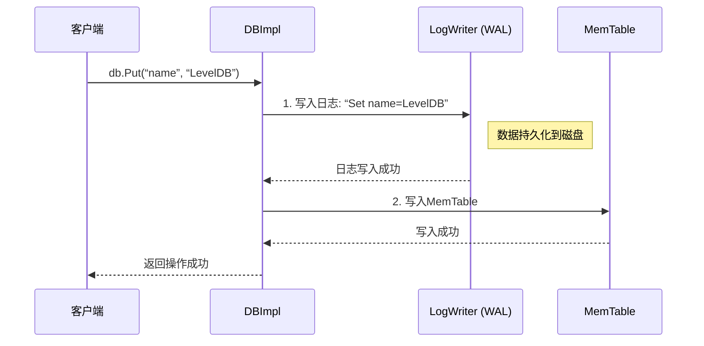
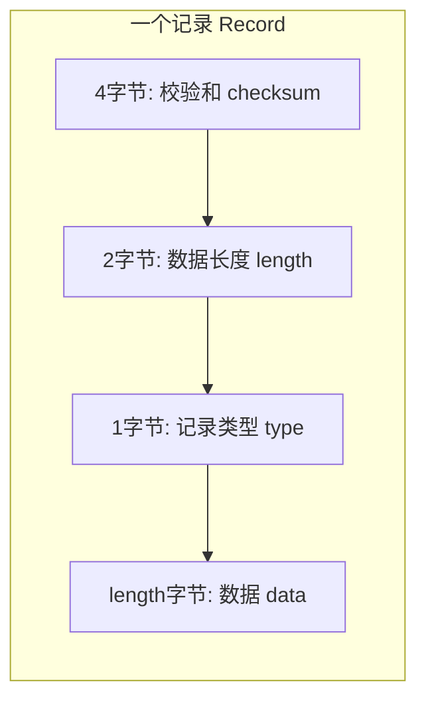

# Chapter 3: 预写日志（WAL / Log）

在上一章 [WriteBatch（批量写入）](02_writebatch_批量写入__.md) 中，我们学会了如何将多个写操作“打包”成一个原子操作。现在，一个关键问题出现了：当一个`WriteBatch`被提交给[数据库核心引擎（DBImpl）](01_数据库核心引擎_dbimpl__.md)处理时，如果程序突然崩溃，这些还没有来得及保存到磁盘文件里的数据，不就永远丢失了吗？

**答案是：不会丢失！** 这正是本章的主角——**预写日志（Write-Ahead Log， WAL）**——发挥威力的地方。

想象一下，你去一家繁忙的餐厅（我们的LevelDB）点餐（写入数据）。服务员（DBImpl）不是直接把你的菜单交给后厨，而是**先飞快地用笔在点菜单（WAL）上记录下“A桌：宫保鸡丁一份”**，然后把这份手写的菜单递给后厨制作。这样，即使后厨突然断电，或者服务员忘记了你点了什么，只要找到那张点菜单，就能恢复你的订单。

WAL就是LevelDB的**“安全网”**或**“黑匣子”**。它的核心思想简单而强大：**在真正修改内存中的数据（MemTable）之前，必须先把“修改意图”完整地、持久化地记录到日志文件中。**

---
## 🎯 在本章，你将学到

*   **WAL解决什么问题**：为什么我们需要它来防止数据丢失。
*   **WAL如何工作**：它的“先写日志，后写内存”的工作流程。
*   **日志的物理格式**：日志在磁盘上是什么样子的。
*   **关键组件**：负责写入日志的`LogWriter`和负责读取（恢复）日志的`LogReader`。
*   **崩溃恢复**：如何利用WAL在数据库重启后“重演”日志，恢复到崩溃前的状态。

---
## 第一步：如果没有WAL，会发生什么？

让我们模拟一个没有WAL的危险场景：

```cpp
// 假设一个极简的不安全写入流程
void UnsafePut(const Slice& key, const Slice& value) {
    // 1. 直接写入内存表 (非常快)
    memtable->Add(key, value);
    // 2. 告诉用户：写好了！
    // --- 崩溃发生点！程序在此处崩溃 ---
    // 3. 计划稍后将内存表写入磁盘...
}
```
*发生了什么？* 用户收到了“写入成功”的响应，但数据只存在于易失的内存（MemTable）中。程序一旦崩溃，内存中的数据全部消失，用户以为已经成功保存的数据就**永久丢失了**。这是数据库系统不可接受的。

**WAL的解决方案**：在步骤1之前，插入一个**必须成功**的步骤0：将`{key, value}`这个操作记录到磁盘上的日志文件。即使后续步骤崩溃，我们仍然可以在重启后读取日志文件，重新执行一遍这个操作。

---
## 第二步：WAL的核心工作流程

一次安全的 `Put` 操作，在有了WAL保护后，流程是这样的：



这个“**先日志，后内存**”的步骤，是保证持久性（Durability）的黄金法则。

1.  **先写日志（Write-Ahead）**：将操作序列化后，追加写入一个只能追加（append-only）的日志文件。这个写入会确保数据落盘（或进入操作系统的可靠缓冲区）。
2.  **后写内存**：日志写入成功后，再将数据应用到内存中的数据结构（MemTable）。此时，即使系统崩溃，重启后也能通过**重放（Replay）** 日志文件来恢复MemTable中的数据。

---
## 第三步：日志文件里到底写了什么？

LevelDB的日志文件在物理上被组织成一系列**32KB大小的块（Block）**。这样做是为了与磁盘操作高效对齐。每个块里包含多条**记录（Record）**。

一条记录就是对一个`WriteBatch`内容（可能包含多个Put/Delete）的完整编码。如果一条记录太大，一个块装不下怎么办？LevelDB允许**跨块记录**。

### 日志记录格式
查看源码 `db/log_format.h`， 我们找到记录的核心定义：

```cpp
// log_format.h (简化版)
namespace leveldb {
namespace log {
    enum RecordType {
        kFullType = 1,   // 完整的记录（小记录）
        kFirstType = 2,  // 跨块记录的第一段
        kMiddleType = 3, // 跨块记录的中间段
        kLastType = 4    // 跨块记录的最后一段
    };
    static const int kBlockSize = 32768; // 32KB 块大小
}
}
```

一条记录的格式可以用下图清晰地表示：


*格式解析*：
*   **校验和（Checksum）**：对`类型(type)`和`数据(data)`部分计算出的CRC32值。用于检测数据在存储或读取过程中是否损坏。这是数据可靠性的第一道防线。
*   **长度（Length）**：后面`data`字段的实际长度。
*   **类型（Type）**：标识这条记录是`kFullType`（独立完整记录），还是跨块记录的`kFirstType`/`kMiddleType`/`kLastType`的一部分。
*   **数据（Data）**：这就是序列化后的`WriteBatch`内容，也就是用户真正的写操作数据。

---
## 第四步：谁在读写日志？—— LogWriter 与 LogReader

LevelDB有两个专门的类来处理日志的物理读写。

### LogWriter：负责写入
`LogWriter` 的工作是接收一段数据（一个序列化的`WriteBatch`），按照上面的格式，将它打包成一条或多条记录，写入到文件块中。

我们看看它的核心方法 `AddRecord` 的简化逻辑：
```cpp
// log_writer.cc (思路模拟)
Status Writer::AddRecord(const Slice& slice) {
    const char* data = slice.data(); // 要写入的数据
    size_t remaining = slice.size(); // 数据剩余长度
    bool is_first_fragment = true;

    while (remaining > 0 || is_first_fragment) {
        // 1. 检查当前块剩余空间是否够放一个记录头(7字节)
        int space_left = kBlockSize - block_offset_;
        if (space_left < kHeaderSize) { // 不够放头了
            // 用0填充块尾部，然后切换到新块
            PadBlockWithZeros();
            block_offset_ = 0;
        }

        // 2. 决定本次能写入多少数据
        int available = kBlockSize - block_offset_ - kHeaderSize;
        int fragment_len = (remaining < available) ? remaining : available;

        // 3. 确定记录类型
        RecordType type;
        if (is_first_fragment && fragment_len == remaining) {
            type = kFullType; // 数据能一次性放下
        } else if (is_first_fragment) {
            type = kFirstType; // 是跨块记录的第一段
        } else if (fragment_len == remaining) {
            type = kLastType;  // 是跨块记录的最后一段
        } else {
            type = kMiddleType;// 是跨块记录的中间段
        }

        // 4. 写入记录头和数据 (会计算并写入校验和)
        EmitPhysicalRecord(type, data, fragment_len);

        // 5. 更新指针和状态
        data += fragment_len;
        remaining -= fragment_len;
        is_first_fragment = false;
    }
    return Status::OK();
}
```
*它在做什么？* `LogWriter` 就像一个耐心的打包工人，仔细计算每个32KB集装箱（Block）的剩余空间，把大件货物（长数据）合理地拆分、打包（加上校验和与类型标签），然后整齐地码放进去。一个集装箱塞满了，就换下一个。

### LogReader：负责读取与恢复
当LevelDB打开一个已存在的数据库时，`DBImpl`会使用`LogReader`读取日志文件。

```cpp
// log_reader.cc (思路模拟)
Status Reader::ReadRecord(Slice* record, std::string* scratch) {
    while (true) {
        // 1. 从当前块读取一条物理记录（包括头和数据）
        const char* header;
        Status s = ReadPhysicalRecord(&header, &fragment_len, &type);
        if (!s.ok()) return s; // 读取失败或到文件尾

        // 2. 检查校验和！如果不匹配，报告数据损坏。
        if (!ValidateChecksum(header, type, data)) {
            reporter_->Corruption(fragment_len, “checksum mismatch”);
            continue; // 跳过这条损坏的记录
        }

        // 3. 根据记录类型拼接数据
        if (type == kFullType) {
            // 完整记录，直接返回
            *record = Slice(data, fragment_len);
            return Status::OK();
        } else if (type == kFirstType || type == kMiddleType) {
            // 是记录片段，暂存到scratch
            scratch->append(data, fragment_len);
        } else if (type == kLastType) {
            // 最后一段，拼接到scratch后，整个记录完成
            scratch->append(data, fragment_len);
            *record = Slice(*scratch);
            return Status::OK();
        }
        // 继续读下一个片段...
    }
}
```
*它在做什么？* `LogReader` 像一个严谨的质检员和组装工。它从集装箱里取出包裹，首先用校验和检查包裹是否完好无损。然后根据包裹上的标签（类型），把被拆分的零件（`kFirstType`, `kMiddleType`, `kLastType`）重新组装成一个完整的货物（原始的`WriteBatch`数据）。

`DBImpl`拿到组装好的`WriteBatch`数据后，就可以像处理一个新的写请求一样，将其内容重新插入到一个新的[内存表（MemTable）](04_内存表_memtable_与跳表_skiplist__.md)中，从而完美恢复到崩溃前的状态。

---
## 第五步：总结与展望

恭喜！你现在已经理解了LevelDB中至关重要的安全机制——预写日志（WAL）。

*   **它是什么**：一个顺序追加的、分块的、带校验和的日志文件。
*   **它为何存在**：为了保证数据的持久性（Durability），防止在程序崩溃时丢失已确认的写操作。
*   **它如何工作**：遵循 **“先写日志，后写内存”** 的铁律。`LogWriter`负责写入，`LogReader`负责在恢复时读取和验证。
*   **它的结果**：即使断电重启，LevelDB也能像一个拥有完美记忆的机器人，通过重放WAL日志，将数据库状态恢复到崩溃前的那一刻。

WAL保护的数据，最终被写入到了哪里？答案是**内存表（MemTable）**。这是一个在内存中、提供快速读写的数据结构。它就像我们餐厅里那个出菜最快的临时餐台。

在下一章 [内存表（MemTable）与跳表（SkipList）](04_内存表_memtable_与跳表_skiplist__.md) 中，我们将深入这个“临时餐台”的内部，看看LevelDB是如何在内存中高效地组织和管理这些尚未持久化到磁盘的数据的。准备好了吗？让我们从安全的“日志层”，进入到高速的“内存层”。

---

Generated by [AI Codebase Knowledge Builder](https://github.com/The-Pocket/Tutorial-Codebase-Knowledge)