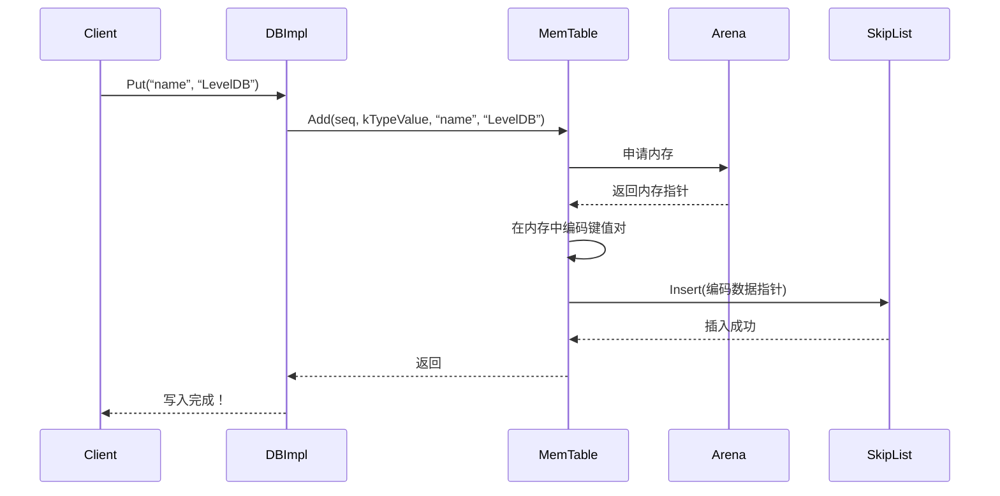

# Chapter 4: 内存表（MemTable）与跳表（SkipList）

在上一章中，我们了解了 [预写日志（WAL / Log）](03_预写日志_wal___log__.md)，它就像是餐厅的“点菜单”，保证了数据安全，即使突然断电订单也不会丢失。

那么，数据被安全地“写下”之后，会被临时存放在哪里，才能让你接下来的 `Get` 请求瞬间读取到呢？

想象一下，你向一家非常高效的餐厅点了一杯咖啡。服务员不会立刻跑到遥远的中央厨房去制作，而是会先把它写在离收银台最近的 **“临时出餐台”** 上，这样咖啡师能最快看到并制作，你也能马上拿到。在 LevelDB 中，这个 **“临时出餐台”就是内存表（MemTable）**。

今天，我们就来揭秘 LevelDB 中这个至关重要的 **“写入缓冲区”** ，以及让它如此高效的秘密武器——**跳表（SkipList）**。

---

## 🎯 你将学到什么

在本章结束时，你将理解：
*   **MemTable 是什么**：它在 LevelDB 写入流程中的核心角色。
*   **MemTable 为什么快**：其内部使用的跳表（SkipList）数据结构如何工作。
*   **“不可变的 MemTable”是什么**：它如何保证读写不冲突。
*   **一个简单的键值对是如何被存入 MemTable 的**。

## 📦 先决条件

*   对 [数据库核心引擎（DBImpl）](01_数据库核心引擎_dbimpl__.md) 有基本了解，知道它协调写入。
*   知道什么是键（Key）和值（Value）。
*   准备好探索一个精巧的内存数据结构！

---

## 第一步：MemTable——LevelDB 的“临时速记本”

当你调用 `db->Put(“name”, “LevelDB”)` 时，数据在写入 [预写日志（WAL）](03_预写日志_wal___log__.md) 确保安全后，第一个目的地就是 **MemTable**。

**MemTable 的核心思想**：先将所有新的写入操作缓存在**内存**中。因为内存的读写速度比磁盘快成千上万倍，这让写入操作变得非常迅速。

我们可以看看 `MemTable` 类的概貌（非常简化）：

```cpp
// 文件：db/memtable.h （简化版）
namespace leveldb {
class MemTable {
 public:
  // 构造函数，需要一个比较器来给键排序
  explicit MemTable(const InternalKeyComparator& comparator);
  
  // 向 MemTable 添加一个键值对（或删除标记）
  void Add(SequenceNumber seq, ValueType type, const Slice& key, const Slice& value);
  
  // 在 MemTable 中查找一个键
  bool Get(const LookupKey& key, std::string* value, Status* s);
  
 private:
  // 内存分配器，负责高效管理内存
  Arena arena_;
  // 核心！一个按键排序的跳表
  SkipList<const char*, KeyComparator> table_;
  // 用于比较键的内部比较器
  KeyComparator comparator_;
};
}
```
*代码解释*：`MemTable` 类主要有三个关键成员：1) `arena_` 负责分配内存。2) `table_` 是核心数据结构，一个跳表，所有数据都存在里面。3) `comparator_` 告诉跳表如何比较键的大小，以保持数据有序。

### 为什么需要保持有序？
保持键的有序性至关重要，因为 LevelDB 承诺提供**有序的**键值遍历。后续将 MemTable 转换成磁盘上的 [SSTable（排序表）](05_sstable_排序表_与数据块_.md) 时，有序的数据可以直接顺序写入，效率极高。

---

## 第二步：跳表（SkipList）——带“快速通道”的链表

链表大家都熟悉，查找一个元素需要从头走到尾，效率是 O(n)，太慢了。跳表（SkipList）就是对链表的一个天才般的改进。

**核心比喻**：想象一个地铁系统。
*   普通链表就像只有**站站停的慢车线**，你要从第1站到第10站，必须经过中间所有站。
*   跳表则像是一个**拥有慢车线、快车线、特快线的多层系统**。
    *   慢车线（L0）连接所有站点。
    *   快车线（L1）可能只连接第1、4、7、10站。
    *   特快线（L2）可能只连接第1、7站。

当你要从第1站去第10站时，可以先坐**特快线（L2）** 到第7站，再换乘**快车线（L1）** 到第10站，跳过了中间很多站，速度大大提升！

```mermaid
graph TD
    subgraph “跳表示意图（查找键 42）”
        A1[“头节点 (L2)”] --> B1[“节点: 15 (L2)”]
        B1 --> C1[“节点: 42 (L2)”]
        C1 --> D1[“节点: 60 (L2)”]
        D1 --> E1[“NULL”]

        A2[“头节点 (L1)”] --> B2[“节点: 15 (L1)”]
        B2 --> C2[“节点: 42 (L1)”]
        C2 --> D2[“节点: 60 (L1)”]
        D2 --> E2[“NULL”]

        A3[“头节点 (L0)”] --> B3[“节点: 3 (L0)”]
        B3 --> C3[“节点: 15 (L0)”]
        C3 --> D3[“节点: 27 (L0)”]
        D3 --> E3[“节点: 42 (L0)”]
        E3 --> F3[“节点: 50 (L0)”]
        F3 --> G3[“节点: 60 (L0)”]
        G3 --> H3[“NULL”]
        
        C1 -.->|“从L2层快速跳跃”| C2
        C2 -.->|“下降到L1层”| C3
        C3 -.->|“下降到L0层找到目标”| E3
    end
```

让我们看看跳表节点的核心结构（简化后）：

```cpp
// 文件：db/skiplist.h （简化版）
template <typename Key, class Comparator>
class SkipList {
 private:
  struct Node {
    // 节点存储的键
    const Key key;
    // 一个柔性数组，存储指向下一层节点的指针。
    // level[0] 是最底层的链表（慢车线），level[1] 是上一层（快车线），以此类推。
    std::atomic<Node*> next_[1]; 
  };
  
 public:
  // 插入一个键
  void Insert(const Key& key);
  // 判断是否包含某个键
  bool Contains(const Key& key) const;
};
```
*代码解释*：每个`Node`除了存储`key`，还有一个`next_`指针数组。数组的大小就是这个节点的高度（有几层“快车线”）。高度是在插入时随机生成的，越高概率越小，这保证了跳表的平衡性。

**查找过程（以查找键 42 为例，对照上图）**：
1.  从最高层（L2）的头节点开始。
2.  向右看（L2层的`next_`指针），发现`15 < 42`，跳到节点`15`。
3.  从节点`15`的L2层向右看，发现`60 > 42`，说明L2层走过头了。
4.  **下降一层**到L1。
5.  从节点`15`的L1层向右看，发现`42 <= 42`，跳到节点`42`。找到了！
6.  如果需要获取值，就继续下降到L0层，访问节点`42`的数据。

跳表平均的查找、插入复杂度都是 O(log n)，媲美平衡二叉树，但实现起来简单得多，且天生支持并发读取。

---

## 第三步：合体！MemTable 如何与跳表协作

现在我们把 MemTable 和跳表组合起来，看看一次 `Put` 操作的数据之旅。

### 旅程概述（非代码）
继续我们的例子 `Put(“name”, “LevelDB”)`：
1.  [DBImpl](01_数据库核心引擎_dbimpl__.md) 在将操作写入 WAL 后，调用 `MemTable::Add(...)`。
2.  `MemTable::Add` 方法首先向 `Arena` (`arena_`) 申请一块连续内存。
3.  它在这块内存中编码数据：格式为 `[键长度][键内容][序列号|类型][值长度][值内容]`。
4.  编码好的数据块指针（`const char*`）被作为“键”，插入到跳表 (`table_`) 中。
5.  跳表根据内部比较器对指针指向的编码数据（主要是键内容）进行排序和插入。



让我们看看 `MemTable::Add` 的核心部分（极度简化）：

```cpp
// 文件：db/memtable.cc （简化思路）
void MemTable::Add(SequenceNumber seq, ValueType type,
                   const Slice& key, const Slice& value) {
  // 1. 计算编码后需要多少内存
  size_t key_size = key.size();
  size_t val_size = value.size();
  size_t encoded_len = key_size + val_size + 几个固定字段长度;

  // 2. 向 Arena 申请内存
  char* buf = arena_.Allocate(encoded_len);

  // 3. 将数据编码进 buf
  char* p = EncodeVarint32(buf, key_size);
  memcpy(p, key.data(), key_size);
  p += key_size;
  // ... 编码序列号、类型、值长度、值内容 ...

  // 4. 将编码后数据的指针插入跳表！
  table_.Insert(buf);
}
```
*代码解释*：`Add` 方法就像一条高效的流水线。`Arena` 是内存池，快速分配；编码是将数据打包成固定格式；最后，跳表负责将这个“数据包”的地址存入其多层索引结构中，保持全局有序。

---

## 第四步：从“临时”到“只读”——不可变的 MemTable

MemTable 是内存中的，而内存是有限的。当 MemTable 的大小增长到一定阈值（例如 4MB）时，它就不能再接收新的写入了，否则会耗尽内存。

这时，[DBImpl](01_数据库核心引擎_dbimpl__.md) 会进行一个巧妙的操作：
1.  将当前的 MemTable 标记为 **不可变的（Immutable MemTable）**。它从此变成**只读**状态。
2.  立即创建一个新的、空的 MemTable 来接收所有后续的写入。
3.  后台的压缩线程会异步地将这个**不可变的 MemTable** 的内容，**完整地、有序地**写入磁盘，形成一个持久的 [SSTable（排序表）](05_sstable_排序表_与数据块_.md) 文件。

**这样做的好处**：
*   **读写分离**：写入新 MemTable 和读取旧 Immutable MemTable 可以并发进行，互不阻塞。
*   **简化刷盘**：因为 Immutable MemTable 是只读且有序的，将其写入 SSTable 非常高效，只需要顺序遍历即可。

---

## 🎉 总结

恭喜！你现在已经揭开了 LevelDB 高性能写入的秘密之一。

*   **MemTable** 是 LevelDB 的**内存写入缓冲区**，所有新数据先到这里，实现高速写入。
*   其内部使用 **跳表（SkipList）** 存储数据，这是一个通过“多层快车线”实现 O(log n) 高效查找和插入的数据结构，简单而强大。
*   MemTable 写满后，会转变为 **不可变的 MemTable**，随后被刷入磁盘形成 [SSTable](05_sstable_排序表_与数据块__.md)，实现了读写分离和有序持久化。

现在，临时存放在内存“速记本”上的数据，已经准备好踏上前往永久存储——**磁盘上的 SSTable**——的旅程了。在下一章，我们将深入探索 [SSTable（排序表）与数据块](05_sstable_排序表_与数据块__.md)，看看 LevelDB 是如何在磁盘上高效组织这些有序数据的。

---

Generated by [AI Codebase Knowledge Builder](https://github.com/The-Pocket/Tutorial-Codebase-Knowledge)