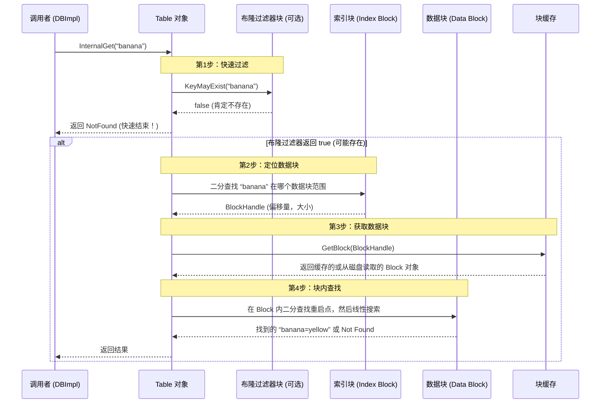

# Chapter 5: SSTable（排序表）与数据块

在[上一章](04_内存表_memtable_与跳表_skiplist__.md)中，我们学习了`MemTable`，它是LevelDB在内存中的“快速工作台”。但它有个致命的缺点：**内存有限**，且断电后数据会丢失。

当`MemTable`写满时，它会被“冻结”并转换成一个**不可变的、持久化的磁盘文件**。这个文件，就是本章的主角——**SSTable（Sorted String Table，排序字符串表）**。你可以把它想象成一本书，里面的所有词条（键值对）都严格按照字母表顺序排列，并装订成册，存放在图书馆（磁盘）的书架上。

---

## 🎯 你将学到什么
在本章结束时，你将理解：
*   **SSTable是什么**：它作为LevelDB的**磁盘数据档案库**，如何解决持久化和有序查询的问题。
*   **SSTable的结构**：一个SSTable文件内部是如何像一本书一样被组织起来的（数据块、索引、目录）。
*   **数据块的奥秘**：数据在块内是如何通过“前缀压缩”巧妙存储以节省空间的。
*   **如何读写SSTable**：了解`TableBuilder`如何“写书”，以及`Table`类如何“读书”。
*   **一个具体的查找过程**：当一个`Get`请求需要查询SSTable时，内部发生了什么。

## 📦 先决条件
*   已完成[第四章](04_内存表_memtable_与跳表_skiplist__.md)的学习，了解MemTable。
*   理解键值对（Key-Value）的基本概念。
*   有“把大象装进冰箱”一样的拆分复杂问题的耐心。

---

## 第一步：一个亟待解决的问题

让我们从一个简单的查询开始。假设数据库里已经持久化了很多水果及其颜色，现在你想查询 **“banana”** 的颜色。

在MemTable里，我们可以用跳表快速找到它。但如果数据量远超内存，大部分数据都存放在磁盘上的SSTable文件中，我们该怎么办？

**最笨的办法**：把整个巨大的SSTable文件读进内存，然后像在MemTable里一样查找。这就像为了查一个单词，把整本《辞海》买回家——速度慢，浪费巨大。

**LevelDB的聪明办法**：给这本“书”（SSTable）设计精妙的**目录**和**索引**。我们只需要：
1.  **快速检查**：先看一眼“快速检查清单”，确认“banana”这个词可能在这本书里。
2.  **查找目录**：去“目录”（索引块）里查找，“banana”应该在哪一“页”（数据块）里。
3.  **精读某一页**：只把那一“页”从磁盘读进内存，然后在这一页里找到“banana”的具体解释。

接下来，我们就来拆解这本设计精妙的“书”——SSTable。

## 第二步：SSTable 文件结构——一本书的解剖图

一个完整的SSTable文件（后缀通常是 `.ldb`），其结构如下图所示，它严格遵循一个固定的格式：

```mermaid
graph TD
    subgraph “SSTable 文件（一本有序的书）”
        A[文件开始] --> B[数据块 1]
        B --> C[...]
        C --> D[数据块 N]
        D --> E[(可选的元数据块<br/>如：布隆过滤器)]
        E --> F[元数据索引块<br/>记录所有元数据块的位置]
        F --> G[索引块<br/>记录所有数据块的位置]
        G --> H[Footer 文件尾<br/>记录 索引块 和 元数据索引块 的位置]
        H --> I[文件结束]
    end

    style B fill:#e1f5fe
    style D fill:#e1f5fe
    style E fill:#f3e5f5
    style F fill:#fff3e0
    style G fill:#fff3e0
    style H fill:#ffecb3
```

让我们来理解每个部分的作用：
*   **数据块 (Data Blocks)**：书的**正文部分**。所有键值对在这里按顺序存储，并被分成了N个固定大小的“页”（块）。默认每页（块）大小约为4KB。
*   **元数据块 (Meta Blocks，可选)**：书的**附录或特殊清单**。目前最重要的是一种叫“布隆过滤器”的块，它就是第一步提到的“快速检查清单”，能极快地告诉你一个键**肯定不在**这本书里，避免无效的磁盘查找。
*   **元数据索引块 (Metaindex Block)**：书的**附录目录**。如果书有附录（元数据块），这里就记录着每个附录的名字和位置。
*   **索引块 (Index Block)**：书的**核心目录**。这是最关键的部分！它记录了每个**数据块**的**范围**和**位置**。例如：“第50-100页包含了从`apple`到`grape`的词条，它们位于文件从偏移量2048字节开始的地方”。
*   **Footer (文件尾)**：书的**封底出版社信息**。它固定在文件末尾，只有固定大小。它唯一的作用就是告诉你**这本书的“核心目录”和“附录目录”在哪**。没有它，你就找不到目录，书就废了。

## 第三步：深入数据块——高效的存储技巧

数据块是真正存储数据的地方。如果直接把成千上万的键值对简单罗列，会非常浪费空间，因为很多键有共同的前缀（例如 `user:001:name`, `user:001:email`）。

LevelDB使用了一种叫做 **“前缀压缩”** 的技术。原理很简单：存储当前键时，只存储它和上一个键**不同的部分**。

### 数据块内部格式
假设我们要按顺序存储以下三个键值对：
1. `key: “apple”, value: “red”`
2. `key: “application”, value: “form”`
3. `key: “banana”, value: “yellow”`

它们在数据块里的存储格式简化如下：

```cpp
// 第一条记录（重启点，完整存储）
shared_bytes = 0 // 与前一个键相同的字节数为0（因为是第一条）
unshared_bytes = 5 // 键独有部分的长度 “apple” -> 5
value_length = 3   // 值的长度 “red” -> 3
key_delta = “apple” // 完整的键
value = “red”       // 完整的值

// 第二条记录（与前一条键 “apple” 共享前缀 “app”）
shared_bytes = 3 // 与前一个键相同的字节数 “app” -> 3
unshared_bytes = 8 // 键独有部分的长度 “lication” -> 8
value_length = 4   // 值的长度 “form” -> 4
key_delta = “lication” // 只存储不同的部分
value = “form”

// 第三条记录（与前一条键 “application” 没有共享前缀）
shared_bytes = 0 // 重启点，完整存储
unshared_bytes = 6 // “banana” -> 6
value_length = 6   // “yellow” -> 6
key_delta = “banana”
value = “yellow”
```
*代码解释*：`shared_bytes`记录共享的前缀长度。对于重启点（如第一条和第三条），`shared_bytes`为0，表示存储完整键。这种方式大大节省了存储空间。

### 重启点与块尾索引
但是，如果一直依赖前一个键来解码，查找时就需要从头开始线性遍历，这很慢。为此，LevelDB引入了**重启点**。
*   **重启点**：每隔一定数量的记录（如16条），就强制将 `shared_bytes` 设为0，存储一次完整键。这条记录就是一个重启点。
*   **块尾索引**：在每个数据块的末尾，会存储所有**重启点**在块内的偏移量（一个数组）。

这样，当要在数据块内查找一个键时，可以先对**重启点数组**进行**二分查找**，定位到大概区间，然后再在那个小区间内进行线性搜索，兼顾了效率和实现简单性。

一个数据块的完整内存布局如下：
```
[条目1][条目2]...[条目K][重启点偏移1, 重启点偏移2, ..., 重启点偏移N][重启点数量N (uint32)]
```

## 第四步：定位与读取——如何查找一个键

现在，让我们把前面所有知识串联起来，看看当`DBImpl`需要在一个SSTable文件里查找键 `K`（比如“banana”）时，具体发生了什么。这个过程由 `Table::InternalGet` 方法协调。


*图表解释*：这是一个简化的查找序列。实际中，布隆过滤器是可选的。索引块的二分查找和数据块内的查找是核心步骤。块缓存（将在[第九章](09_缓存与布隆过滤器_.md)详述）在这里起到了避免重复磁盘IO的关键作用。

## 第五步：核心代码一览

让我们看看支撑上述流程的几个核心代码结构，理解它们是如何联系在一起的。

### 1. 块位置指针：BlockHandle
`BlockHandle` 是一个简单的结构体，用于在文件中唯一定位一个块。它就像书中的一个精确页码（偏移量）和章节长度（大小）。

```cpp
// table/format.h (简化)
class BlockHandle {
 public:
  uint64_t offset_; // 块在文件中的起始位置
  uint64_t size_;   // 块的大小
  void EncodeTo(std::string* dst) const; // 序列化（写入文件）
  Status DecodeFrom(Slice* input);       // 反序列化（从文件读取）
};
```

### 2. 书的封底：Footer
`Footer` 固定在文件末尾，它只做一件事：保存索引块和元数据索引块的`BlockHandle`。

```cpp
// table/format.h (简化)
class Footer {
 public:
  static const size_t kEncodedLength = 2*BlockHandle::kMaxEncodedLength + 8; // 固定大小
  BlockHandle metaindex_handle_; // 元数据索引块的位置
  BlockHandle index_handle_;     // 索引块的位置，这是关键！
  void EncodeTo(std::string* dst) const;
  Status DecodeFrom(Slice* input);
};
```
*代码解释*：`kEncodedLength`是固定的，因此读取文件时，可以直接跳到`file_size - kEncodedLength`的位置读取Footer，进而找到整个文件的“目录”。

### 3. 书的构建者：TableBuilder
当`MemTable`需要被转换成SSTable时，就由`TableBuilder`来负责“写书”。

```cpp
// include/leveldb/table_builder.h (关键方法)
class TableBuilder {
 public:
  // 添加一个键值对，Builder会决定将其放入哪个数据块
  void Add(const Slice& key, const Slice& value);
  // 完成SSTable的构建，写入所有元数据块、索引块和Footer
  Status Finish();
  // 丢弃未完成的构建
  void Abandon();
};
```

它的工作流程是：
1.  不断接收`Add(key, value)`，用`BlockBuilder`填充当前数据块。
2.  当当前数据块大小超过预设值，就将其写入磁盘，并同时在内存的索引块中添加一条记录（“当前块最后一个键” -> “该块的BlockHandle”）。
3.  所有数据写完后，调用`Finish()`，依次写入元数据块、元数据索引块、索引块，最后写入Footer。

### 4. 书的阅读器：Table
`Table` 类代表了磁盘上一个已打开的SSTable文件，它封装了所有的读取逻辑。

```cpp
// include/leveldb/table.h (关键方法)
class Table {
 public:
  // 静态方法，打开一个文件并解析为Table对象
  static Status Open(const Options& options,
                     RandomAccessFile* file,
                     uint64_t file_size,
                     Table** table);
  // 内部方法，根据键获取值（即我们前面分析的流程）
  Status InternalGet(const ReadOptions&, const Slice& key,
                     void* arg,
                     void (*handle_result)(void* arg,
                                           const Slice& k,
                                           const Slice& v));
  // 创建一个遍历整个SSTable的迭代器
  Iterator* NewIterator(const ReadOptions&) const;
};
```
*代码解释*：`Open`方法会读取文件尾的`Footer`，然后根据`Footer`加载`索引块`。`InternalGet`方法则实现了我们前面图解的全套查找逻辑。

## 🎉 总结与展望

恭喜你！现在你已经理解了LevelDB在磁盘上的核心存储单元——**SSTable**。

**本章核心收获**：
*   **SSTable是磁盘上有序、不可变的键值对集合**，是MemTable的持久化形态。
*   其结构像一本书：**数据块**是正文，**索引块**是目录，**Footer**是封底，指引你找到目录。
*   **数据块内使用前缀压缩**节省空间，并利用**重启点**支持高效的二分查找。
*   读取时，先查**布隆过滤器**（如果有），再用**索引块**定位数据块，最后在**数据块内**找到具体数据。
*   `TableBuilder`负责写，`Table`负责读，`BlockHandle`和`Footer`是它们沟通的“地图坐标”。

SSTable的设计是LSM-Tree架构**高效的核心**：写入时只需顺序写入新文件，读取时通过索引快速定位。但这也带来了新问题：随着写入不断发生，磁盘上会存在大量SSTable文件（可能有重复或已删除的键），如何管理和合并它们以保障读取效率和空间利用率呢？

这就引出了下一章的关键角色——**版本管理**。它像一位图书馆管理员，维护着一份全局“藏书目录”（`Version`），记录着当前所有有效的SSTable文件及其层级关系。让我们继续前进，探索[第六章：版本管理（VersionSet 与 Version）](06_版本管理_versionset_与_version__.md)。

---

Generated by [AI Codebase Knowledge Builder](https://github.com/The-Pocket/Tutorial-Codebase-Knowledge)