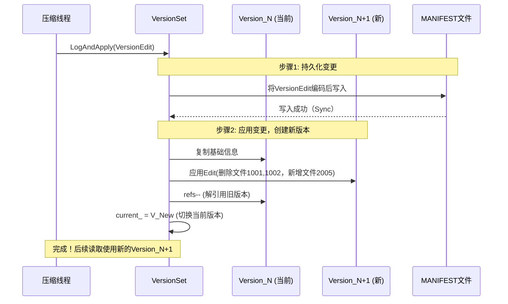

# Chapter 6: 版本管理（VersionSet 与 Version）

欢迎回来！在上一章中，我们学习了数据最终如何以 **[SSTable（排序表）](05_sstable_排序表_与数据块_.md)** 的形式被优雅地组织在磁盘上。

现在，想象这样一个场景：在数据库运行期间，后台的 **[压缩机制](07_压缩机制_compaction__.md)** 正在勤奋地工作，它读取了一些旧的 SSTable 文件，合并、整理后，写入了全新的 SSTable 文件。**那么，在压缩进行到一半时，一个新的读请求进来，它应该去旧的 SSTable 里找数据，还是去新的 SSTable 里找？** 如果去新的里面找，但数据还没合并完怎么办？如果只去旧的里面找，那已经合并完的数据岂不是读不到了？

这就是 **版本管理** 要解决的核心问题。它让 LevelDB 能够**安全、高效地管理不断变化的文件集合**，确保任何时候的读操作都能看到一个**完整且一致**的数据库状态，就像什么都没在后台发生一样。

如果把 LevelDB 比作一个不断生长的图书馆：
*   **SSTable 文件** 就是一本本编好号的图书。
*   每次压缩，就像一次图书馆的**图书整理**：下架一些旧书，上架一些合并后的新书。
*   一个 **`Version`（版本）** 就是**某一时刻图书馆的完整藏书目录**，精确记录了每一层书架（Level）上有哪些书（SSTable 文件）。
*   **`VersionSet`** 就是管理所有这些历史“藏书目录”的**图书馆总管理员**。
*   当图书整理员（压缩线程）工作完成后，他会生成一份 **`VersionEdit`（版本编辑日志）**，描述“下架了哪几本书，上架了哪几本新书”。总管理员`VersionSet`拿到这份编辑日志后，就会基于旧目录，生成一份全新的、反映当前藏书情况的总目录（新`Version`）。

理解了版本管理，你就能明白 LevelDB 如何实现**无锁的快照读取**和**平滑的后台压缩**。

---

## 🎯 你将学到什么

在本章结束时，你将理解：
*   **什么是 Version**：一个数据库在某个时刻的“静态快照”。
*   **什么是 VersionSet**：如何管理多个版本的生命周期，实现“多版本并发控制”。
*   **什么是 VersionEdit**：如何像 Git 的 `diff` 一样，描述版本之间的变更。
*   **MANIFEST 文件**：如何将版本变更持久化，确保数据库可恢复。
*   **快照（Snapshot）** 是如何与版本系统协同工作的。

## 📦 先决条件

*   对 **[SSTable](05_sstable_排序表_与数据块_.md)** 有基本了解。
*   知道 LevelDB 的数据是分层（Level）存储的。
*   听说过 Git 的基本概念（commit, diff）会有帮助，但不是必须。

---

## 第一步：从一个具体问题出发 - “快照读取”

假设你是一个交易系统，在时间点 T1 执行了一次关键操作后，你希望后续的审计查询能**永远读到 T1 时刻的数据状态**，即使之后数据库又写入了千万条新记录。

LevelDB 通过 `GetSnapshot()` 和 `ReadOptions::snapshot` 提供了这个能力。其背后的魔法就是版本管理。

**关键思想是**：当一个快照被创建时，它会“钉住”（pin）当时的那个`Version`。只要这个快照还被使用者持有，这个`Version`及其对应的所有 SSTable 文件就会被保护起来，不会被后台压缩删除。读操作使用这个快照，就能访问到那个“过去的”文件集合视图。

---

## 第二步：核心概念拆解

### 概念一：Version - 某一时刻的文件清单

`Version` 是版本系统的核心。它不包含实际数据，只包含**元数据**。

```cpp
// db/version_set.h (简化版)
class Version {
 public:
  // 核心数据结构：每个层级（level）包含哪些文件
  std::vector<FileMetaData*> files_[config::kNumLevels];

  // 引用计数。当有快照或迭代器使用此版本时，计数>0，版本不能被删除。
  int refs_;
};
```
*代码解释*：`Version` 类内部主要是一个数组 `files_`。数组的每个元素（对应一个层级）是一个列表，里面存放着该层所有 SSTable 文件的元信息（`FileMetaData`），包括文件编号、大小、以及文件内最小和最大的键。`refs_` 用于跟踪有多少个“用户”（如快照）正在使用这个版本。

**一个 Version 实例就像一张静态的、只读的“地图”**，告诉你：“此刻，数据库的所有数据就分布在这些文件里，按这个层级规则组织。”

### 概念二：VersionEdit - 版本变更日志

当发生压缩或 MemTable 持久化（成为 Level-0 的 SSTable）时，文件集合发生了变化。我们不直接修改`Version`，而是用 `VersionEdit` 来描述发生了什么变化。

```cpp
// db/version_edit.h (极度简化)
class VersionEdit {
 public:
  // 记录新增了哪些文件
  std::vector<std::pair<int, FileMetaData>> new_files_;
  // 记录删除了哪些文件（层级 + 文件编号）
  std::vector<std::pair<int, uint64_t>> deleted_files_;

  // 其他全局信息变更，如最后的序列号
  uint64_t last_sequence_;
};
```
*代码解释*：`VersionEdit` 是一个**增量变更记录**。它只关心“变”了什么，不关心全部状态。这非常像 Git 的提交（commit）。`new_files_` 记录了新增的文件和它所属的层级，`deleted_files_` 记录了要删除的文件。通过应用（Apply）一个 `VersionEdit` 到一个 `Version`，就可以得到一个新的 `Version`。

### 概念三：VersionSet - 版本管理器

`VersionSet` 是总管，它持有`current`指针指向当前最新的`Version`，并管理着一个版本的双向链表（用于维护历史版本供快照使用）。

```cpp
// db/version_set.h (概念示意)
class VersionSet {
 private:
  // 当前正在使用的版本（最新）
  Version* current_;
  // 所有版本的链表头（用于管理生命周期）
  Version dummy_versions_;

  // 用于将 VersionEdit 持久化到 MANIFEST 文件的组件
  WritableFile* descriptor_file_;
  log::Writer* descriptor_log_;

 public:
  // 应用一个 VersionEdit，生成新版本，并更新 current_
  Status LogAndApply(VersionEdit* edit, port::Mutex* mu);
  // 获取当前版本
  Version* current() const { return current_; }
};
```
*代码解释*：`VersionSet::LogAndApply` 是核心方法。它做两件事：1. 将`VersionEdit`的内容写入 **MANIFEST** 日志文件（保证持久化）；2. 将`edit`应用到`current_`版本上，创建一个新的`Version`并更新`current_`指针。旧的`Version`如果引用计数为0，则会被垃圾回收。

---

## 第三步：这一切是如何协作的？- 内部流程解析

让我们追踪一次压缩完成后，版本系统是如何更新的。

### 流程概述（非代码）
假设 **压缩线程** 已经完成工作，它知道：
*   删除了 Level-1 的 `文件1001` 和 `文件1002`。
*   新增了 Level-2 的 `文件2005`。

它将创建一个 `VersionEdit` 对象，填入这些信息，然后调用 `VersionSet::LogAndApply(&edit)`。



*图表解释*：这个时序图展示了从 `Version N` 切换到 `Version N+1` 的原子过程。关键点在于**先写日志（MANIFEST），后改内存状态**。即使在这一步系统崩溃，重启时也能从 MANIFEST 日志回放全部`VersionEdit`，重建出最新的`Version`，保证数据的一致性视图不丢失。

### 深入代码：`LogAndApply` 的关键片段

下面是 `LogAndApply` 方法核心逻辑的简化展示：

```cpp
// db/version_set.cc (逻辑简化，非直接拷贝)
Status VersionSet::LogAndApply(VersionEdit* edit, port::Mutex* mu) {
  // 1. 为edit设置本次操作最后的序列号（全局递增）
  edit->SetLastSequence(last_sequence_);

  // 2. 将edit内容序列化成字符串，准备写入日志
  std::string record;
  edit->EncodeTo(&record);

  // 3. **关键：先持久化到MANIFEST文件**
  Status s = descriptor_log_->AddRecord(record);
  if (s.ok()) {
    s = descriptor_file_->Sync(); // 确保落盘
  }
  if (!s.ok()) {
    // 日志写入失败，整个操作失败，current_版本保持不变
    return s;
  }

  // 4. 持久化成功，开始应用edit到内存，创建新版本
  Version* v = new Version(this);
  // 将当前版本作为基础，构建新版本
  Builder builder(this, current_);
  builder.Apply(edit); // builder内部处理文件增删
  builder.SaveTo(v);   // 将builder结果保存到新版本v

  // 5. 安装新版本，替换current_
  Finalize(v); // 计算一些新版本的统计信息（如每一层大小）
  AppendVersion(v); // 将v加入版本链表，并设置 current_ = v

  // 6. 尝试回收旧版本（如果其refs_==0）
  MaybeDeleteOldVersions();
  return Status::OK();
}
```
*代码解释*：这个过程清晰地体现了“Write-Ahead Logging”的思想。只有在描述变更的日志（MANIFEST）**确保持久化之后**，才会去修改内存中最关键的元数据——当前版本`current_`。这保证了操作的原子性和可恢复性。

---

## 第四步：快照（Snapshot）是如何实现的？

还记得第一章提到的 **[数据库核心引擎（DBImpl）](01_数据库核心引擎_dbimpl__.md)** 吗？它内部持有一个 `VersionSet`。当调用 `DBImpl::GetSnapshot()` 时：

1.  **DBImpl** 获取当前的**序列号（Sequence Number）**。每个写操作都会分配一个全局递增的序列号。
2.  它调用 `VersionSet` 相关逻辑，确保当前 `Version` 的引用计数 `refs_++`（防止被删除）。
3.  返回一个 `Snapshot` 对象给用户，该对象内部主要就是这个序列号。

当用户使用这个快照进行读操作（`Get`）时：
1.  **迭代器体系（Iterator）** 在查找数据时，会使用快照携带的序列号。
2.  它遍历 MemTable 和 SSTable 时，会忽略那些序列号大于快照序列号的记录（即快照之后写入的数据）。
3.  因为该快照对应的 `Version` 被“钉住”，所以它需要的所有 SSTable 文件都保证存在。

这样，**快照读取** 和 **后台压缩** 就完美地并行不冲突了。

---

## 第五步：MANIFEST - 版本历史的保险箱

`MANIFEST` 是一个特殊的日志文件（通常命名为 `MANIFEST-xxxxxx`），它按顺序记录了数据库生命周期内所有的 `VersionEdit`。数据库打开时，`VersionSet` 会读取这个文件，依次回放所有的 `edit`，从而精确地重建出最新的 `Version` 状态。

**这就像游戏存档**：`Version` 是当前游戏状态，`VersionEdit` 是你每一步的操作记录，`MANIFEST` 就是保存了所有操作记录的存档文件。重启游戏（打开数据库）时，加载存档并回放所有操作，就能恢复到上次退出的状态。

---

## 🎉 总结与下一步

你已经揭开了 LevelDB 版本管理的神秘面纱！现在你知道了：

*   **`Version`** 是数据库在某一时刻的**静态文件清单**，是快照的基石。
*   **`VersionSet`** 是**版本管家**，通过 `LogAndApply` 原子性地切换版本，并管理版本生命周期。
*   **`VersionEdit`** 是描述版本差异的**变更日志**，使得状态更新变得轻量和可持久化。
*   这套多版本机制（MVCC）使得 **快照读取** 和 **后台压缩** 可以安全地并发执行。

版本管理系统清晰地划分了**数据的物理存储（SSTable文件）** 和**数据的逻辑视图（Version）**。它让 LevelDB 从一个简单的文件集合，变成了一个健壮的、支持快照和并发维护的存储引擎。

那么，这个系统的核心驱动力——决定何时、如何选择文件进行合并的 **[压缩机制（Compaction）](07_压缩机制_compaction__.md)**，又是如何工作的呢？它如何与 `VersionSet` 交互来选择需要压缩的文件？让我们在下一章深入探索！

---

Generated by [AI Codebase Knowledge Builder](https://github.com/The-Pocket/Tutorial-Codebase-Knowledge)