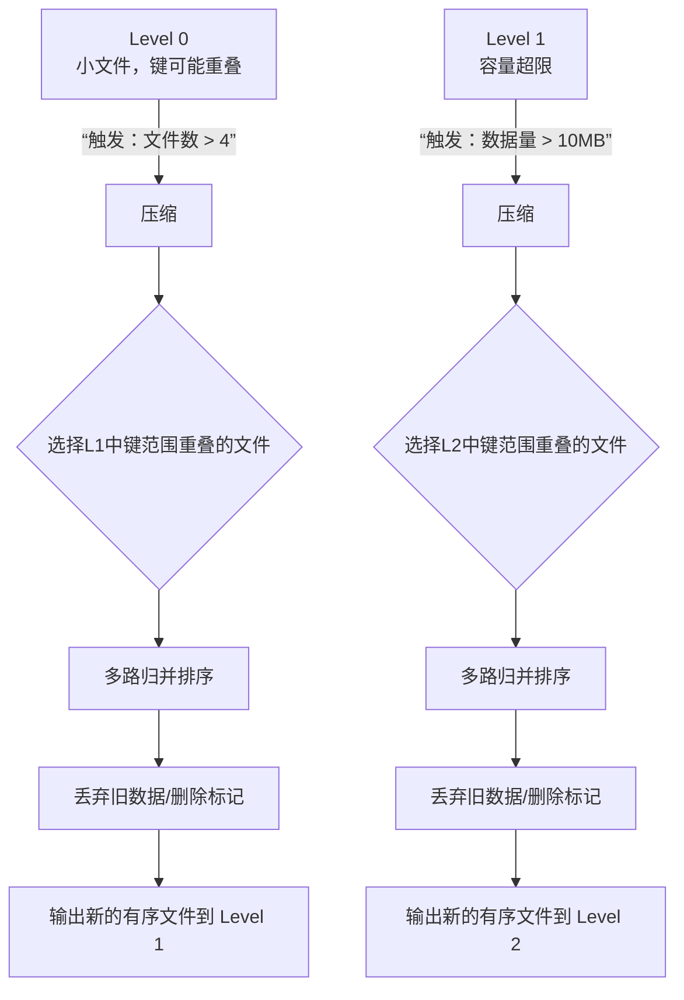

# Chapter 7: 压缩机制（Compaction）

在上一章，我们学习了 LevelDB 如何通过 [版本管理（VersionSet 与 Version）](06_版本管理_versionset_与_version__.md) 来追踪磁盘上所有的 `SSTable` 文件。这就像为你的数据图书馆建立了一套精确的“藏书目录”。

但是，想象一下：随着你不断地写入新书（数据），图书馆里堆满了各种临时的小册子、还有内容已经过时的旧书。这会让找书（读取数据）变得越来越慢，而且非常浪费书架空间。

本章的主角——**压缩机制（Compaction）**，就是 LevelDB 的**专职图书管理员**。它负责在后台默默工作，定期整理图书馆：把小册子合并成厚书，把过时的旧书扔掉，让整个图书馆保持整洁有序，从而确保读写效率。它是 LSM-Tree 架构能稳定运行的核心维护操作。

---

## 🎯 你将学到什么

在本章结束时，你将理解：
*   **压缩要解决什么**：为什么需要整理 `SSTable` 文件？
*   **压缩如何工作**：LevelDB 独特的“分层（Level）”整理策略是什么？
*   **压缩何时触发**：什么情况下图书管理员会开始工作？
*   **压缩的影响**：它对读写性能有什么好处和代价？

## 📦 先决条件

*   理解 [SSTable（排序表）与数据块](05_sstable_排序表_与数据块_.md) 的基本概念。
*   了解 [版本管理（VersionSet 与 Version）](06_版本管理_versionset_与_version__.md) 如何管理文件列表。
*   一颗好奇的心，想知道 LevelDB 如何“自动”保持高效。

---

## 第一步：我们面临的问题——为什么需要压缩？

让我们从上一章延续的比喻开始。你的数据图书馆有这些情况：

1.  **大量小文件**：每当一个 [内存表（MemTable）](04_内存表_memtable_与跳表_skiplist__.md) 写满，它就会被冻结并转换成一个 `SSTable` 文件存入磁盘（Level 0）。这会产生很多小文件。
2.  **数据冗余与删除**：如果你更新了键 `A` 的值，旧值还在旧的 `SSTable` 里。如果你删除了键 `B`，也只是写入一个“删除标记”，旧数据依然占着空间。
3.  **读取变慢**：要查找一个键，可能需要检查 Level 0 的多个文件（因为它们可能有键范围重叠），再逐层向下查找，文件越多越慢。

如果不整理，磁盘会迅速被垃圾数据填满，查询会像在杂乱的仓库里找东西一样痛苦。

**压缩（Compaction）** 就是为了解决这些问题：它选取一些 `SSTable` 文件，将它们合并成一个新的、更大的、键范围有序且不重叠的文件，并丢弃被覆盖或已删除的旧数据。

```cpp
// 概念上的伪代码：压缩的核心操作
输入: 一批旧的 SSTable 文件 [file1.ldb, file2.ldb, ...]
输出: 一批新的、合并后的 SSTable 文件 [new_file1.ldb, ...]

过程:
1. 读取所有输入文件的键值对，进行多路归并排序。
2. 当遇到同一个键的多个版本时，只保留最新的版本（序列号最大的）。
3. 如果最新版本是“删除标记”，则丢弃这个键。
4. 将最终的结果写入新的、更大的输出文件。
```
*代码解释*：这就像把几本旧笔记的内容抄写到一本新笔记本上。抄写时，如果同一件事有多个记录，只抄最新的一条；如果最新记录是“已作废”，那这件事就不抄了。新笔记更整洁、更薄。

---

## 第二步：LevelDB 的整理策略——分层（Leveled）压缩

LevelDB 采用了一种聪明且高效的分层整理策略。想象一个图书馆有 7 层（Level 0 到 Level 6）：

*   **Level 0 (L0)**：**新书暂存区**。书籍（`SSTable` 文件）刚被送来，随意摆放（键范围可能重叠）。容量小，最多放 4 本书（`level0_file_num_compaction_trigger` 默认 4）。
*   **Level 1 到 Level 6 (L1-L6)**：**正式书架层**。每层书架容量是上一层的 10 倍（例如 L1 最多 10MB，L2 最多 100MB）。每层书架上的书都摆放得整整齐齐，并且同一层内的书，其键范围**绝不重叠**。

**压缩的基本规则**：数据像水流一样，从高层级向低层级“沉降”。
1.  当 L0 的文件数超过阈值（如4个），就会触发一次压缩，将 L0 的所有文件与 L1 中键范围有重叠的文件合并，结果输出到 L1。
2.  当 L1 的数据量超过其容量（如10MB），就会触发一次压缩，将 L1 的一部分文件与 L2 中键范围有重叠的文件合并，结果输出到 L2。
3.  以此类推，直到 L6。



*图表解释*：这个流程图展示了两个层级的触发和合并过程。数据总是从高（编号小）层向低（编号大）层整理，每次压缩都会清理掉无用的历史数据。

---

## 第三步：深入代码——压缩如何被触发和执行？

压缩是一个后台任务，由 `DBImpl` 中的后台线程执行。整个过程涉及多个组件的协作。

### 1. 触发压缩的时机
主要在两个地方会检查是否需要触发压缩：
1.  **完成一次写入后**：如果这次写入导致 `MemTable` 被刷新到 L0，可能使 L0 文件数超标。
2.  **完成一次压缩后**：这次压缩输出到某一层（比如 L1），可能导致该层数据量超标，进而触发下一次到 L2 的压缩。

关键函数是 `MaybeScheduleCompaction()`：
```cpp
// db/db_impl.cc (简化)
void DBImpl::MaybeScheduleCompaction() {
  if (background_compaction_scheduled_) {
    // 已经在整理了，不重复安排
    return;
  }
  if (imm_ == nullptr && !versions_->NeedsCompaction()) {
    // 没有需要冻结的MemTable，且各层都未超限，无需整理
    return;
  }
  // 标记整理已安排，并唤醒后台线程
  background_compaction_scheduled_ = true;
  env_->Schedule(&DBImpl::BGWork, this); // 后台线程执行 BGWork -> BackgroundCompaction
}
```
*代码解释*：`DBImpl` 检查两个条件：1）是否有待冻结的 `MemTable`（`imm_`）；2）`Version` 所代表的当前文件布局是否需要压缩。只要满足一个，就调度后台任务。

### 2. 选择要压缩哪些文件？
这项工作由 `VersionSet::PickCompaction()` 完成。它根据当前是哪个 Level 触发了压缩，智能地选择输入文件。
```cpp
// db/version_set.cc (极度简化)
Compaction* VersionSet::PickCompaction() {
  Compaction* c = new Compaction(options_, current_);
  
  // 1. 找出哪个 Level 需要被压缩
  for (int level = 0; level < config::kNumLevels; level++) {
    if (current_->compaction_score_[level] >= 1) { // 分数>=1表示需要压缩
      c->level_ = level;
      break;
    }
  }
  
  // 2. 选择该 Level 上的一个“启动”文件
  c->inputs_[0].push_back(current_->files_[c->level_][start_file_index]);
  
  // 3. 在下一层（Level+1）找到与这个启动文件键范围有重叠的所有文件
  GetOverlappingInputs(c->level_ + 1, &c->start, &c->limit, &c->inputs_[1]);
  
  return c;
}
```
*代码解释*：`Version` 会为每一层计算一个“压缩分数”，分数高低取决于“文件数超标”或“数据量超标”。压缩器（`Compaction`）对象会记录从哪一层（`level_`）选择哪些文件（`inputs_[0]`）进行合并，以及下一层（`level_+1`）中哪些文件（`inputs_[1]`）参与合并。

### 3. 执行合并——真正的“抄写”工作
这是最核心的一步，在 `DBImpl::DoCompactionWork()` 和 `BuildTable()` 函数中完成。

```cpp
// db/db_impl.cc 和 db/builder.cc (概念合并，极度简化)
Status DBImpl::DoCompactionWork(CompactionState* compact) {
  // 1. 为本次压缩的所有输入文件创建一个多路合并迭代器
  Iterator* input = versions_->MakeInputIterator(compact->compaction);
  
  // 2. 遍历排序后的所有键值对
  for (input->SeekToFirst(); input->Valid(); ) {
    // 跳过旧版本，只保留当前键的最新版本（序列号最大）
    // 如果最新版本是删除标记，也跳过（即丢弃该键）
    
    // 3. 将有效的键值对添加到正在构建的新 SSTable 中
    current_output_builder->Add(input->key(), input->value());
    
    // 4. 如果当前输出的 SSTable 文件大小达到上限（如 2MB），就完成它，并开始写下一个
    if (current_output_builder->FileSize() >= target_file_size) {
      FinishCompactionOutputFile(compact, input);
    }
    input->Next();
  }
  
  // 5. 安装新的版本（用新文件替换旧文件）
  InstallCompactionResults(compact);
}
```
*代码解释*：这个过程就像一个高效的流水线：合并迭代器负责提供排好序且已去重的最新数据流；`TableBuilder` 负责将这些数据打包成新的 `SSTable` 块和文件；最后通过 `VersionEdit` 原子性地更新文件清单。

---

## 第四步：压缩的影响——双刃剑

压缩对 LevelDB 至关重要，但它也是一把双刃剑。

**优点：**
*   **空间放大**：及时回收被覆盖和删除数据所占用的磁盘空间。
*   **读放大**：减少文件数量，尤其是清理 L0 的重叠文件，能显著提升点查询（`Get`）和范围查询的速度。
*   **数据有序化**：使数据在磁盘上分布更紧凑，顺序读性能更好。

**代价：**
*   **写放大**：这是最大的代价！一个键值对可能在多次压缩中被反复读取和重写。例如，一个热键可能从 L0 -> L1 -> L2 -> ... -> L6，每次移动都被重写一次。
*   **I/O 和 CPU 消耗**：压缩是密集的磁盘读写和计算操作，会占用系统资源，可能与前台读写产生竞争。
*   **临时空间**：在合并完成前，新旧文件会同时存在，需要额外的磁盘空间。

LevelDB 通过参数（如每层大小、触发阈值、文件大小）让使用者可以在**写性能**和**读性能/空间利用率**之间进行权衡。

---

## 总结与下一站

恭喜你！你现在理解了 LevelDB 这位“图书管理员”是如何工作的。**压缩（Compaction）** 是 LSM-Tree 引擎的“心跳”，它通过后台持续的分层合并与清理，使得 LevelDB 能够在享受高写入吞吐的同时，维持可接受的读取性能和空间利用率。

核心要点回顾：
*   **目的**：合并小文件，清理过期数据，减少读取时需要检查的文件数量。
*   **策略**：分层（Leveled）结构，数据从 Level 0 逐级向下合并。
*   **过程**：选择文件 -> 多路归并去重 -> 写入新文件 -> 原子化更新版本。
*   **权衡**：以**写放大**为代价，换取更好的空间利用率和读性能。

整理好了文件，我们终于可以高效地查找数据了。下一章，我们将学习 LevelDB 如何统一地遍历内存和磁盘上的数据——那就是功能强大且设计精巧的 **[迭代器体系（Iterator）](08_迭代器体系_iterator__.md)**。它将为我们打开灵活查询数据的大门。

---

Generated by [AI Codebase Knowledge Builder](https://github.com/The-Pocket/Tutorial-Codebase-Knowledge)