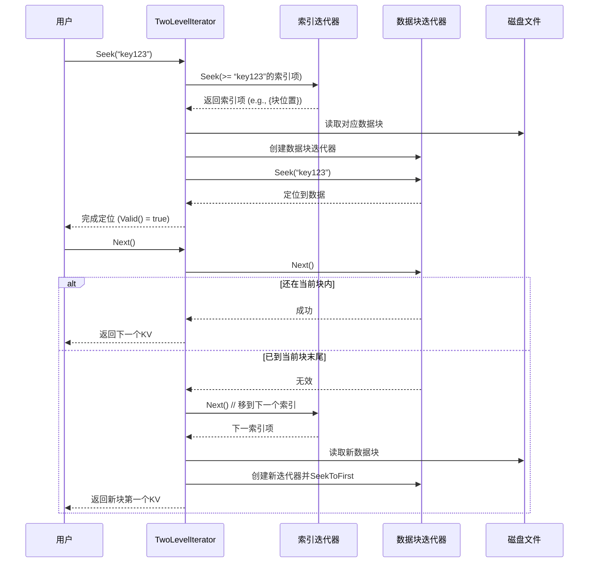

# Chapter 8: 迭代器体系（Iterator）

在上一章[压缩机制（Compaction）](07_压缩机制_compaction__.md)中，你看到了 LevelDB 如何通过后台整理，将数据从 `MemTable` 移动到一个分层的 `SSTable` 文件集合中。这带来一个直接的问题：当用户想查询一个范围内的所有数据时，数据可能散落在内存（`MemTable`）和磁盘上多个不同层级的 `SSTable` 文件中。我们该如何统一、高效地读取这些分散的数据？

**想象一下**：你有一个大型图书馆，但书籍不仅按编号放在主书架上，还有一些新到的书堆在入口的推车上，另一些旧书存放在地下仓库的不同区域。你需要找一本编号在100到200之间的书。难道要分别去推车、主书架、各个仓库翻一遍，然后自己手动把所有找到的书按顺序排好？

太麻烦了！你需要的，是一个**智能的图书管理员机器人**。你告诉它“从编号100开始，按顺序找”，它就会自动去检查推车、主书架、各个仓库，按照编号顺序，一本接一本把书递给你。这个“机器人”，就是 LevelDB 的**迭代器（Iterator）**。

---

## 🎯 你将学到什么

在本章结束时，你将理解：
*   **迭代器是什么**：一个让你能顺序（或逆序）遍历数据的“统一阅读器”接口。
*   **它解决了什么问题**：如何用同一个接口，透明地遍历内存表、单个SSTable文件，甚至整个数据库的所有数据。
*   **组合模式**：LevelDB 如何像搭积木一样，用小迭代器组合出功能强大的复杂迭代器。
*   **关键迭代器**：`MergingIterator` 和 `TwoLevelIterator` 的工作原理。

## 📦 先决条件

*   理解了 [内存表（MemTable）与跳表（SkipList）](04_内存表_memtable_与跳表_skiplist__.md) 的基本读写。
*   知道了 [SSTable（排序表）与数据块](05_sstable_排序表_与数据块_.md) 的物理结构。
*   了解 [版本管理（VersionSet 与 Version）](06_版本管理_versionset_与_version__.md) 如何管理文件集合。

---

## 第一步：从问题出发——我们想做什么？

让我们先看一个最常见的需求：**范围查询**。假设我们存入了以下数据：

```cpp
db->Put(“user:1”, “Alice”);
db->Put(“user:3”, “Charlie”);
db->Put(“user:5”, “Eve”); // 这可能在 MemTable
// ... 经过压缩，`user:1` 和 `user:3` 可能已被写入 L1 的某个 SSTable 文件
```

现在，我们想获取所有以 `“user:”` 开头的键值对。理想中的代码应该如此简洁：

```cpp
// 伪代码：我们希望有这样一个“全能书签”
leveldb::Iterator* it = db->NewRangeIterator(“user:”);
for (it->Seek(“user:”); it->Valid(); it->Next()) {
    std::string key = it->key().ToString();
    std::string value = it->value().ToString();
    std::cout << key << “ => ” << value << std::endl;
}
delete it;
// 预期输出（顺序可能因内部状态而变）:
// user:1 => Alice
// user:3 => Charlie
// user:5 => Eve
```

这个“全能书签”需要做到：
1.  **统一接口**：无论数据在 MemTable 还是哪个 SSTable 文件里，都用同样的 `key()`, `value()`, `Next()` 方法访问。
2.  **自动合并**：自动把所有来源的数据，按键的顺序合并起来返回给我，就像它们来自同一个有序列表。
3.  **高效定位**：能快速跳到某个键（`Seek(“user:100”)`）开始遍历。

**迭代器（Iterator）** 就是为了完美实现这个“全能书签”而设计的抽象体系。

---

## 第二步：理解迭代器的核心——统一的“阅读”接口

所有迭代器的行为都定义在 `/include/leveldb/iterator.h` 中。我们来看最关键的几个方法：

```cpp
class LEVELDB_EXPORT Iterator {
 public:
  // 迭代器当前是否指向一个有效的键值对？
  virtual bool Valid() const = 0;
  // 获取当前键（仅在 Valid() 为 true 时调用）
  virtual Slice key() const = 0;
  // 获取当前值（仅在 Valid() 为 true 时调用）
  virtual Slice value() const = 0;

  // 将迭代器移动到第一个键值对
  virtual void SeekToFirst() = 0;
  // 将迭代器移动到最后一个键值对
  virtual void SeekToLast() = 0;
  // 将迭代器移动到第一个 >= target 的键
  virtual void Seek(const Slice& target) = 0;

  // 移动到下一个键值对
  virtual void Next() = 0;
  // 移动到上一个键值对
  virtual void Prev() = 0;

  virtual Status status() const = 0; // 获取操作状态
  virtual ~Iterator();
};
```
*代码解释*：这是一个**抽象类**（包含纯虚函数 `=0`），它定义了一个“阅读器”的标准合同。任何具体的迭代器（比如遍历 MemTable 的或遍历 SSTable 的）都必须实现这些方法。通过这个接口，上层代码就完全不用关心数据具体在哪里、底层是如何实现的。

**类比**：这就好比 USB 接口标准。你只要知道设备支持 USB，就能用同样的线缆和方式连接它，而不需要关心它内部是U盘、键盘还是摄像头。

---

## 第三步：数据来源——多种多样的“基础”迭代器

有了统一的接口，我们就可以为每种数据来源实现具体的迭代器：

1.  **`MemTableIterator`**：遍历内存中的跳表（SkipList）。它非常快，因为操作都在内存中。
2.  **`Block::Iter`**：遍历一个 SSTable 文件内部的单个数据块（Block）。SSTable 由多个 Block 组成。
3.  **`Table::Iterator`**：遍历一个完整的 SSTable 文件。它内部会使用 `TwoLevelIterator`（我们稍后解释）来高效地跨 Block 查找。

想象一下，当数据库某一时刻有 1 个 MemTable 和 3 个 SSTable 文件时，我们就有 4 个独立的、各自有序的“数据流”。要得到全局有序视图，我们需要一个“合并大师”。

---

## 第四步：组合模式——用 MergingIterator 合并多个流

如何合并多个有序的数据流？LevelDB 使用了经典的**多路归并**算法，并由 `MergingIterator`（在 `/table/merger.cc` 中实现）来封装。

```cpp
// 简化版 MergingIterator 工作原理
class MergingIterator : public Iterator {
 private:
  const Comparator* comparator_;
  // 它持有多个子迭代器（如指向 MemTable 和各个 SSTable 的迭代器）
  std::vector<IteratorWrapper> children_;
  // 一个优先队列（或最小堆），始终维护当前指向最小键的子迭代器
  // 当调用 Next() 时，移动那个子迭代器，并重新调整堆
};
```
*代码解释*：`MergingIterator` 本身不直接存储数据。它管理一组子迭代器，并使用一个**最小堆**来实时跟踪哪个子迭代器当前指向的键最小。每次调用 `Next()`，它就从堆顶（当前最小键）取出数据，然后移动对应的子迭代器，并将其新键重新插入堆中，从而始终保持堆顶是全局最小的键。

```mermaid
graph TD
    subgraph “输入：多个有序数据流”
        A[MemTable<br/>迭代器: a1, a2, a3]
        B[SSTable-1<br/>迭代器: b1, b2]
        C[SSTable-2<br/>迭代器: c1, c2, c3]
    end

    MI[MergingIterator<br/>最小堆管理]
    O[输出: a1, b1, a2, b2, c1, a3, c2, c3]

    A --> MI
    B --> MI
    C --> MI
    MI --> O
```

**工作流程**：
1.  初始化时，将所有子迭代器移动到第一个元素，并放入最小堆。
2.  `Valid()` 检查堆是否为空。
3.  `key()` 和 `value()` 返回堆顶子迭代器指向的数据。
4.  调用 `Next()`：
    a. 移动堆顶的子迭代器到它的下一个元素。
    b. 如果该子迭代器仍然有效，将其（带着新键）重新放入堆中。
    c. 调整堆，新的堆顶就是全局下一个最小的键。

这样，用户通过 `MergingIterator` 就能透明地、按顺序访问所有底层数据了！

---

## 第五步：深入 SSTable——TwoLevelIterator 的两级查找

`MergingIterator` 解决了跨文件合并的问题。但单个 SSTable 文件内部也可能很大（几MB），如何高效地遍历它而不必全部读入内存？这就要靠 `TwoLevelIterator`（两级迭代器）。

回忆一下 [SSTable的格式](05_sstable_排序表_与数据块_.md)：文件末尾有索引块（Index Block），它记录了每个数据块（Data Block）的起始键和其在文件中的位置。

`TwoLevelIterator` 巧妙地利用了这一结构：

```cpp
// 简化理解 TwoLevelIterator
class TwoLevelIterator : public Iterator {
 private:
  Iterator* index_iter_;     // 第一级：遍历索引块的迭代器
  Iterator* data_iter_;      // 第二级：遍历当前数据块的迭代器
  BlockFunction block_function_; // 函数：根据索引值加载数据块迭代器
};
```
*代码解释*：这是一个典型的“迭代器的迭代器”。
*   **第一级 (`index_iter_`)**：遍历索引块。它当前指向的“值”不是用户数据，而是一个数据块的位置信息。
*   **第二级 (`data_iter_`)**：遍历由第一级定位到的具体数据块。这里面的才是真正的用户键值对。
*   当用户调用 `Next()` 时，`TwoLevelIterator` 先移动 `data_iter_`。如果 `data_iter_` 移出了当前块，它就移动 `index_iter_` 到下一个索引项，然后加载新的数据块，创建新的 `data_iter_`。



**这种设计的好处**：在遍历时，只有当前需要的数据块才会被加载到内存中，极大地节省了内存占用，并且利用索引实现了快速的 `Seek` 操作。

---

## 第六步：整合视图——从用户迭代器到数据

现在，让我们把碎片拼成完整的图景。当你在 LevelDB 中调用 `db->NewIterator()` 时，背后发生了什么？

1.  **收集数据源**：当前的 `Version`（版本）会列出所有需要遍历的 `SSTable` 文件（每个层级选一个），加上当前的 `MemTable`（和可能存在的 `Immutable MemTable`）。
2.  **创建叶子迭代器**：为每个 `SSTable` 文件创建一个 `TwoLevelIterator`，为每个 `MemTable` 创建一个 `MemTableIterator`。
3.  **合并**：将这些叶子迭代器作为输入，创建一个 `MergingIterator`。
4.  **包装**：最后，再在 `MergingIterator` 外面包一个 `DBIter`（数据库迭代器）。`DBIter` 是一个智能的装饰器，它负责处理一些高层逻辑，比如**过滤掉已被删除的键**（`kTypeDeletion` 标记），以及**确保快照隔离**（不读取在迭代器创建后写入的数据）。

所以，最终的用户迭代器是一个层层封装的强大工具：
`DBIter` -> `MergingIterator` -> [`TwoLevelIterator` for SST1, `TwoLevelIterator` for SST2, ..., `MemTableIterator`]

---

## 你构建了什么

通过本章，你理解了 **LevelDB 迭代器体系** 这个精妙的设计：
*   **统一接口 (`leveldb::Iterator`)**：定义了遍历数据的标准方式，是抽象和封装的关键。
*   **组合模式**：通过 `MergingIterator` 和 `TwoLevelIterator`，将小迭代器组合成功能强大的大迭代器，解决了多源数据合并和大型文件高效遍历的问题。
*   **透明性**：用户只需一个简单的 `NewIterator()` 调用，就能获得一个可以遍历整个数据库状态（且符合快照）的“全能书签”，完全无需关心底层数据分布的复杂性。

这种设计是 LevelDB 简洁性和强大功能的核心体现之一。

## 下一步

迭代器让我们能够高效地读取数据。但你知道 LevelDB 是如何加速重复读取，以及如何快速判断一个键“一定不存在”以节省磁盘IO的吗？这就要用到下一章的核心组件：[缓存与布隆过滤器](09_缓存与布隆过滤器_.md)。

---

Generated by [AI Codebase Knowledge Builder](https://github.com/The-Pocket/Tutorial-Codebase-Knowledge)