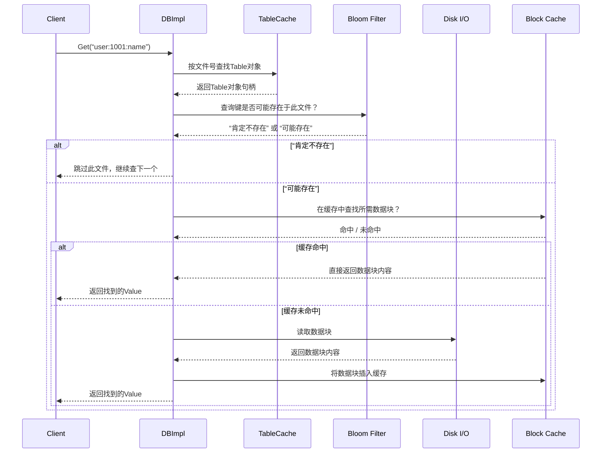

# Chapter 9: 缓存与布隆过滤器

欢迎回来！在前几章，我们一起探索了LevelDB如何写入数据（[WriteBatch](02_writebatch_批量写入__.md) 和 [WAL](03_预写日志_wal___log__.md)）、如何在内存中组织数据（[MemTable](04_内存表_memtable_与跳表_skiplist__.md)）、以及如何将数据持久化为有序的文件（[SSTable](05_sstable_排序表_与数据块_.md)）。我们还了解了系统如何管理这些文件的版本（[VersionSet](06_版本管理_versionset_与_version__.md)）并整理它们（[Compaction](07_压缩机制_compaction__.md)）。

现在，想象一个场景：你的LevelDB数据库已经存入了数GB甚至更多的数据，它们分布在成百上千个SSTable文件中。这时，你执行一次 `db->Get("user:1001:name")`。如果系统傻乎乎地从第一个文件开始，一直找到最后一个文件，每次都要打开文件、读取磁盘，那速度会慢得像在翻阅一本超厚的纸质电话簿。

本章要介绍的**缓存（Cache）** 和**布隆过滤器（Bloom Filter）**，就是LevelDB为了解决这个性能瓶颈而装备的“加速引擎”。它们能将随机读取的性能提升数倍，是LevelDB高效的关键。

---

## 🎯 你将学到什么

在本章结束时，你将理解：
*   **为什么需要缓存**：磁盘与内存的速度鸿沟，以及“局部性原理”。
*   **LevelDB的两种缓存**：`LRUCache`（缓存数据块）和 `TableCache`（缓存文件句柄与索引）。
*   **什么是布隆过滤器**：一种用空间换时间、能快速判断“键不存在”的神奇数据结构。
*   **它们如何协同工作**：在一次`Get`操作中，它们如何联手避免不必要的磁盘I/O。

## 📦 先决条件

*   对 [SSTable文件格式](05_sstable_排序表_与数据块_.md) 有基本了解（数据块、元数据块等）。
*   知道磁盘读取（I/O）比内存访问慢好几个数量级。
*   准备好了学习让数据库“飞起来”的魔法！

---

## 第一步：从问题出发——缓慢的磁盘查找

让我们先感受一下没有加速机制时的痛点。

**一个简单的思想实验**：
1.  你的数据库有1000个SSTable文件（`000001.ldb` ... `001000.ldb`）。
2.  你要查找的键 `K` 只可能存在于其中1个文件里，但你不确定是哪个。
3.  最坏情况下，你需要**顺序打开并检查999个文件**，才能找到（或确认不存在）`K`。每次文件打开和读取都涉及缓慢的磁盘操作。

这就像你要在一栋有1000个房间的大楼里找一个人，却不得不逐个敲门询问。效率极低！

**LevelDB的解决方案组合拳**：
*   **缓存（Cache）**：记住你最近问过哪些房间，以及房间里的人员名单。下次再问，直接看“记忆”即可，不用再敲门。
*   **布隆过滤器（Bloom Filter）**：每个房间门口贴一个“本房间人员特征清单”。你在走廊看一眼清单，就能**确定**某人**绝对不在这间房**，从而跳过它。

---

## 第二步：理解缓存——记住“热点”数据

缓存的核心思想是 **局部性原理**：最近被访问过的数据，很可能在不久的将来再次被访问。

### 类比：手机通讯录与常用联系人

你的手机通讯录里有1000个联系人。你不会每次都从头翻到尾去找“妈妈”的电话。你会：
1.  **最近通话记录**：如果刚跟妈妈打过电话，直接在记录里找到她。（这好比 **LRU缓存**，最近最少使用算法）。
2.  **收藏夹/常用联系人**：你把妈妈设为“常用联系人”，一点就通。（这好比缓存了最重要的数据）。

### LevelDB的两种缓存

LevelDB内部主要维护着两种缓存：

1.  **Block Cache (LRUCache)**：缓存的是SSTable文件中的**数据块（Data Block）内容**。
    *   **有什么用**：当你第一次从某个SSTable文件读取一个数据块后，它的内容会被缓存在内存中。下次需要读同一个块（或其相邻块）时，直接从内存获取，省去磁盘I/O。
    *   **代码位置**：`util/lru_cache.h`, `util/cache.cc`

2.  **Table Cache**：缓存的是已打开的**SSTable文件句柄**以及对应的`Table`对象（包含索引和过滤器等元数据）。
    *   **有什么用**：避免反复打开、关闭同一个SSTable文件。打开文件是一个相对昂贵的操作。缓存其句柄和`Table`对象能极大提升重复访问同一文件的速度。
    *   **代码位置**：`db/table_cache.h`, `db/table_cache.cc`

让我们看一个极度简化的`LRUCache`使用示例：

```cpp
// 模拟：从缓存中查找一个键对应的数据块
#include “leveldb/cache.h”
#include “leveldb/slice.h”

// 1. 创建一个容量为8MB的LRU缓存
leveldb::Cache* block_cache = leveldb::NewLRUCache(8 * 1024 * 1024);

// 2. 假设这是某个SSTable中一个数据块的唯一标识符
std::string block_key = “sstable_123_block_456”;
leveldb::Slice key_slice(block_key);

// 3. 尝试从缓存中查找
leveldb::Cache::Handle* handle = block_cache->Lookup(key_slice);
if (handle != nullptr) {
    // 缓存命中！直接使用缓存的数据
    void* cached_block_data = block_cache->Value(handle);
    // ... 处理 cached_block_data ...
    block_cache->Release(handle); // 使用完毕，释放引用
} else {
    // 缓存未命中，需要去磁盘读取
    void* block_data_from_disk = ReadBlockFromDisk(“sstable_123.ldb”, 456);
    // 将读取到的数据插入缓存，供下次使用
    handle = block_cache->Insert(key_slice, block_data_from_disk,
                                  block_data_size,
                                  &DeleteBlockData);
    block_cache->Release(handle);
}
```
*代码解释*：我们首先创建了一个缓存。`Lookup`方法根据键查询缓存。如果找到（命中），就直接使用缓存值。如果没找到（未命中），则需要从慢速的磁盘读取，然后用`Insert`方法将结果存入缓存。`Release`用于减少对缓存项的引用计数。

---

## 第三步：理解布隆过滤器——高效的“预检员”

缓存解决了“重复读取相同数据”快的问题。但面对一个从未读过的键，我们如何避免“无效的磁盘查找”呢？布隆过滤器登场了。

### 类比：高效的集会安检

假设你要在一个有10000人的集会中找一个叫“张三”的朋友。最笨的方法是挨个问。
一个高效的方法是：
1.  组织者在门口记录：所有入场者的**姓**的首字母。
2.  你想找“张三”。你先看记录，发现今天入场的人里，**没有**姓“张”（首字母Z）的。
3.  结论：你**可以立即确定**张三不在集会上，根本不用进去找。

布隆过滤器就是这样的“记录员”。它用一个**比特数组（Bit Array）** 和多个**哈希函数**，为每个键计算一组位置并置为1。查询时，用同样的方法计算位置，如果**任何一个位置是0，则键肯定不存在**；如果所有位置都是1，则键**可能**存在（存在一定的误判率）。

### LevelDB中的布隆过滤器

每个SSTable文件末尾都有一个特殊的“过滤器块”（Filter Block），里面存储的就是基于该文件所有键构建的一个布隆过滤器位图。

```cpp
// 非常简化的布隆过滤器查询逻辑（概念性代码）
bool BloomFilterQuery(const BloomFilter& filter, const std::string& key) {
    // 使用多个哈希函数，计算 key 在位图中的多个位置
    uint32_t h1 = Hash1(key) % filter.num_bits;
    uint32_t h2 = Hash2(key) % filter.num_bits;
    uint32_t h3 = Hash3(key) % filter.num_bits;
    // ...
    // 检查所有位置是否都为1
    return (filter.bit_array[h1] &&
            filter.bit_array[h2] &&
            filter.bit_array[h3]);
    // 返回 true  -> 键“可能存在”（需要进一步磁盘查找确认）
    // 返回 false -> 键“绝对不存在”（可以安全跳过这个文件！）
}
```
*代码解释*：布隆过滤器对键进行多次哈希，映射到位数组（`bit_array`）的多个位置上。写入时，将这些位置置1。查询时，检查这些位置是否全为1。只要有一个位置是0，就能铁定判定该键不在这个过滤器的原始集合中。

LevelDB内置的布隆过滤器实现在 `util/bloom.cc` 中。你可以在创建数据库时指定使用它：

```cpp
leveldb::Options options;
options.filter_policy = leveldb::NewBloomFilterPolicy(10); // 每个键分配约10个比特
leveldb::DB* db;
leveldb::DB::Open(options, “/tmp/testdb”, &db);
```
*代码解释*：通过`options.filter_policy`启用布隆过滤器。`NewBloomFilterPolicy(10)`表示平均为每个键分配10个比特位，比特数越多，误判率越低，但空间开销越大。

---

## 第四步：它们如何协同工作——一次Get操作的加速之旅

现在，让我们把缓存和布隆过滤器放到一次真实的`DBImpl::Get`操作中，看看它们如何将性能最大化。

当你要查找一个键时，系统大致会按以下步骤工作（我们聚焦于SSTable查找部分）：



**旅程详解**：

1.  **确定目标文件**：[Version](06_版本管理_versionset_与_version__.md) 当前维护着所有SSTable文件的元数据。`Get`操作会从第0层到最高层，确定可能包含目标键的文件列表。

2.  **TableCache 加速**：对于每个待查文件，首先通过`TableCache`获取其`Table`对象。如果该文件最近被访问过，其`Table`对象很可能已在缓存中，避免了重复的文件打开和元数据解析。

3.  **布隆过滤器预检**：拿到`Table`对象后，第一件事就是用它内部的布隆过滤器检查目标键。
    *   **如果过滤器说“肯定不存在”**：恭喜！可以直接跳过整个文件的磁盘查找。这是**性能提升的关键**，尤其是当键不存在时，可能一次磁盘I/O都不需要。
    *   **如果过滤器说“可能存在”**：则需要进入文件内部查找。

4.  **查找索引与数据块**：在文件内部，利用`Table`对象缓存的索引信息，找到目标键可能位于哪个数据块。

5.  **Block Cache 加速**：得到了数据块的位置（偏移量），先询问`Block Cache`是否缓存了这个块的内容。
    *   **缓存命中**：直接从内存返回数据，飞速完成。
    *   **缓存未命中**：执行真正的磁盘读取，将读取到的数据块放入`Block Cache`，然后返回数据。

通过这样层层递进的加速机制，一次原本可能需要数十次磁盘寻道的`Get`操作，在理想情况下（缓存命中且布隆过滤器拦截了无关文件）可以被优化到**仅需1次或0次磁盘I/O**。

---

## 第五步：深入内部实现一瞥

让我们看看`TableCache`是如何实现“缓存文件句柄和Table对象”的。以下代码大幅简化自 `db/table_cache.cc`：

```cpp
// TableCache 的核心查找方法
Status TableCache::FindTable(uint64_t file_number, uint64_t file_size,
                             Cache::Handle** handle) {
    Status s;
    // 1. 构造缓存键：使用文件号
    char buf[sizeof(file_number)];
    EncodeFixed64(buf, file_number);
    Slice key(buf, sizeof(buf));

    // 2. 从LRU缓存中查找
    *handle = cache_->Lookup(key);
    if (*handle == nullptr) { // 缓存未命中
        // 3. 需要打开磁盘文件并创建Table对象
        std::string fname = TableFileName(dbname_, file_number);
        RandomAccessFile* file = nullptr;
        Table* table = nullptr;
        // ... 打开文件，解析Table ...
        TableAndFile* tf = new TableAndFile{file, table};

        // 4. 将新创建的对象插入缓存
        *handle = cache_->Insert(key, tf, 1, &DeleteEntry);
    }
    return s;
}
```
*代码解释*：`TableCache`内部持有一个`Cache* cache_`（LRU缓存）。缓存键是SSTable的文件编号（`file_number`）。缓存的值是一个自定义结构`TableAndFile`，里面包含了文件句柄和`Table`对象指针。`FindTable`方法实现了“有则用，无则创建并缓存”的逻辑。

对于布隆过滤器的构建，`FilterBlockBuilder` (`table/filter_block.cc`) 负责收集每个数据块的键，并周期性地（例如每2KB数据）生成一个过滤器段：

```cpp
// FilterBlockBuilder 添加键和生成过滤器
void FilterBlockBuilder::AddKey(const Slice& key) {
    // 记录键的偏移，收集到 keys_ 字符串中
    start_.push_back(keys_.size());
    keys_.append(key.data(), key.size());
}

void FilterBlockBuilder::GenerateFilter() {
    // 当收集了足够多的键（或一个数据块结束），调用策略创建过滤器
    if (start_.empty()) return;
    // 调用如 BloomFilterPolicy 的 CreateFilter 方法
    // policy_->CreateFilter(keys_pointer, num_keys, &result_);
    // 将生成的过滤器位图偏移记录下来
    filter_offsets_.push_back(result_.size());
    // 清空临时收集的键，准备下一轮
    keys_.clear();
    start_.clear();
}
```
*代码解释*：`AddKey`负责收集属于当前过滤段的键。当数据写入达到一定量（例如`kFilterBase` = 2KB）时，`GenerateFilter`被调用，利用配置的`FilterPolicy`（如布隆过滤器）将所有收集的键转换成一个紧凑的位图（`result_`），并将该位图在结果中的偏移量保存下来。

---

## 🎉 总结

恭喜你！你现在理解了LevelDB的“加速引擎”：

*   **缓存是“记忆”**：`Block Cache`记住了最近访问过的数据块内容，`TableCache`记住了最近打开过的SSTable文件信息。它们利用**局部性原理**，让重复访问快如闪电。
*   **布隆过滤器是“哨兵”**：它是一种**概率性数据结构**，用微小的空间开销，能够以极高的概率快速判断一个键**是否绝对不存在**于某个SSTable中。这能有效避免大量无效的磁盘查找，是提升随机读性能的利器。
*   **协同作战**：在一次`Get`操作中，它们层层设防。先由布隆过滤器排除不可能的文件，再由`TableCache`避免重复打开文件，最后由`Block Cache`提供热点数据。这套组合拳让LevelDB在面临海量数据时，依然能保持出色的读取性能。

简单来说：**缓存让你找“老地方”更快，布隆过滤器帮你跳过“死胡同”。**

---

## ➡️ 下一步

我们已经深入探讨了LevelDB的核心存储引擎和性能优化机制。下一章，我们将目光投向一个支撑整个系统可移植性和灵活性的抽象层：**[环境抽象层（Env）](10_环境抽象层_env__.md)**。你将看到LevelDB如何通过统一的接口，在不同的操作系统（如Linux、Windows）和环境中（如内存文件系统）优雅地运行。这对理解LevelDB的架构哲学至关重要，我们下一章见！

---

Generated by [AI Codebase Knowledge Builder](https://github.com/The-Pocket/Tutorial-Codebase-Knowledge)