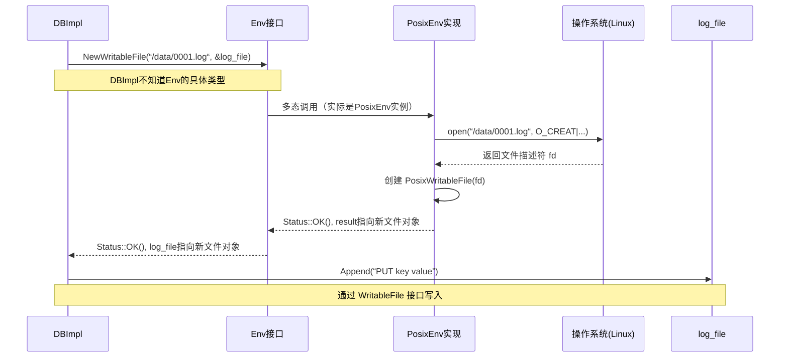

# Chapter 10: 环境抽象层（Env）


欢迎回来！在探索了LevelDB的核心引擎、内存表、SSTable等瑰宝后，我们把目光投向一个可能不那么起眼，却至关重要的部分：**环境抽象层（Env）**。如果说前面的章节教会了你如何使用和搭建“跑车”的发动机和底盘，那么本章将带你看看，这辆跑车如何在不同的“路面”（Windows、Linux、Mac）上平稳行驶的奥秘。

想象一下：你是一位家电设计师，设计了一台功能强大的“数据冰箱”（LevelDB）。然而，世界各地的电源插座标准不一（中国是220V，美国是110V）。为了让你的冰箱销往全球，你会做什么？你会设计一个**电源适配器**！无论用户插上什么标准的电源，适配器都能将其转换成冰箱内部电路需要的稳定电流。

LevelDB的 **`Env`（环境抽象层）** 就是这个“电源适配器”。它将所有与底层操作系统（OS）相关的操作（如文件读写、创建目录、线程睡眠）抽象成一套统一的接口。这让LevelDB的核心代码**完全不用关心**自己是在Linux、Windows还是Mac上运行，它只需要调用`Env`的接口即可。

---

## 🎯 你将学到什么

在本章结束时，你将理解：
*   **Env 是什么**：它作为操作系统适配器的核心设计思想。
*   **为什么需要 Env**：平台无关性给LevelDB带来的巨大好处。
*   **Env 的关键实现**：`PosixEnv`、`WindowsEnv`和用于测试的`MemEnv`。
*   **如何扩展 Env**：通过`EnvWrapper`自定义行为，例如注入故障或限速。

## 📦 先决条件

*   已完成 [第9章：缓存与布隆过滤器](09_缓存与布隆过滤器_.md) 的学习。
*   了解基本的操作系统概念，如文件、目录、线程。
*   知道C++中的虚函数和接口（抽象类）的概念。

---

## 第一步：为什么需要环境抽象？—— 一个现实问题

让我们看一个最简单的需求：LevelDB需要将内存中的数据（一个`MemTable`）写入到磁盘，生成一个`SSTable`文件。

在Linux上，你可能用`open`和`write`系统调用。
在Windows上，你可能用`CreateFile`和`WriteFile` API。
代码完全不同！

如果不做抽象，`DBImpl`的代码里就会充斥着`#ifdef _WIN32 ... #else ... #endif`这样的条件编译，代码臃肿、难以维护，并且无法轻易移植到新平台（比如新的嵌入式系统）。

`Env`的出现解决了这个问题。它定义了一套统一的“操作说明书”（接口），然后针对不同平台提供不同的“实现手册”。

**核心思想**：LevelDB核心代码（`DBImpl`， `VersionSet`等）**依赖接口，而非具体实现**。这正体现了面向对象设计中的“依赖倒置原则”。

## 第二步：Env 接口面面观

`Env` 接口在 `include/leveldb/env.h` 中定义。它像一份“能力清单”，罗列了LevelDB需要操作系统提供的所有服务。让我们看看最重要的几项：

```cpp
// include/leveldb/env.h (精简版)
namespace leveldb {

class LEVELDB_EXPORT Env {
 public:
  Env() = default;
  virtual ~Env();

  // --- 文件操作 ---
  // 创建一个新的、可顺序写入的文件。
  virtual Status NewWritableFile(const std::string& fname,
                                 WritableFile** result) = 0;
  // 打开一个已存在的文件用于顺序读取。
  virtual Status NewSequentialFile(const std::string& fname,
                                   SequentialFile** result) = 0;
  // 打开一个已存在的文件用于随机读取。
  virtual Status NewRandomAccessFile(const std::string& fname,
                                     RandomAccessFile** result) = 0;

  // --- 文件系统操作 ---
  // 判断文件/目录是否存在。
  virtual Status FileExists(const std::string& fname) = 0;
  // 获取文件大小。
  virtual Status GetFileSize(const std::string& fname, uint64_t* size) = 0;
  // 删除文件。
  virtual Status DeleteFile(const std::string& fname) = 0;
  // 创建目录。
  virtual Status CreateDir(const std::string& dirname) = 0;
  // 删除目录。
  virtual Status DeleteDir(const std::string& dirname) = 0;
  // 列出目录下的文件。
  virtual Status GetChildren(const std::string& dirname,
                             std::vector<std::string>* result) = 0;

  // --- 线程与同步 ---
  // 启动一个新线程运行指定的函数。
  virtual void Schedule(void (*function)(void* arg), void* arg) = 0;
  // 让当前线程睡眠指定的微秒数。
  virtual void SleepForMicroseconds(int micros) = 0;

  // --- 时间 ---
  // 获取当前的微秒级时间戳（通常用于性能测量和超时）。
  virtual uint64_t NowMicros() = 0;
  // ... 其他方法
};

}  // namespace leveldb
```
*代码解释*：`Env` 是一个抽象基类（包含 `= 0` 的纯虚函数）。它定义了 LevelDB 需要操作系统做的所有事情。`Status` 是 LevelDB 用于表示操作成功或失败（及原因）的通用类。像 `WritableFile` 这样的类也是接口，定义了文件写入的具体方法。

**关键点**：
1.  **职责分离**：`Env`只负责“做什么”（打开文件、创建线程），不负责“怎么做”。具体的“怎么做”由平台相关的实现类完成。
2.  **统一错误处理**：所有操作都返回`Status`，让上层代码可以用一致的方式处理成功和失败。
3.  **异步支持**：`Schedule`方法使得LevelDB可以将后台压缩等任务放到线程池中执行，不阻塞主线程。

## 第三步：Env 的具体实现——适配不同的“插座”

有了统一的“电源接口”（`Env`），现在我们需要为不同的“墙面插座”制造适配器。

### 1. PosixEnv（给 Linux/Mac/Unix-like 系统）

在 `util/env_posix.cc` 中，`PosixEnv` 类实现了 `Env` 接口，内部使用 POSIX 标准 API（如 `open`, `read`, `write`, `pthread_create`）。

```cpp
// util/env_posix.cc (概念性代码)
namespace leveldb {

class PosixEnv : public Env {
 public:
  PosixEnv() {/* 初始化资源，如线程池 */}
  ~PosixEnv() override {/* 清理资源 */}

  // 实现所有 Env 的纯虚函数
  Status NewWritableFile(const std::string& fname, WritableFile** result) override {
    // 内部调用 open() 和 write() 等 POSIX 函数
    int fd = open(fname.c_str(), O_CREAT | O_WRONLY | O_TRUNC, 0644);
    if (fd < 0) {
      return Status::IOError(fname, strerror(errno));
    }
    *result = new PosixWritableFile(fname, fd); // 返回一个包装了fd的对象
    return Status::OK();
  }
  // ... 实现其他所有方法
};

// 全局函数：获取默认的 PosixEnv 实例
Env* Env::Default() {
  static PosixEnv default_env; // 单例模式
  return &default_env;
}

} // namespace leveldb
```
*代码解释*：`PosixEnv` 继承自 `Env`，并逐一实现所有虚函数。在Linux/Mac上，当LevelDB调用 `Env::Default()->NewWritableFile(...)` 时，实际调用的是这里的`PosixEnv::NewWritableFile`，它使用标准的Unix文件操作。

### 2. WindowsEnv（给 Windows 系统）

在 `util/env_windows.cc` 中，`WindowsEnv` 类做同样的事情，但内部使用 Windows API（如 `CreateFileW`, `ReadFile`, `CreateThread`）。其对外接口与`PosixEnv`**完全一致**。

### 3. MemEnv（内存文件系统——用于测试）

这是最有趣的一个实现，位于 `helpers/memenv/memenv.cc`。`MemEnv` 不操作真实的磁盘文件，而是用一个 `std::map<std::string, std::string>` 在内存中模拟文件系统。

```cpp
// helpers/memenv/memenv.cc (极度简化概念)
namespace leveldb {

class FileState {
  std::string data; // 用字符串模拟文件内容
  // ... 引用计数、锁等管理状态
};

class MemEnv : public Env {
  std::map<std::string, FileState*> files_; // 文件名 -> 文件内容
  mutable port::Mutex mutex_;
 public:
  Status NewWritableFile(const std::string& fname, WritableFile** result) override {
    MutexLock l(&mutex_);
    FileState* file = new FileState();
    files_[fname] = file;
    *result = new MemWritableFile(fname, file); // 写入操作会修改 file->data
    return Status::OK();
  }
  Status NewSequentialFile(const std::string& fname, SequentialFile** result) override {
    MutexLock l(&mutex_);
    auto it = files_.find(fname);
    if (it == files_.end()) {
      return Status::IOError(fname, "File not found");
    }
    *result = new MemSequentialFile(it->second); // 从 file->data 读取
    return Status::OK();
  }
  // ... 实现其他方法，都在操作 files_ 这个 map
};

} // namespace leveldb
```
*代码解释*：`MemEnv` 将“文件”模拟为内存中的字符串。写入文件就是向字符串追加数据，读取文件就是从字符串读取数据。**这极大地方便了单元测试**，因为测试无需创建和清理真实的临时文件，运行速度极快，且不会产生磁盘垃圾。

## 第四步：Env 的内部工作原理——一次写文件请求的旅程

让我们追踪一次 `DBImpl` 创建新的 [预写日志（WAL）](03_预写日志_wal___log__.md) 文件的调用，看看 `Env` 是如何被使用的。


*图表解释*：
1.  `DBImpl` 请求 `Env` 接口创建一个可写文件。
2.  由于程序运行在Linux上，`Env::Default()` 返回的是 `PosixEnv` 实例，因此发生多态调用，执行 `PosixEnv::NewWritableFile`。
3.  `PosixEnv` 使用Linux的 `open()` 系统调用，与真实操作系统交互，获得一个文件描述符（fd）。
4.  `PosixEnv` 用这个fd构造一个 `PosixWritableFile` 对象，并返回给 `DBImpl`。
5.  此后，`DBImpl` 调用 `log_file->Append(...)` 写入数据时，实际上调用的是 `PosixWritableFile::Append`，它内部会调用 `write(fd, ...)`。

**整个过程，`DBImpl` 对 Linux 系统调用一无所知！** 如果要移植到Windows，只需要把 `PosixEnv` 换成 `WindowsEnv`，`DBImpl` 的代码一行都不用改。

## 第五步：扩展 Env——自定义你的适配器

`Env` 的强大之处还在于其可扩展性。LevelDB 提供了一个 `EnvWrapper` 类，它继承自 `Env`，并持有一个 `Env*` 成员（指向被包装的Env）。你可以继承 `EnvWrapper`，只覆盖你关心的部分方法。

**应用场景举例**：
1.  **限速Env**：在云环境中，你可能想限制数据库的IOPS。你可以创建一个 `RateLimitingEnv`，在它的 `NewWritableFile` 和 `Read` 方法中加入令牌桶算法，控制读写速率。
2.  **故障注入Env**：为了测试系统的容错性，可以创建一个 `FaultInjectionEnv`，在它的 `Write` 方法中随机返回 `Status::IOError`，模拟磁盘写入失败。
3.  **监控Env**：创建一个 `MonitoringEnv`，在所有文件操作前后记录日志和耗时，用于性能分析和监控。

```cpp
// 一个简单的、概念性的 EnvWrapper 使用示例
#include “leveldb/env.h”

class MyMonitoringEnv : public leveldb::EnvWrapper {
 public:
  // 构造函数，传入一个底层的 Env（如默认的Env）
  explicit MyMonitoringEnv(leveldb::Env* target) : EnvWrapper(target) {}

  leveldb::Status NewWritableFile(const std::string& fname,
                                  leveldb::WritableFile** result) override {
    // 1. 记录开始时间
    auto start = std::chrono::steady_clock::now();
    // 2. 调用底层（真实）Env 的功能
    leveldb::Status s = target()->NewWritableFile(fname, result);
    // 3. 记录结束时间并打印日志
    auto end = std::chrono::steady_clock::now();
    auto duration = std::chrono::duration_cast<std::chrono::microseconds>(end - start);
    fprintf(stderr, “[监控] NewWritableFile ‘%s‘ 耗时：%lld us\n”,
            fname.c_str(), static_cast<long long>(duration.count()));
    return s;
  }
  // ... 可以覆盖其他方法
};
```
*代码解释*：`MyMonitoringEnv` 继承了 `EnvWrapper`。它重写了 `NewWritableFile` 方法，在调用被包装的 `target_` Env 的前后，加入了计时和打印日志的逻辑。这就是典型的“装饰器模式”。

---

## 🎉 你学到了什么

恭喜你完成了环境抽象层的探索！你现在理解了：

*   **Env 是什么**：它是 LevelDB 的**操作系统适配器**，通过定义统一接口，屏蔽了底层平台的差异。
*   **关键实现**：
    *   `PosixEnv`：为 Linux、macOS 等类 Unix 系统提供实现。
    *   `WindowsEnv`：为 Windows 系统提供实现。
    *   `MemEnv`：纯内存实现，是**单元测试的利器**，让测试快如闪电。
*   **设计精髓**：**依赖接口而非实现**。这使得LevelDB核心代码高度可移植、可测试。
*   **扩展能力**：通过继承 `EnvWrapper`，可以轻松创建自定义的 `Env`，用于限速、监控、故障注入等高级场景。

`Env` 是LevelDB坚实的地基。正是有了这层优雅的抽象，我们之前学习的所有精巧组件——[内存表（MemTable）](04_内存表_memtable_与跳表_skiplist__.md)、[SSTable](05_sstable_排序表_与数据块_.md)、[版本管理](06_版本管理_versionset_与_version__.md)——才能在不同的操作系统上自由、高效地运行。

至此，我们已经走马观花般领略了LevelDB所有核心模块的壮丽景观。从接收请求的[引擎](01_数据库核心引擎_dbimpl__.md)，到保证持久化的[日志](03_预写日志_wal___log__.md)，从高速的[内存表](04_内存表_memtable_与跳表_skiplist__.md)，到有序的[磁盘文件](05_sstable_排序表_与数据块_.md)，再到后台的[整理工](07_压缩机制_compaction__.md)，以及支撑这一切的[缓存](09_缓存与布隆过滤器_.md)和**环境抽象**。希望这个系列能为你打开通往数据库系统内部世界的一扇大门，并激发你继续深入探索的兴趣。

探索愉快！

---

Generated by [AI Codebase Knowledge Builder](https://github.com/The-Pocket/Tutorial-Codebase-Knowledge)