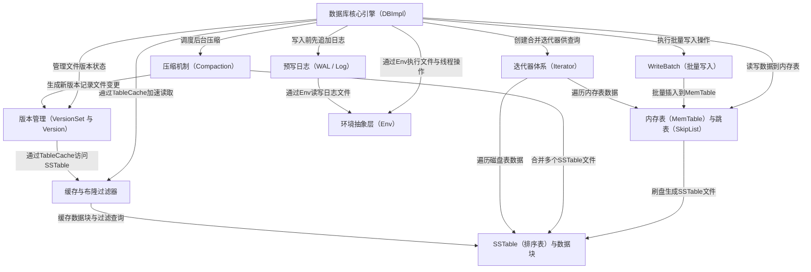

# Tutorial: leveldb

**LevelDB** 是 Google 开发的一个高性能 *嵌入式键值存储引擎*，基于 **LSM-Tree**（日志结构合并树）架构。它的核心思想是：写入数据时先写入内存中的 **MemTable**，积累到一定大小后再批量刷入磁盘上的 **SSTable** 文件。通过 *预写日志*（WAL）保证数据不丢失，通过后台 *压缩*（Compaction）合并整理磁盘文件以维持读取性能。整个系统通过 **版本管理** 跟踪文件变化，通过 **迭代器** 提供统一的数据访问接口，并利用 **缓存** 和 **布隆过滤器** 加速读取。*环境抽象层* 则让核心代码可以运行在不同操作系统上。

**Source Repository:** [None](None)

## Chapters

1. [数据库核心引擎（DBImpl）
](01_数据库核心引擎_dbimpl__.md)
2. [WriteBatch（批量写入）
](02_writebatch_批量写入__.md)
3. [预写日志（WAL / Log）
](03_预写日志_wal___log__.md)
4. [内存表（MemTable）与跳表（SkipList）
](04_内存表_memtable_与跳表_skiplist__.md)
5. [SSTable（排序表）与数据块
](05_sstable_排序表_与数据块_.md)
6. [版本管理（VersionSet 与 Version）
](06_版本管理_versionset_与_version__.md)
7. [压缩机制（Compaction）
](07_压缩机制_compaction__.md)
8. [迭代器体系（Iterator）
](08_迭代器体系_iterator__.md)
9. [缓存与布隆过滤器
](09_缓存与布隆过滤器_.md)
10. [环境抽象层（Env）
](10_环境抽象层_env__.md)

---

Generated by [AI Codebase Knowledge Builder](https://github.com/The-Pocket/Tutorial-Codebase-Knowledge)